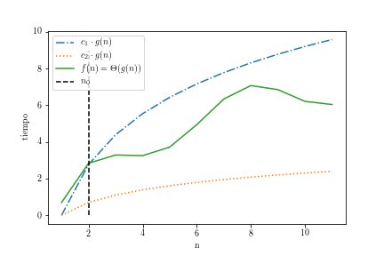
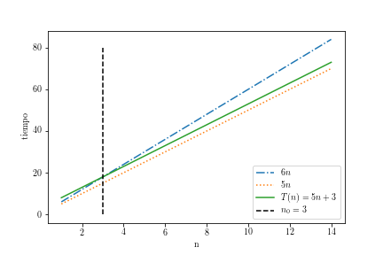
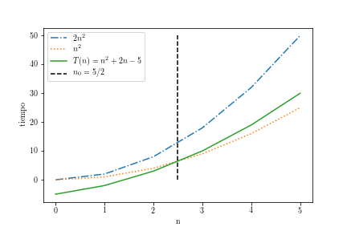
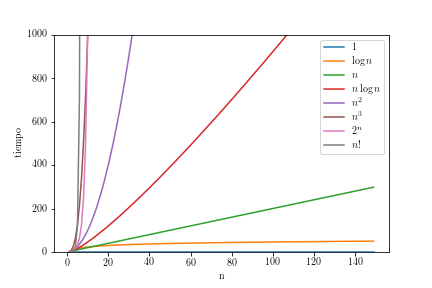

---
title: "Capítulo 2. Análisis Asintótico"
author: "Diego Munguía Molina ^[Esta obra está bajo una Licencia Creative Commons Atribución 4.0 Internacional.]"
date: "Agosto, 2017"
institute: "Ingeniería en Computación, TEC"
geometry: margin=1in
header-includes:
    - \usepackage{setspace}
    - \doublespacing
	- \providecommand{\subtitle}[1]{\usepackage{titling} \posttitle{\par\large#1\end{center}}}
output: pdf_document
lang: es
---

# Capítulo 2. Cotas y notación $\mathcal{O}$-grande #

En términos generales, el análisis asintótico es una herramienta matemática que permite describir el comportamiento de una función en un límite. Específicamente en el contexto del análisis de algoritmos, permite determinar el orden de la tasa de crecimiento de una función de complejidad de tiempo o espacio cuando el tamaño de la entrada es muy grande --es decir, cuando $n$ tiende a infinito--. 

A través del análisis asintótico vamos a poder determinar cotas o límites superiores e inferiores para nuestras funciones $T(n)$ y $S(n)$. Si la función $g(n)$ es una cota superior de $T(n)$, entonces el tiempo de ejecución $T(n)$ nunca va a ser mayor que $c \cdot g(n)$, donde $c$ es una constante específica. Por otro lado, si $g(n)$ es una cota inferior de $T(n)$, entonces el tiempo de ejecución de $T(n)$ nunca va a ser menor que $c \cdot g(n)$, donde $c$ es una constante específica. Las cotas se denotan utilizando notación de $\mathcal{O}$-grande.

A continuación se presenta esta notación junto con la definición formal del concepto de cotas. Estaremos volviendo constantemente a estas definiciones para demostrar nuestros resultados.

Cota Superior
  ~ Decimos que $g(n)$ es una cota superior de $f(n)$ si y sólo si existen $n_{0}$ y $c$ tal que $c \cdot g(n) \geq f(n)\,, \forall n \geq n_{0}$ cuando $n_{0} \geq 0 \land c > 0.\\$
  La cota superior se denota $f(n) = \mathcal{O}(g(n))\\$

Cota Inferior
  ~ Decimos que $g(n)$ es una cota inferior de $f(n)$ si y sólo si existen $n_{0}$ y $c$ tal que $c \cdot g(n) \leq f(n)\,, \forall n \geq n_{0}$ cuando $n_{0} \geq 0 \land c > 0.\\$
  La cota inferior se denota $f(n) = \Omega(g(n))\\$

Cota Ajustada
  ~ Decimos que $g(n)$ es una cota ajustada de $f(n)$ si y sólo si existen $n_{0}$, $c_{1}$ y $c_{2}$ tal que $c_{1} \cdot g(n) \leq f(n) \leq c_{2} \cdot g(n)\,, \forall n \geq n_{0}.$ cuando $n_{0} \geq 0 \land c_{1} > 0 \land c_{2} > 0\\$
  La cota ajusta se denota $f(n) = \Theta(g(n))\\$

Notemos que con base en estas definiciones podemos concluir que $\mathcal{O}$, $\Omega$, y $\Theta$ **no denotan funciones**; denotan más bien conjuntos de funciones. Por esta razón, cuando se utiliza esta notación la expresión $f(n) = \mathcal{O}(g(n))$ debe leerse *"$f(n)$ pertenece a $\mathcal{O}(g(n))$"*.

{#fig:cotas}

La figura 1 presenta de manera gráfica un ejemplo de cotas para un función $f(n)$, representada por la línea contínua. La función $c_{1} \cdot g(n)$ representa la cota superior, tal que $f(n) = \mathcal{O}(g(n))$. La función $c_{2} \cdot g(n)$ representa la cota inferior, tal que $f(n) = \Omega(g(n))$. Finalmente tenemos un $c_{1}$ y $c_{2}$ que cumplen las condiciones de la cota ajustada, tal que $f(n) = \Theta(g(n))$.

Notemos además que la cota ajustada indica que una misma función $g(n)$, multiplicada por distintas constantes puede ser a la vez cota inferior y cota superior de $f(n)$; desde una perspectiva matemática podemos decir que

\begin{equation}
f(n) = \mathcal{O}(g(n)) \land f(n) = \Omega(g(n)) \implies f(n) = \Theta(g(n))
\end{equation}

Notemos también la línea vertical que demarca el punto $n_{0}$. Podemos observar que a la izquierda de $n_{0}$ las condiciones de las cotas no siempre se cumplen, y además no es necesario que lo hagan de acuerdo con la definición. Estaremos interesados en el comportamiento de las funciones conforme estas van creciendo sobre el eje $n$, el tamaño de la entrada.

## Ejemplo: Factorial

Consideremos por ejemplo el algoritmo `factorial(n)`. Este algoritmo tiene una función de complejidad de tiempo 

\begin{equation}
T(n) = 5n + 3
\end{equation}

Para encontrar las cotas de $T(n)$ podemos remitirnos a las definiciones. Estas nos indican que debemos encontrar valores para $c$ y $n_{0}$ que permitan cumplir con las relaciones establecidas. Esta búsqueda puede hacerse inicialmente como un tanteo de prueba y error, más adelante veremos que podemos hacer uso de límites y algunas propiedades del análisis asintótico para determinar las cotas con más rapidez.

Volviendo al caso del `factorial(n)`, tenemos que 

$$
c = 6 \land n_{0} = 3 \land g(n) = n \implies 6n \geq 5n + 3 \,, \forall n \geq 3 \, \therefore T(n) = \mathcal{O}(n)
$$ 

$$
c = 5 \land n_{0} = 0 \land g(n) = n \implies 5n \leq 5n + 3 \,, \forall n \geq 0 \, \therefore T(n) = \Omega(n)
$$

Puesto que tenemos $T(n) = \mathcal{O}(n)$ y $T(n) = \Omega(n)$, podemos concluir que $T(n) = \Theta(n)$.

{#fig:cotas_fact}

La figura 2 representa estos resultados de manera gráfica.

## Ejemplo: Selection Sort

Consideremos ahora el caso general para el *selection sort*. 

\begin{equation}
T(n) = n^2 + 2n - 5
\end{equation}

Utilizando las definiciones de análisis asintótico podemos demostrar que $T(n) = \mathcal{O}(n^2)$.

$$
c = 2 \land n_{0} = 0 \implies 2n^2 \geq n^2 + 2n - 5 \,, \forall n \geq 0
$$

Esta afirmación se puede poner a prueba simplificando la inecuación.

$$
\begin{aligned}
2n^2 \geq n^2 + 2n - 5 \\  
2n^2 - n^2 \geq n^2 + 2n - 5 - n^2\\  
n^2 \geq 2n - 5 \\  
n = 0 \implies 0 \geq -5
\end{aligned}
$$

A partir de $n = 0$ la función cuadrática va a crecer en un orden mayor que la lineal.

Otra manera para resolver este problema es analizando cada término de la suma por separado ($n^2$, $2n$, $-5$).

$$
\begin{aligned}
n^2 \geq n^2 \,, \forall n \geq 0 \\  
2n^2 \geq 2n \,, \forall n \geq 0 \\  
5n^2 \geq 5 \,, \forall n \geq 0
\end{aligned}
$$

Por lo tanto, la siguiente inecuación es verdadera.

$$
\begin{aligned}
n^2 + 2n^2 + 5n^2 \geq n^2 + 2n - 5 \\  
8n^2 \geq n^2 + 2n - 5 \\  
\end{aligned}
$$

Y tenemos entonces que $T(n) = \mathcal{O}(n^2)$ cuando $c = 8$ y $n_{0} = 0$.

Con respecto a la cota inferior, podemos afirmar que $T(n) = \Omega(n^2)$.

$$
c = 1 \land n_{0} \geq 3 \implies n^2 < n^2 + 2n - 5 \,, \forall n \geq 3
$$

Simplificando la inecuación podemos encontrar el $n_{0}$ a partir del cual se cumple la condición de la cota.

$$
\begin{aligned}
n^2 < n^2 + 2n - 5 \\
n^2 - n^2 < n^2 + 2n - 5 - n^2 \\
0 < 2n - 5 \\
5 < 2n \\
\frac{5}{2} < n
\end{aligned}
$$

Puesto que $T(n) = \mathcal{O}(n^2)$ y $T(n) = \Omega(n^2)$ podemos afirmar que $T(n) = \Theta(n^2)$. La figura 3 visualiza estos resultados.

{#fig:cotas_selection_sort}

\newpage

## Ejercicios

1. Demuestre que $3n^2-5n-1 = \Theta(n^2)$
1. Si $f(n) = n^2 + 2n - 5$, ¿$f(n) = \Theta(n)$? Explique su respuesta.
1. Si $f(n) = n^2 + 2n - 5$, ¿$f(n) = \Theta(n^3)$? Explique su respuesta.
1. Demuestre que $2n + \log n = \mathcal{O}(n)$
2. Demuestre que $2^{n+1} = \Theta(2^n)$
3. Demuestre que $(x + y)^2 = \mathcal{O}(x^2 + y^2)$

\newpage

# Jerarquía de dominio

Los siguientes resultados pueden ayudar a establecer relaciones de orden entre funciones más fácilmente.

\begin{equation}
\begin{aligned}
1 \leq n \,, \forall n \geq 1 \\  
\log n \leq n \,, \forall n \geq 2 \\  
n \leq n \log n \,, \forall n \geq 2 \\  
n \leq n^2 \,, \forall n \geq 1 \\  
n \log n \leq n^2 \,, \forall n \geq 1 \\  
n^2 \leq 2^n \,, \forall n \geq 4 \\  
2^n \leq n! \,, \forall n \geq 4
\end{aligned}
\end{equation}

De una manera más general, se puede establecer el orden de las tasas de crecimiento de dos funciones a través del siguiente límite.

\begin{equation}
f(n) \prec g(n) \iff \lim_{n \to \infty} \frac{f(n)}{g(n)} = 0
\end{equation}

El operador $f(n) \prec g(n)$ se lee "$f(n)$ tiene una tasa de crecimiento menor que $g(n)$"

De esta definición se puede derivar el siguiente resultado sobre potencias de $n$.

\begin{equation}
\begin{aligned}
n^\alpha \prec n^\beta \iff \alpha < \beta
\end{aligned}
\end{equation}

Podemos demostrar esta afirmación analizando el límite correspondiente.

\begin{equation}
\begin{aligned}
\lim_{n \to \infty} \frac{n^\alpha}{n^\beta} = \lim_{n \to \infty} \frac{1}{n^{\beta-\alpha}} = 0
\end{aligned}
\end{equation}

Este resultado lo podemos generalizar aún más, de potencias a funciones polinómicas. Recordemos que es común que las funciones de complejidad temporal y espacial presenten formas polinómicas.

\begin{equation}
\begin{aligned}
p(x) = a_{n}x^n + a_{n-1}x^{n-1} + ... + a_{1}x + a_{0} \\  
q(x) = b_{m}x^m + b_{m-1}x^{m-1} + ... + b_{1}x + b_{0} \\  
\lim_{x \to \infty} \frac{p(x)}{q(x)} = 0 \iff m > n
\end{aligned}
\end{equation}

(Para la demostración de este resultado y un refrescamiento de algunos otros resultados importantes sobre límites ver el Apéndice I).

Por lo tanto, se cumple que:

\begin{equation}
p(x) \prec q(x) \iff m > n
\end{equation}

Utilizando este resultado rápidamente podemos comparar dos funciones polinómicas para determinar cuál tiene mayor tasa de crecimiento, por ejemplo $n^2 + 2n - 5 \prec n^3$ pues la relación entre el grado de los polinomios es $3 > 2$.

La siguiente relación entre funciones comúnes en el contexto de la complejidad algorítmica será de utilidad a partir de este punto.

\begin{equation}
1 \prec \log n \prec n \prec n \log n \prec n^2 \prec n^3 \prec 2^n \prec n!
\end{equation}

{#fig:jerarquia}

\newpage

# Propiedades de $\mathcal{O}$

1. $\mathcal{O}(f(n)) + \mathcal{O}(g(n)) = \mathcal{O}(f(n) + g(n))$
2. $\mathcal{O}(f(n) + g(n)) = \mathcal{O}(\max(f(n), g(n)))$
3. $\mathcal{O}(f_{1}(n) + f_{2}(n) + ... + f_{m}(n)) = \mathcal{O}(\max(f_{1}(n), f_{2}(n), ..., f_{m}(n)))$
4. $n^\alpha = \mathcal{O}(n^\beta) \,, \alpha \leq \beta$
5. $f(n) = \mathcal{O}(f(n))$
6. $c \cdot \mathcal{O}(f(n)) = \mathcal{O}(f(n))$
7. $\mathcal{O}(\mathcal{O}(f(n))) = \mathcal{O}(f(n))$
8. $\mathcal{O}(f(n)) \mathcal{O}(g(n)) = \mathcal{O}(f(n) g(n))$
9. $\mathcal{O}(f(n) g(n)) = f(n) \mathcal{O}(g(n))$
10. $f(n) = \mathcal{O}(g(n)) \land g(n) = \mathcal{O}(h(n)) \implies f(n) = \mathcal{O}(h(n))$

A continuación ejemplificamos cómo partiendo de una función inicial podemos simplificarla para encontrar su orden de crecimiento. 

Partimos de la siguiente función

$$
T(n) = n^2 + 2n - 5
$$

Por definición podemos manejar cada uno de sus términos como una categoría de funciones individual.

$$
T(n) = \mathcal{O}(n^2) + \mathcal{O}(2n) + \mathcal{O}(-5)
$$

Esta expresión la podemos simplificar al término de mayor orden utilizando las propiedades anteriormente descritas.

Iniciemos de atrás hacia adelante.

$$
g(n) = -5 = -5 \cdot 1 \implies \mathcal{O}(g(n)) = \mathcal{O}(-5) = \mathcal{O}(-5 \cdot 1) \\
$$

Aplicando la propiedad (9)

$$
\mathcal{O}(-5 \cdot 1) = -5 \cdot \mathcal{O}(1)
$$

Aplicando la propiedad (6)

$$
-5 \cdot \mathcal{O}(1) = \mathcal{O}(1)
$$

Obtenemos entonces

$$
T(n) = \mathcal{O}(n^2) + \mathcal{O}(2n) + \mathcal{O}(-5) = \mathcal{O}(n^2) + \mathcal{O}(2n) + \mathcal{O}(1)
$$

Analizando el término del medio y aplicando la propiedad (9) tenemos

$$
\mathcal{O}(2n) = 2 \cdot \mathcal{O}(n)
$$

Aplicando la propiedad (6)

$$
2 \cdot \mathcal{O}(n) = \mathcal{O}(n)
$$

Volviendo a $T(n)$ tenemos

$$
T(n) = \mathcal{O}(n^2) + \mathcal{O}(2n) + \mathcal{O}(1) = \mathcal{O}(n^2) + \mathcal{O}(n) + \mathcal{O}(1)
$$

Aplicando la propiedad (1)

$$
T(n) = \mathcal{O}(n^2) + \mathcal{O}(n) + \mathcal{O}(1) = \mathcal{O}(n^2 + n + 1)
$$

Sabemos por la jerarquía de funciones que $1 \prec n \prec n^2$ y aplicando la propiedad (2) tenemos entonces

$$
T(n) = \mathcal{O}(n^2 + n + 1) = \mathcal{O}(n^2)
$$

Por lo tanto

$$
T(n) = n^2 + 2n - 5 = \mathcal{O}(n^2)
$$

Conociendo estas propiedades y la jerarquía de funciones, en la práctica cuando queramos categorizar una función según su orden podemos saltar al último paso identificando el término de mayor crecimiento.

Por ejemplo, si tenemos $T(n) = 3n + 3$ podemos identificar que $3n$ es el término de mayor crecimiento y afirmar que $T(n) = 3n + 3 = \mathcal{O}(n)$. El desarrollo de todos los pasos sería necesario únicamente si se nos solicita una demostración formal del resultado.

Procedemos a continuación a demostrar las propiedades (1) y (2).

## Demostración de la propiedad (1)

\begin{equation}
\mathcal{O}(f(n)) + \mathcal{O}(g(n)) = \mathcal{O}(f(n) + g(n))
\end{equation}

Debemos recordar que $\mathcal{O}$ representa un conjunto de funciones y por tanto cuando se utiliza el operador "$=$" estamos hablando de pertenencia al conjunto. Podemos reinterpretar entonces nuestra ecuación anterior como una relación entre conjuntos.

$$
\mathcal{O}(f(n)) + \mathcal{O}(g(n)) \subseteq \mathcal{O}(f(n) + g(n))
$$

A partir de este hecho, nuestra estrategia de demostración será probar que toda función $h(n)$ que esté en $\mathcal{O}(f(n)) + \mathcal{O}(g(n))$ también debe estar en $\mathcal{O}(f(n) + g(n))$.

De manera más formal, $\mathcal{O}(f(n)) + \mathcal{O}(g(n)) = \mathcal{O}(f(n) + g(n))$ si y sólo si $\exists h$ tal que $h(n) = \mathcal{O}(f(n)) + \mathcal{O}(g(n)) \implies h(n) = \mathcal{O}(f(n) + g(n))$.

Volviendo a la definición de cota superior, si $h(n) = \mathcal{O}(f(n)) + \mathcal{O}(g(n))$ quiere decir que $\exists c_{f} > 0 \,, c_{g} > 0 \,, n_{f0} \geq 0 \,, n_{g0} \geq 0$ tal que 

$$
h(n) \leq c_{f} \cdot f(n) + c_{g} \cdot g(n) \,, \forall n \geq n_{f0} \land n \geq n_{g0}
$$

Con respecto a las $n$ es importante notar que

$$
n \geq n_{f0} \land n \geq n_{g0} \implies n \geq \max(n_{f0}, n_{g0})
$$

Definiendo un nuevo valor $n_0 = \max(n_{f0}, n_{g0})$ tenemos entonces

$$
n \geq n_{f0} \land n \geq n_{g0} \implies n \geq n_0
$$

Esta afirmación nos será de utilidad al final de la prueba.

Ahora, partimos de las siguientes desigualdades

$$
\begin{aligned}
f(n) \leq f(n) + g(n) \\
g(n) \leq g(n) + f(n)
\end{aligned}
$$

Multiplicando por sus respectivas constantes a ambos lados de las desigualdades

$$
\begin{aligned}
c_{f} \cdot f(n) \leq c_{f} \cdot (f(n) + g(n)) \\  
c_{g} \cdot g(n) \leq c_{g} \cdot (g(n) + f(n))
\end{aligned}
$$

Podemos sumar ambas inecuaciones manteniendo la relación

$$
c_{f} \cdot f(n) + c_{g} \cdot g(n) \leq c_{f} \cdot (f(n) + g(n)) + c_{g} \cdot (g(n) + f(n))
$$

Volviendo a la definición tenemos entonces que

$$
h(n) \leq c_{f} \cdot f(n) + c_{g} \cdot g(n) \leq c_{f} \cdot (f(n) + g(n)) + c_{g} \cdot (g(n) + f(n)) \,, \forall n \geq n_0
$$

Por transitividad

$$
h(n) \leq c_{f} \cdot (f(n) + g(n)) + c_{g} \cdot (g(n) + f(n)) \,, \forall n \geq n_0
$$

Factorizando por el factor común $f(n) + g(n)$

$$
\begin{aligned}
h(n) \leq (f(n) + g(n)) (c_{f} + c_{g}) \,, \forall n \geq n_0 \\  
h(n) \leq (c_{f} + c_{g}) (f(n) + g(n)) \,, \forall n \geq n_0
\end{aligned}
$$

Definiendo una nueva constante $c = (c_{f} + c_{g})$ tenemos

$$
h(n) \leq c \cdot (f(n) + g(n)) \,, \forall n \geq n_0
$$

Por tanto concluimos que 

$$
h(n) = \mathcal{O}(f(n) + g(n))
$$

Queda demostrado que toda función $h(n)$ que esté en $\mathcal{O}(f(n)) + \mathcal{O}(g(n))$ también está en $\mathcal{O}(f(n) + g(n))$ y con esto se demuestra la veracidad de la propiedad (1).

$\blacksquare$

## Demostración de la propiedad (2)

\begin{equation}
\mathcal{O}(f(n) + g(n)) = \mathcal{O}(\max(f(n), g(n)))
\end{equation}

Para esta demostración utilizaremos la misma estrategia de la demostración anterior. Esto es que todo $h(n)$ que esté al lado izquierdo de la ecuación también debe estar al lado derecho. Más formalmente

$$
h(n) = \mathcal{O}(f(n) + g(n)) \implies h(n) = \mathcal{O}(\max(f(n), g(n)))
$$

Partimos de $h(n) = \mathcal{O}(f(n) + g(n))$, volviendo a la definición

$$
h(n) \leq c (f(n) + g(n)) \,, \forall n \geq n_0
$$

Debemos manejar dos posibles casos, el primer caso se da cuando $f(n) \geq g(n)$

$$
\begin{aligned}
f(n) + g(n) \leq f(n) + f(n) \\  
f(n) + g(n) \leq 2 \cdot f(n)
\end{aligned}
$$

El otro caso se da cuando $g(n) \geq f(n)$

$$
\begin{aligned}
f(n) + g(n) \leq g(n) + g(n) \\  
f(n) + g(n) \leq 2 \cdot g(n)
\end{aligned}
$$

Tenemos entonces las inecuaciones 

$$
\begin{aligned}
f(n) + g(n) \leq 2 \cdot f(n) \\  
f(n) + g(n) \leq 2 \cdot g(n)
\end{aligned}
$$

Podemos manejar ambos casos a la vez utilizando la función $\max$

$$
f(n) + g(n) \leq 2 (\max(f(n), g(n)))
$$

Multiplicando por $c$ a ambos lados de la inecuación

$$
c \cdot (f(n) + g(n)) \leq c \cdot 2 (\max(f(n), g(n)))
$$

Volviendo a $h(n)$ se cumple que

$$
h(n) \leq c \cdot (f(n) + g(n)) \leq 2c (\max(f(n), g(n))) \,, \forall n \geq n_0
$$

Por transitividad

$$
h(n) \leq 2c (\max(f(n), g(n))) \,, \forall n \geq n_0
$$

Por lo tanto

$$
h(n) = \mathcal{O}(\max(f(n), g(n)))
$$

Queda demostrado entonces que toda función $h(n)$ que esté en $\mathcal{O}(f(n) + g(n))$ también está en $\mathcal{O}(\max(f(n), g(n)))$. Con esto se verifica la propiedad (2).

$\blacksquare$

## Ejercicios

1. Demuestre utilizando las propiedades de $\mathcal{O}$-grande que $7n^2+3n-1=\mathcal{O}(n^2)$
2. Demuestre utilizando las propiedades de $\mathcal{O}$-grande que $3n + 2n \cdot \log n = \mathcal{O}(n \cdot \log n)$
3. Construya la demostración para la propiedad (3) 
4. Construya demostraciones para las propiedades (4) a la (10)

# Cotas no ajustadas asintóticamente

El análisis asintótico también permite determinar cotas no ajustadas asintóticamente.

Cota Superior No Ajustada Asintóticamente
  ~ Decimos que $g(n)$ es una cota superior no ajustada asintóticamente de $f(n)$ si y sólo si $\forall c > 0 \,, \exists n_0 > 0$ tal que $0 \leq f(n) < c \cdot g(n) \,, \forall n \geq n_0\\$ 
  La cota superior no ajustada asintóticamente se denota $f(n) = o(g(n))\\$

Cota Inferior No Ajustada Asintóticamente
  ~ Decimos que $g(n)$ es una cota inferior no ajustada asintóticamente de $f(n)$ si y sólo si $\forall c > 0 \,, \exists n_0 > 0$ tal que $0 \leq c \cdot g(n) < f(n) \,, \forall n \geq n_0\\$ 
  La cota inferior no ajustada asintóticamente se denota $f(n) = \omega(g(n))\\$

Estas cotas son más estrictas que sus análogas $\mathcal{O}$ y $\Omega$. Por ejemplo si un algoritmo tiene una complejidad de tiempo $T(n) = o(n^2)$ quiere decir que se comporta mejor que cualquier algoritmo con complejidad de tiempo cuadrática. Su función de tiempo puede acercarse a $n^2$ pero **nunca** va a llegar a ser $n^2$.

Para ilustrar más allá este punto, consideremos las funciones $f_1(n)=2n^2$, $f_2(n)=2n$, y $f_3(n)=2n^3$. Tenemos por definición que 

$$
\begin{aligned}
f_1(n)=2n^2=\mathcal{O}(n^2) \\  
f_1(n)=2n^2 \neq o(n^2)
\end{aligned}
$$

$$
\begin{aligned}
f_2(n)=2n=\mathcal{O}(n^2) \\  
f_2(n)=2n=o(n^2)
\end{aligned}
$$

$$
\begin{aligned}
f_1(n)=2n^2=\Omega(n^2) \\  
f_1(n)=2n^2 \neq \omega(n^2)
\end{aligned}
$$

$$
\begin{aligned}
f_3(n)=2n^3=\Omega(n^2) \\  
f_3(n)=2n^3=\omega(n^2)
\end{aligned}
$$

Es importante además notar que 

\begin{equation}
\begin{aligned}
f(n)=o(g(n)) \implies \lim_{n \to \infty} \frac{f(n)}{g(n)} = 0 \\  
f(n)=\omega(g(n)) \implies \lim_{n \to \infty} \frac{f(n)}{g(n)} = \infty
\end{aligned}
\end{equation}

## Ejercicios

1. Demuestre que $f(n)=7n+3=o(n^2)$
1. Demuestre que $f(n)=n \log n=o(n^2)$
2. Demuestre que $f(n)=n^3=o(n^4)$
2. Demuestre que $f(n)=n^3=\omega(n^2)$
2. Demuestre que $o(g(n))\cap\omega(g(n))=\varnothing$

# Referencias

Cormen T., Leiserson C., Rivest R. y Stein C. (2009) Introduction to Algorithms (2nd ed.). MIT Press.

Skiena S. (2010) The Algorithm Design Manual (2da ed.) Springer.
