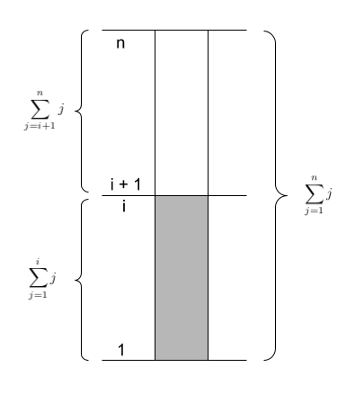

---
title: "Capítulo 3. Análisis de ciclos"
author: "Diego Munguía Molina ^[Esta obra está bajo una Licencia Creative Commons Atribución 4.0 Internacional.]"
date: "Febrero, 2019"
institute: "Ingeniería en Computación, TEC"
geometry: margin=1in
header-includes:
    - \usepackage{setspace}
    - \providecommand{\subtitle}[1]{\usepackage{titling} \posttitle{\par\large#1\end{center}}}
    - \usepackage[spanish]{babel}
    - \usepackage[linesnumbered,ruled,vlined,spanish,onelanguage]{algorithm2e}
    - \usepackage{amssymb}
    - \SetKwInput{KwInput}{Entradas}
    - \SetKwInput{KwOutput}{Salidas}
    - \newcommand{\twodots}{\mathrel{{.}\,{.}}\nobreak}
    - \newcommand{\assign}{\leftarrow}
output:
  pdf_document:
    latex_engine: xelatex
---

Iniciamos este capítulo recordando algunas de las conclusiones que alcanzamos en los capítulos anteriores. La aplicación del modelo RAM al análisis de consumo de recursos de tiempo y espacio de un algoritmo nos permite determinar funciones específicas $T(n)$ y $S(n)$. Sin embargo, resaltamos que prestaremos especial atención a la tasa de crecimiento de dichas funciones conforme crece el tamaño de la entrada $n$.

De esta forma, posterior a determinar cuál es la función $T(n)$ o $S(n)$, el siguiente paso en nuestro análisis es identificar el término de mayor crecimiento en su definición, para luego descartar cualquier constante en dicho término, y finalmente categorizar la función en alguna clase $\mathcal{O}$, $\Omega$, o $\Theta$.

Partiendo de estos hechos, podemos determinar también que la repetición es una de las principales fuentes de complejidad de un algoritmo. Por tanto debemos prestar especial atención a los constructos repetitivos implicados en el algoritmo que estemos analizando.

Uno de los errores más comúnes que cometemos al iniciar a estudiar y aplicar el análisis de algoritmos es asumir como regla general que cuando tenemos ciclos anidados, el número de repeticiones del ciclo más interno se multiplica por el número de repeticiones del ciclo que lo contiene. Esto puede ser cierto para algunos casos, más no para todos los casos posibles. En este capítulo estudiaremos algunos ejemplos comúnes de diferentes casos de anidamiento de ciclos y cómo éstos pueden afectar el comportamiento de los algoritmos.

## Ciclos anidados independientes ##

Consideremos en primera instancia el problema de multiplicar matrices cuadradas.

\begin{algorithm}[H]
    \DontPrintSemicolon
    \KwInput{Matrices $A$ y $B$ ambas de tamaño $n \times n$}
    \KwOutput{Una matriz $C$ de tamaño $n \times n$ tal que $C = A \cdot B$}
  
    \BlankLine
    \caption{Multiplicación de matrices cuadradas}
    \SetAlgoVlined
    
    $C \assign $ matriz $n \times n$ \\

    \For{$i \in [0 \twodots n[$}{
        \For{$j \in [0 \twodots n[$}{
            \For{$k \in [0 \twodots n[$}{
                $C_{ij} \assign C_{ij} + A_{ik} \cdot B_{kj}$
            }
        }
    }

    \KwRet{$C$}
\end{algorithm}

Analizaremos a continuación la complejidad temporal del algoritmo propuesto para resolver este problema. Notamos que incluye tres ciclos anidados que constituyen su principal fuente de complejidad. Observemos la definición de estos ciclos.

Podemos determinar de antemano que el ciclo más interno, localizado en la línea 4 y definido en términos de $k$, ejecutará $n$ repeticiones desde $k=0$ hasta $k=(n - 1)$. Las operaciones al interior de este ciclo incluyen asignaciones, accesos a memoria y operaciones aritméticas; no las tomaremos en cuenta ya que sabemos que serán representadas en $T(n)$ como una constante que eventualmente descartaremos.

Nos movemos ahora al siguiente ciclo de adentro hacia afuera. El ciclo de la línea 3 está definido en términos de $j$, y también ejecutará $n$ repeticiones desde $j=0$ hasta $j = (n - 1)$.

Finalmente, el ciclo de la línea 2, definido en términos de $i$ también ejecutará $n$ repeticiones desde $i = 0$ hasta $i = (n - 1)$.

Observamos para el ciclo $k$ en la línea 4, que ni su estado inicial ni su condición de parada dependen en ninguna forma de algún estado que cambie con cada iteración del ciclo $j$. Es decir, el ciclo $k$ es independiente del ciclo $j$, y es por esto que podemos determinar de antemano que ejecutará $n$ repeticiones indistintamente del comportamiento del ciclo $j$. Podemos realizar la misma afirmación para los ciclos $j$ e $i$.

Puesto que los ciclos son independientes, para determinar el número de repeticiones que ejecutará el algoritmo construimos el cálculo de adentro hacia afuera: (i) sabemos que el ciclo $k$ ejecutará $n$ repeticiones; (ii) por tanto el ciclo $j$ ejecutará $n$ veces las $n$ repeticiones del ciclo $k$; y finalmente (iii) el ciclo $i$ ejecutará $n$ veces las $n \cdot n$ repeticiones del ciclo $j$.

Otra manera de entender este comportamiento es formalizándolo como una serie de sumatorias.

$$
\begin{aligned}
\sum_{i=1}^{n} \sum_{j=1}^{n} \sum_{k=1}^{n} 1 = \\
\sum_{i=1}^{n} \sum_{j=1}^{n} n = \\
\sum_{i=1}^{n} \left( n \cdot \sum_{j=1}^{n} 1 \right) = \\
\sum_{i=1}^{n} n \cdot n = \\
\sum_{i=1}^{n} n^2 = \\
n^2 \sum_{i=1}^{n} 1 = \\
n^2 \cdot n = n^3
\end{aligned}
$$

De ambas formas obtenemos entonces que

$$
T(n) = n \cdot n \cdot n = \mathcal{O}(n^3)
$$

Podemos concluir que cuando tenemos ciclos anidados que __son independientes entre sí__ podemos calcuilar su número de repeticiones multiplicando el número de repeticiones del ciclo más interno por el número de repeticiones del ciclo que lo contiene.

## Ciclos anidados dependientes ##

Consideremos ahora el problema de ordenamiento. Queremos ordenar una secuencia de números enteros en forma ascendente. Podemos resolver este problema utilizando el algoritmo de ordenamiento por selección (_Selection Sort_).

\begin{algorithm}[H]
    \DontPrintSemicolon
    \KwInput{Una secuencia de $n$ enteros $A$ tal que $n \ge 1$ y $\forall i \in [0 \twodots (n-1)[$ se cumple que $a_i \le a_{i+1} \lor a_i \ge a_{i+1}$}
    \KwOutput{Una permutación de $A$, $A^\prime = [a_1, a_2, \dots, a_n]$ tal que $a_1 \le a_2 \le \dots \le a_n$}
  
    \BlankLine
    \caption{Ordenamiento por selección}
    \SetAlgoVlined
    
    \For{$i \in [0 \twodots (n - 1)[$} {
        $i_{min} \assign i$ \\
        \For{$j \in [(i+1) \twodots n[$} {
            \If{$A[j] < A[i_{min}]$} {
                $i_{min} \assign j$
            }
            
            \If{$i_{min} \neq i$} {
                $tmp \assign A[i]$ \;
                $A[i] \assign A[i_{min}]$ \;
                $A[i_{min}] \assign tmp$ \;
            }
        }
    }

\end{algorithm}

Para determinar la complejidad temporal del algoritmo de ordenamiento por selección, podemos iniciar por determinar qué hacer con los constructos condicionales de las líneas 4 y 6.

El problema con los condicionales es que es difícil saber de antemano cuándo se ejecutarán las operaciones contenidas dentro de ellos, pues dependen totalmente del contenido de la secuencia a ordenar y por tanto el número de posibilidades a considerar es simplemente inmanejable. Este tipo de análisis se pueden desarrollar utilizando teoría de probabilidades.

Sin embargo, en este caso particular los condicionales no serán un problema mayor, pues las operaciones que contienen son simples y por tanto en cualquier caso terminarán siendo representadas como una constante. Por esta razón podemos establecer que las líneas 4 a la 9 tienen, en conjunto, un costo constante de $1$. Siguiendo un razonamiento similar, también podemos decidir que no prestaremos atención a la línea 2.

Nos queda entonces la principal fuente de complejidad del algoritmo, los ciclos anidados de las líneas 1 y 3, los cuales llamaremos ciclo $i$ y ciclo $j$ respectivamente.

Si observamos la definición del ciclo $j$ notaremos que su rango de acción está definido en términos de $i$.

$$
j \in [(i+1) \twodots n[
$$

En este caso no podemos afirmar que los ciclos $j$ e $i$ sean independientes entre si. Es decir, la cantidad de repeticiones en cada ejecución del ciclo $j$ dependerá de la iteración en la cual se encuentre el ciclo $i$.

No podemos analizar a los ciclos dependientes de manera individual, en este caso debemos observar el comportamiento de ambos ciclos a la vez.

Observemos este comportamiento con más detalle. Supongamos que $n = 5$. La siguiente tabla resume el rango de índices de $j$ para cada iteración de $i$.

$i$      rango $j$    $j$         repeticiones de $j$
-----    ---------    --------    -------------------
`0`      `[1..5[`     `1,2,3,4`   4 veces
`1`      `[2..5[`     `2,3,4`     3 veces
`2`      `[3..5[`     `3,4`       2 veces
`3`      `[4..5[`     `4`         1 vez

¿Cuántas repeticiones ejecutarán los ciclos trabajando juntos? Para el caso particular de $n = 5$ podemos determinar a partir de la tabla que para la iteración de $i=0$ se ejecutarán $4$ repeticiones de $j$, luego $3$, luego $2$ y finalmente $1$. El número total de repeticiones será la suma del número de repeticiones de $j$ para cada repetición de $i$. También podemos expresar esta idea de la siguiente manera

$$
T(5) = 4 + 3 + 2 + 1
$$

Podemos comprobar rápidamente que para $n = 6$ el resultado sería

$$
T(6) = 5 + 4 + 3 + 2 + 1
$$

Y para $n = 7$

$$
T(7) = 6 + 5 + 4 + 3 + 2 + 1
$$

Podemos entonces generalizar el patrón de la siguiente forma

$$
T(n) = (n - 1) + (n - 2) + \dots + 2 + 1
$$

Y resumirlo como una sumatoria

$$
T(n) = \sum_{i=1}^{n-1} i
$$

Esta sumatoria representa una progresión aritmética, y podemos expresarla algebraicamente como un número triangular (ver Apéndice) de la siguiente manera

$$
T(n) = \frac{n(n-1)}{2} = \frac{n^2 - n}{2} = \frac{1}{2}n^2 - \frac{1}{2}n
$$

Por lo tanto podemos concluir que

$$
\therefore T(n) = \mathcal{O}(n^2)
$$

\begin{center}
  $\ast$~$\ast$~$\ast$
\end{center}

Analicemos ahora la complejidad temporal del siguiente programa.

```{#alg_foo .c .numberLines startFrom="1"}
int foo(int n) {
    int r = 0;
    for (int i = 1; i < n; i++) {
        for (int j = i + 1; j <= n; j++) {
            for (int k = 1; k <= j; k++) {
                r = r + 1;
            }
        }
    }

    return r;
}
```

Observamos que los ciclos anidados son la principal fuente de complejidad temporal y que además estos ciclos son dependientes entre si.

Podemos expresar entonces la función $T(n)$ como una serie de sumatorias anidadas.

$$
T(n) = \sum_{i=1}^{n-1} \sum_{j=i+1}^{n} \sum_{k=1}^{j} 1
$$

Podemos simplificar estas sumatorias hasta lograr una forma algebraica trabajando de adentro hacia afuera.

Iniciamos entonces con la sumatoria definida en términos de $k$.

$$
\sum_{k=1}^{j} 1
$$

En este caso observamos que la expresión sumará $j$ veces el $1$, por tanto

$$
\sum_{k=1}^{j} 1 = j
$$

Reemplazando en la ecuación original

$$
T(n) = \sum_{i=1}^{n-1} \sum_{j=i+1}^{n} j
$$

Nos enfocamos ahora en la sumatoria definida en términos de $j$.

$$
\sum_{j=i+1}^{n} j
$$

La figura $\ref{fig:sumatoria}$ nos presenta un posible acercamiento a la simplificación de esta sumatoria. En esta figura la barra completa representa la sumatoria que iría desde $1$ hasta $n$. Nuestra sumatoria en cuestión inicia en un índice mayor que $1$, por esta razón podemos representarla como la parte superior de la barra (la parte no sombreada).

{ height=300px }

El análisis de la figura nos permite observar que la siguiente relación es verdadera

$$
\sum_{j=1}^{n} j = \left( \sum_{j=1}^{i} j \right) + \left( \sum_{j=i+1}^{n} j \right)
$$

Y si despejamos

$$
\sum_{j=i+1}^{n} j = \left( \sum_{j=1}^{n} j \right) - \left( \sum_{j=1}^{i} j \right)
$$

Los dos términos a la derecha de la igualdad corresponden a progresiones aritméticas con diferentes límites superiores, las cuales podemos expresar algebraicamente.

$$
\sum_{j=i+1}^{n} j = \frac{n(n+1)}{2} - \frac{i(i+1)}{2}
$$

Si reemplazamos en la ecuación original

$$
T(n) = \sum_{i=1}^{n-1} \left( \frac{n(n+1)}{2} - \frac{i(i+1)}{2} \right)
$$

Distribuimos la sumatoria entre sus términos

$$
T(n) = \sum_{i=1}^{n-1} \frac{n(n+1)}{2} - \sum_{i=1}^{n-1} \frac{i(i+1)}{2}
$$

Y resolvemos primero el término de la izquierda.

$$
\sum_{i=1}^{n-1} \frac{n(n+1)}{2}
$$

Puesto que el cuerpo de la sumatoria está definido en términos de $n$ y no de $i$ lo consideramos constante y lo podemos sacar de la misma.

$$
\sum_{i=1}^{n-1} \frac{n(n+1)}{2} = \frac{n(n+1)}{2} \sum_{i=1}^{n-1} 1 = \frac{n(n+1)}{2} (n-1) = \frac{n(n+1)(n-1)}{2}
$$

Reemplazamos en la ecuación.

$$
T(n) = \frac{n(n+1)(n-1)}{2} - \sum_{i=1}^{n-1} \frac{i(i+1)}{2}
$$

Y resolvemos el término de la derecha.

$$
\sum_{i=1}^{n-1} \frac{i(i+1)}{2} = \sum_{i=1}^{n-1} \frac{i^2+i}{2} = \sum_{i=1}^{n-1} \left( \frac{i^2}{2}+\frac{i}{2} \right)
$$

Distribuimos la sumatoria entre sus términos.

$$
\sum_{i=1}^{n-1} \frac{i^2}{2} + \sum_{i=1}^{n-1} \frac{i}{2}
$$

En ambos términos podemos extraer las constantes.

$$
\frac{1}{2} \sum_{i=1}^{n-1} i^2 + \frac{1}{2} \sum_{i=1}^{n-1} i
$$

El término de la derecha es una progresión aritmética.

$$
\frac{1}{2} \sum_{i=1}^{n-1} i^2 + \frac{1}{2} \frac{n(n-1)}{2} = \frac{1}{2} \sum_{i=1}^{n-1} i^2 + \frac{n(n-1)}{4}
$$

Para resolver el término de la izquierda utilizamos el número piramidal cuadrado.

$$
\sum_{i=1}^{x} i^2 = \frac{x(x+1)(2x+1)}{6}
$$

De manera tal que obtenemos

$$
\frac{1}{2} \frac{(n-1)((n-1)+1)(2(n-1)+1)}{6} + \frac{n(n-1)}{4}
$$

Simplificando.

$$
\sum_{i=1}^{n-1} \frac{i(i+1)}{2} = \frac{n(n-1)(2n-1)}{12} + \frac{n(n-1)}{4}
$$

Reemplazamos en la ecuación

$$
T(n) = \frac{n(n+1)(n-1)}{2} - \frac{n(n-1)(2n-1)}{12} + \frac{n(n-1)}{4}
$$

En este caso no es necesario distribuir los factores de cada término para obtener un sólo polinomio. Podemos tratar cada término por separado, aplicando posteriormente las propiedades de $\mathcal{O}$.

$$
\begin{aligned}
T(n) = \mathcal{O}(n^3) - \mathcal{O}(n^3) + \mathcal{O}(n^2) \\
 = \mathcal{O}(n^3) + -1 \cdot \mathcal{O}(n^3) + \mathcal{O}(n^2) \\
 = \mathcal{O}(n^3) + \mathcal{O}(n^3) + \mathcal{O}(n^2) \\
 = \mathcal{O}(n^3 + n^3 + n^2) \\
 = \mathcal{O}(\max(n^3, n^3, n^2)) \\
\therefore T(n) = \mathcal{O}(n^3)
\end{aligned}
$$

## Ejercicios ##

1. Escriba un algoritmo para multiplicar matrices no cuadradas, ¿cuál es su complejidad temporal?

2. Analice la complejidad temporal del siguiente algoritmo.

\begin{algorithm}[H]
    \DontPrintSemicolon
    \KwInput{Una secuencia de $n$ enteros $A$ tal que $n \ge 1$ y $\forall i \in [0 \twodots (n-1)[$ se cumple que $a_i \le a_{i+1} \lor a_i \ge a_{i+1}$}
    \KwOutput{Una permutación de $A$, $A^\prime = [a_1, a_2, \dots, a_n]$ tal que $a_1 \le a_2 \le \dots \le a_n$}
  
    \BlankLine
    \caption{Ordenamiento burbuja}
    \SetAlgoVlined
    
    \For{$j \in [(n-1) \twodots 1]$} {
        \For{$i \in [0 \twodots j[$} {
            \If{$A[i] > A[i+1]$} {
                $tmp \assign A[i]$ \;
                $A[i] \assign A[i+1]$ \;
                $A[i+1] \assign tmp$ \;
            }
        }
    }

\end{algorithm}

3. Escriba un algoritmo con complejidad temporal $\mathcal{O}(n^2)$ y complejidad espacial $\mathcal{O}(n)$ para determinar si un arreglo de enteros contiene duplicados.

4. Dada una secuencia de enteros, donde cada elemento estará en el rango $[0 \twodots k]$, escriba un algoritmo con complejidad temporal $\mathcal{O}(n)$ para determinar si la secuencia contiene duplicados. ¿Cuál es la complejidad espacial de este algoritmo?

5. Escriba un algoritmo para determinar la moda en una secuencia de enteros, donde cada elemento estará en el rango $[0 \twodots k]$. La moda será el número que más se repita en la secuencia. Una secuencia puede tener múltiples modas. Calcule la complejidad temporal y espacial de este algoritmo.

6. Calcule la complejidad temporal del siguiente programa

```{#alg_goo .c }
    int goo(int n) {
        int r = 0;
        for (int i = 1; i <= n; i++) {
            for (int j = i; j <= 2*i; j++) {
                r = r + 1;
            }
        }

        return r;
    }
```

7. Escriba un programa iterativo en python para copiar una lista utilizando el método `append`. ¿Cuál es su complejidad espacial?

8. Escriba un programa iterativo en python para copiar una lista utilizando el operador `+` para concatenar listas. ¿Cuál es su complejidad espacial?

9. Escriba un programa recursivo de pila en python para copiar una lista utilizando el operador `+` para concatenar listas. ¿Cuál es su complejidad espacial?

## Apéndice. Progresión aritmética ##

Queremos demostrar que

\begin{equation}
\sum_{i=1}^{x} i = \frac{x(x+1)}{2}
\end{equation}

Llamemos $S$ a la sumatoria, observamos que

$$
S = \sum_{i=1}^{x} i = 1 + 2 + \dots + (x - 1) + x
$$

Sabemos además que la sumatoria $S$ ejecutará $x$ cantidad de iteraciones, o en otras palabras el número de términos en $S$ es $x$.

Si sumamos $S + S$ de la siguiente manera

\begin{tabular}{cccccccccccc}
  & S & = & 1 & + & 2 & + & \dots & + & (x -- 1) & + & x \\
+ & S & = & x & + & (x -- 1) & + & \dots & + & 2 & + & 1 \\
\hline
  & 2S & = & (x + 1) & + & (x + 1) & + & \dots & + & (x + 1) & + & (x + 1) \\
\end{tabular}

obtenemos $2S$.

Notemos que el número de términos de $2S$ es igual al número de términos de $S$, es decir $2S$ tiene $x$ términos. Entonces para $2S$ estamos sumando $x$ cantidad de veces el término $(x + 1)$.

Por tanto podemos simplificar la expresión

$$
2S = x(x+1)
$$

Si despejamos $S$

$$
S = \frac{x(x+1)}{2}
$$

Por lo tanto queda demostrado que

$$
\sum_{i=1}^{x} i = \frac{x(x+1)}{2}
$$

$\blacksquare$

Podemos utilizar este resultado para expresar esta progresión aritmética de manera algebraica para distintos límites superiores siempre y cuando sean estos finitos. Lo único que debemos hacer es reemplazar $x$ con el nuevo límite superior en ambos lados de la ecuación.

Por ejemplo, para el límite superior $5$ reemplazamos y simplificamos

$$
\sum_{i=1}^{5} i = \frac{5(5+1)}{2} = \frac{5 \cdot 6}{2} = \frac{30}{2} = 15
$$

Para el límite superior $n$

$$
\sum_{i=1}^{n} i = \frac{n(n+1)}{2}
$$

Para el límite superior $(n + 1)$

$$
\sum_{i=1}^{n + 1} i = \frac{(n + 1)((n + 1) + 1)}{2} = \frac{(n + 1)(n + 2)}{2}
$$

Y finalmente para el límite superior $(n - 1)$

$$
\sum_{i=1}^{n - 1} i = \frac{(n - 1)((n - 1) + 1)}{2} = \frac{n(n - 1)}{2}
$$

## Referencias ##

Murillo Tsijli M., González Argüello J.F. (2012) Teoría de los números. 2da ed. Cartago: Editorial Tecnológica.

Skiena S. (2010) The Algorithm Design Manual (2da ed.) Springer.
