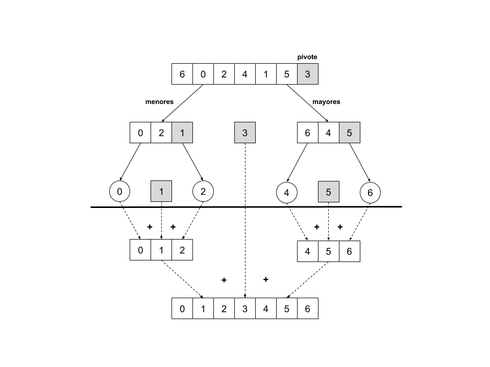
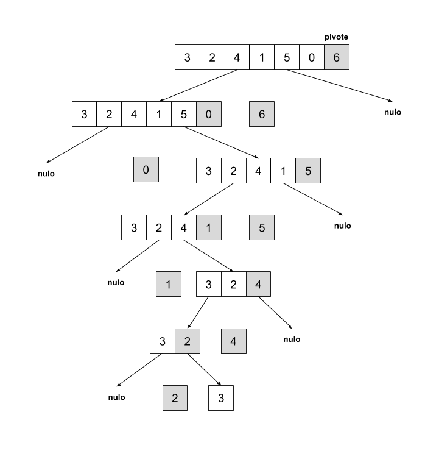
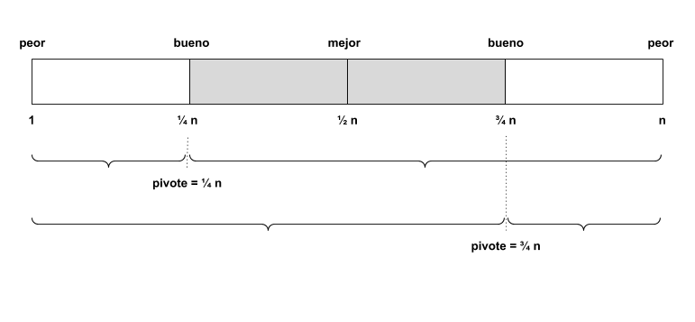

Divide y conquista es una técnica de diseño de algoritmos que permite resolver problemas complejos, partiéndolos repetidamente en problemas cada vez más pequeños, hasta llegar a problemas que son de trivial solución. Por ejemplo, consideremos la complejidad de ordenar una secuencia que contiene tan solo un elemento, o buscar un número en una secuencia que igualmente solo contiene un elemento. En el caso del ordenamiento, no hay nada que hacer, la secuencia de un elemento ya está en orden. En el caso de la búsqueda, la solución es trivial, hay que comparar el único elemento de la secuencia con el elemento buscado.

Aplicando esta técnica dividimos el problema en partes iguales, usualmente en mitades, cada una de estas mitades será ahora un subproblema. Tomemos por ejemplo el problema de ordenar una secuencia de $n$ números, si partimos la secuencia en dos obtendremos dos secuencias nuevas con aproximadamente $\frac{n}{2}$ elementos cada una. Ordenar una subsecuencia de estas es más sencillo que ordenar la secuencia completa simplemente porque contiene menos elementos, la mitad para ser precisos.

Posteriormente, resolvemos cada subproblema recursivamente aplicándoles a su vez divide y conquista. Una vez finalizada la llamada recursiva sobre cada subproblema tendremos dos subsecuencias debidamente ordenadas. Finalmente, juntamos las dos subsecuencias o soluciones parciales en una solución final.

Este último paso no necesariamente es trivial, por ejemplo si nuestras soluciones parciales son $[1, 3, 5]$ y $[2, 4, 6]$, la secuencia final no puede ser simplemente $[1, 3, 5, 2, 4, 6]$ pues no cumpliría con el orden requerido. El algoritmo de fusión de las soluciones parciales debe tener alguna lógica de selección para determinar que la secuencia final es $[1, 2, 3, 4, 5, 6]$. El supuesto del que partimos para que nuestro algoritmo divide y conquista tenga sentido, es que fusionar dos soluciones parciales es más sencillo que resolver el problema completo original; es decir, el hecho de que las subsoluciones ya estén en orden debería ser una ayuda para que el algoritmo que las junta en una solución final pueda actuar con eficiencia.

Por esta razón, la eficiencia de nuestro algoritmo divide y conquista dependerá de que la complejidad de juntar las soluciones parciales sea menor a la complejidad de solucionar cada subproblema.

## Búsqueda binaria ##

Consideremos el problema de buscar un número en una secuencia de números.

(@) **Problema**. Buscar la posición de un número en una secuencia de números.  
  **Entradas**. Una secuencia de números $A = [a_1, a_2, \dots, a_n]$ de tamaño $n$ tal que $A$ es una permutación aleatoria y un número $e$ tal que $e \in A \lor e \notin A$.  
  **Salida**. Un número natural $i$ tal que $i \le n$ y $a_i = e$, o $-1$ cuando $e \notin A$.

Dado que $A$ se encuentra en orden aleatorio no nos queda más remedio que resolver este problema con un algoritmo de búsqueda lineal que recorra la secuencia elemento por elemento hasta encontrar al elemento buscado $e$. En el peor caso de que $e \notin A$ el algoritmo tendrá una cota superior de complejidad temporal $\mathcal{O}(n)$.

Sin embargo, si modificamos ligeramente el problema estableciendo que la secuencia está ordenada, podemos aplicar la técnica de divide y conquista para recursivamente reducir el espacio de búsqueda de tamaño $n$ a un espacio de búsqueda de tamaño $1$. Buscar a $e$ en un $A^\prime$ tal que $|A^\prime| = 1$ es trivial, basta con preguntar si $a_1 = e$, esta pregunta tiene complejidad temporal $\mathcal{O}(1)$.

Estudiemos entonces el algoritmo de búsqueda binaria.

\begin{algorithm}[H]
    \DontPrintSemicolon
    \KwInput{Una secuencia de $n$ enteros $A = [a_0, a_1, \dots, a_{n-1}]$ tal que $a_0 \le a_1 \le \dots \le a_{n-1}$ y un número $e$ tal que $e \in A \lor e \notin A$}
    \KwOutput{Un número natural $i$ tal que $i < n$ y $a_i = e$, o $-1$ cuando $e \notin A$.}
  
    \BlankLine
    \caption{Búsqueda binaria}
    \SetAlgoVlined

    $inicio \assign 0$ \;
    $fin \assign n - 1$ \;

    \While{$inicio \le fin$} {
        $mitad \assign \left \lfloor{\frac{inicio + fin}{2}}\right \rfloor$ \;

        \If{$e = A[mitad]$} {
            \Return {$mitad$}
        } \ElseIf{$e < mitad$} {
            $fin \assign mitad - 1$ \;
        } \ElseIf{$e > mitad$} {
            $inicio \assign mitad + 1$ \;
        }
    }

    \Return{$-1$} \;
\end{algorithm}

Este algoritmo trabaja siempre sobre un espacio de búsqueda delimitado por los punteros ${inicio}$ y ${fin}$. Al principio estos punteros se colocan respectivamente sobre el primer y último elemento de la secuencia. Buscamos nuestro elemento $e$ en la mitad del espacio de búsqueda. Con suerte $e$ estará en la ${mitad}$, pero sino es el caso, tendremos entonces dos posibilidades: $e$ puede ser mayor que el número que está en la mitad del espacio de búsqueda, o $e$ puede ser menor.

Cuando $e$ es mayor que el número en la mitad del espacio de búsqueda podemos concluir definitivamente que es imposible encontrar a $e$ en una posición anterior a la mitad ya que sabemos que la secuencia está ordenada ascendentemente. De esta forma podemos descartar todo el espacio de búsqueda a la izquierda de la mitad, corriendo al puntero ${inicio}$ a la derecha de ${mitad}$. Reducimos de esta forma el espacio de búsqueda en aproximadamente $\frac{n}{2}$ y repetimos el proceso.

De manera análoga, cuando $e$ es menor que el número a la mitad del espacio de búsqueda, podemos descartar todo el espacio de búsqueda a la derecha de la mitad, efectivamente disminuyendo a la mitad el espacio de búsqueda.

¿Cuál es la complejidad temporal de este algoritmo? El número de repeticiones del algoritmo depende del contenido de la secuencia $A$ y por tanto debemos hacer un análisis por casos.

### Peor y mejor caso ###

En el mejor de los casos, el número $e$ se encontrará en la mitad de la secuencia. En este caso, el algoritmo se detendrá en la primera iteración. El mejor caso tiene entonces una complejidad temporal de $\mathcal{O}(1)$.

$$
\therefore T_{mejor}(n) = \mathcal{O}(1)
$$

En el peor de los casos, el número $e$ no estará en la secuencia $A$. En este caso, tendremos que dividir a la mitad el espacio de búsqueda una cantidad determinada de veces hasta obtener un espacio de tamaño $1$ y determinar que el número $e$ no se encuentra en la lista.

¿Cuántas veces podemos dividir $n$ entre $2$ hasta obtener un espacio de tamaño $1$?

Observemos que después de la primera iteración tendremos un espacio de tamaño $\frac{n}{2}$. En la siguiente iteración tendremos

$$
\frac{\frac{n}{2}}{2} = \frac{\frac{n}{2}}{\frac{2}{1}} = \frac{n}{4}
$$

Y en la siguiente iteración

$$
\frac{\frac{n}{4}}{2} = \frac{n}{8}
$$

En términos generales, para la i-ésima iteración tenemos que

$i$      tamaño
-----    --------
`0`      $n$
`1`      $\frac{n}{2}$
`2`      $\frac{n}{4}$
`3`      $\frac{n}{8}$
$\vdots$ 
`i`      $\frac{n}{2^i}$

Podemos replantear nuestra pregunta ¿cuántas veces podemos dividir n entre 2 hasta obtener un espacio de tamaño 1?, como la siguiente ecuación

$$
\frac{n}{2^i} = 1
$$

Siendo $i$ la cantidad de veces que podemos dividir el espacio de búsqueda entre dos hasta obtener un espacio de búsqueda de tamaño $1$.

Si despejamos $i$ obtenemos

$$
\begin{aligned}
\frac{n}{2^i} &= 1 \\
n &= 2^i \\
i &= \log_2(n) \\
\end{aligned}
$$

Podemos, entonces, expresar el peor caso como

$$
\begin{aligned}
&T_{peor}(n) = \log_2(n) + 1 \\
\therefore &T_{peor}(n) = \mathcal{O}(\log n)
\end{aligned}
$$

### Caso promedio ###

Para estimar el caso promedio, primero establecemos algunos puntos de partida. Supongamos una distribución uniforme de los valores en la secuencia que constituye el espacio de búsqueda, es decir todas las posiciones son equiprobables. Supongamos también que $e \in A$.

Definimos la variable discreta aleatoria $X$ como el número de iteraciones necesarias para encontrar la posición de $e$ en $A$. Analicemos ahora las probabilidades para los distintos valores de $X$. 

Para encontrar $e$ en la primera iteración, tendría que estar en la mitad de la secuencia. Sólo hay una posición entre $n$ que cumple con esta condición, por tanto

$$
P(X = 1) = \frac{1}{n}
$$

Para encontrar $e$ en la segunda iteración hay dos posibilidades. Después de haber partido el espacio de búsqueda en la primera iteración, el elemento $e$ podría estar en la mitad del subespacio de búsqueda izquierdo, o podría estar en la mitad del subespacio derecho. Por tanto

$$
P(X = 2) = \frac{2}{n}
$$

Para encontrar $e$ en la tercera iteración hay cuatro posibilidades, la primera iteración parte el espacio de búsqueda en dos, la segunda iteración a su vez parte los dos subespacios en dos partes más cada uno. Tenemos entonces que

$$
P(X = 3) = \frac{4}{n}
$$

Observamos entonces un patrón que podemos generalizar para la i-ésima iteración de la siguiente manera

$$
P(X = i)= \frac{2^{i-1}}{n}
$$

Para estimar el caso promedio necesitamos determinar la expectativa para $X$. Recordemos además que el número máximo de iteraciones posibles antes de agotar el espacio de búsqueda es $\log_2 n$.

$$
\begin{aligned}
T_{prom}(n) &= E[X] \\
 &= \sum_{i=1}^{\log_{2}n} i \frac{2^{i-1}}{n} \\
 &= \frac{1}{n} \sum_{i=1}^{\log_{2}n} i 2^{i-1} \\
\end{aligned}
$$

Resolvamos la sumatoria antes de volver a $T_{prom}(n)$. Reemplazamos $\log_2 n$ con $k$.

$$
\begin{aligned}
\sum_{i=1}^{k} i 2^{i-1}
\end{aligned}
$$

Podemos cambiar los límites de la sumatoria para obtener las formas de la serie geométrica.

$$
\begin{aligned}
\sum_{i=1}^{k} i 2^{i-1} = \sum_{i=0}^{k-1} (i + 1) 2^i
\end{aligned}
$$

Si distribuimos los términos

$$
\begin{aligned}
\sum_{i=0}^{k-1} (i + 1) 2^i &= \sum_{i=0}^{k-1} i 2^i + 2^i \\
 &= \sum_{i=0}^{k-1} i 2^i + \sum_{i=0}^{k-1} 2^i \\
\end{aligned}
$$

Ambas sumatorias son formas de series geométricas para las que ya conocemos los siguientes resultados

\begin{equation}
\sum_{i=0}^{n} c^i = \frac{c^{n+1}-1}{c-1}, c \neq 1
\end{equation}

\begin{equation}
\sum_{i=0}^{n} i c^i = \frac{nc^{n+2}-(n+1)c^{n+1}+c}{(c-1)^2}, c \neq 1
\end{equation}

Reemplazando valores, tenemos que

$$
\begin{aligned}
\sum_{i=0}^{k-1} i 2^i &= \frac{(k-1)2^{(k-1)+2}-((k-1)+1)2^{(k-1)+1}+2}{(2-1)^2} \\
 &= (k-1) 2^{k+1} - k 2^k + 2 \\
 &= (k-1) 2^k 2 - k 2^k + 2
\end{aligned}
$$

Y también que

$$
\begin{aligned}
\sum_{i=0}^{k-1} 2^i &= \frac{2^{(k-1)+1}-1}{2-1} \\
 &= 2^k - 1 \\
\end{aligned}
$$

Si volvemos a nuestra expresión original en términos de $k$ tenemos entonces que

$$
\begin{aligned}
\sum_{i=1}^{k} i 2^{i-1} &= \sum_{i=0}^{k-1} i 2^i + \sum_{i=0}^{k-1} 2^i \\
 &= (k-1) 2^k 2 - k 2^k + 2 + 2^k - 1 \\
 &= (k-1) 2^k 2 - k 2^k + 2^k + 1 \\
 &= 2^k(2(k-1) - k + 1) + 1 \\
 &= 2^k(2k - 2 - k + 1) + 1 \\
 &= 2^k(k - 1) + 1 \\
\end{aligned}
$$

Si restauramos el valor de $k$ a $log_2 n$

$$
\begin{aligned}
\sum_{i=1}^{\log_{2}n} i 2^{i-1} &= 2^{\log_2 n}({\log_2 n} - 1) + 1\\
 &= n({\log_2 n} - 1) + 1\\
 &= n \log_2 n - n + 1\\
\end{aligned}
$$

Si retornamos a $T_{prom}(n)$

$$
\begin{aligned}
T_{prom}(n) &= \frac{1}{n} \sum_{i=1}^{\log_{2}n} i 2^{i-1} \\
 &= \frac{1}{n} \cdot (n \log_2 n - n + 1) \\
 &= \frac{1}{n} \cdot \mathcal{O}(n \log_2 n) \\
 &= \mathcal{O}(\frac{n \log_2 n}{n}) \\
 &= \mathcal{O}(\log_2 n) \\
 \therefore T_{prom}(n) &= \mathcal{O}(\log n) \\
\end{aligned}
$$

### Síntesis ###

La búsqueda binaria es un algoritmo muy eficiente para recuperar datos, y es aplicado en distintas estructuras de datos como árboles de búsqueda binaria o *b-trees* utilizadas como índices de búsqueda en herramientas de software para manejo de datos como motores de búsqueda y bases de datos.

La importancia de este algoritmo resalta a su vez la importancia de los algoritmos de ordenamiento. Lograr búsquedas eficientes depende de que podamos mantener nuestros datos en orden también de manera eficiente.

## Quicksort ##

Siguiendo esta línea estudiamos ahora otro caso interesante de un algoritmo divide y conquista, el algoritmo *Quicksort* para resolver el problema de ordenamiento.

\begin{algorithm}[H]
    \DontPrintSemicolon
    \KwInput{Una secuencia de $n$ enteros $A$ tal que $n \ge 1$ y $\forall i \in [0 \twodots (n-1)[$ se cumple que $a_i \le a_{i+1} \lor a_i \ge a_{i+1}$}
    \KwOutput{Una permutación de $A$, $A^\prime = [a_1, a_2, \dots, a_n]$ tal que $a_1 \le a_2 \le \dots \le a_n$}
  
    \BlankLine
    \caption{Quicksort}
    \SetAlgoVlined

    \If{$n \leq 1$} {
        \Return{$A$} \:
    }

    $pivote \assign A[n-1]$ \;
    $menores, mayores \assign \Particionar(A, pivote)$ \;

    $menores^\prime \assign \Quicksort(menores)$ \;
    $mayores^\prime \assign \Quicksort(mayores)$ \;

    $ordenada \assign menores^\prime + pivote + mayores^\prime$ \;

    \Return{$ordenada$} \;
\end{algorithm}

\begin{algorithm}[H]
    \DontPrintSemicolon
    \KwInput{Una secuencia de $n$ enteros $A$ y un número entero $pivote$}
    \KwOutput{Un par de secuencias $(m, M)$ donde $m \subseteq A$ y $\forall e \in m, e < pivote$; y $M \subseteq A$ y $\forall e \in M, e \geq pivote$}
  
    \BlankLine
    \caption{Particionar}
    \SetAlgoVlined

    $mayores \assign [\ ]$ \;
    $menores \assign [\ ]$ \;

    \For{$i \in [0, n-1[$} {
        \If{$A[i] < pivote$} {
            $menores \twoheadleftarrow A[i]$ \;
        } \Else {
            $mayores \twoheadleftarrow A[i]$ \;
        }
    }

    \Return{$(menores, mayores)$}
\end{algorithm}

Este algoritmo trabaja partiendo la secuencia a ordenar en dos partes con base en un valor de pivote tomado del contenido mismo de la secuencia (*Quicksort* línea 3). Dado que la secuencia es una permutación aleatoria el pivote puede ser cualquier elemento; particularmente en nuestro algoritmo siempre se toma el último elemento de la secuencia como pivote.

La partición del problema en subproblemas se hace comparando cada elemento de la secuencia con el pivote (*Particionar* líneas 3-7), generando dos nuevas subsecuencias, una que contiene todos los elementos que son menores al pivote y otra que contiene todos los elementos que son mayores o iguales al pivote. Este proceso de subdivisión se repite recursivamente hasta que ya no se pueda particionar más las secuencias; estas últimas subsecuencias(de tamaño $n \le 1$) ya estarán ordenadas por si mismas y por tanto no requieren de más trabajo.

Cada subproblema es entonces tratado con el mismo algoritmo recursivamente (*Quicksort* lineas 5-6), de manera tal que al final de la primera llamada tendremos el pivote, la subsecuencia de elementos menores al pivote ya ordenada, y la subsecuencia de elementos mayores o iguales al pivote también ordenada. El último paso es entonces volver a unir la secuencia colocando al pivote en el centro, a las menores a la izquierda del pivote y a las mayores a su derecha (*Quicksort* línea 7).

La figura $\ref{fig:quicksort_mejor}$ ilustra el comportamiento del algoritmo. Como podemos observar, el algoritmo recursivo genera un árbol de llamadas donde cada nodo corresponde a la secuencia que debe ser ordenada en dicha llamada. Los nodos circulares son las hojas del árbol, representan los casos triviales de ordenamiento, las secuencias de tamaño $n \leq 1$.

Para analizar la complejidad temporal de este algoritmo, debemos primero observar que el número de repeticiones viene dado por el número de llamadas a la función recursiva. También es importante notar que el número de llamadas recursivas va a dependender del contenido de la secuencia a ordenar, específicamente del pivote que se elija. Podemos replantear el análisis preguntándonos ¿cuántas veces podemos particionar la secuencia en las subsecuencias de $mayores$ y $menores$ hasta obtener secuencias de tamaño $n \leq 1$?

Dado que el comportamiento del algoritmo depende del pivote que escojamos, debemos hacer un análisis de casos para responder a la pregunta.

### Mejor caso ###

El mejor caso es precisamente el que se nos presenta en la figura $\ref{fig:quicksort_mejor}$. En este caso, siempre escogemos a la mediana[^1] de la secuencia como pivote, de esta forma la secuencia se particiona en dos subsecuencias de aproximadamente tamaño $\frac{n}{2}$ cada una.

[^1]: https://es.wikipedia.org/wiki/Mediana_(estad%C3%ADstica)

Como resultado, obtenemos un árbol de llamadas balanceado de altura $h$, a partir del cual establecemos que se realizarán $2h$ llamadas. Para determinar la altura del árbol, nos preguntamos cuántas veces podemos dividir la secuencia entre dos hasta obtener secuencias de tamaño $n=1$. El razonamiento es semejante al que realizamos durante el análisis de la búsqueda binaria, y por tanto concluimos que

$$
h = \left \lceil{\log_2 n}\right \rceil
$$

Debemos tomar en cuenta que en cada llamada se particiona la secuencia (*Quicksort* línea 4) y también se concatenan las subsecuencias ya ordenadas (*Quicksort* línea 7). Estas dos operaciones tienen complejiad lineal $\mathcal{O}(n)$ cada una.

Podemos plantear entonces al mejor caso de la siguiente manera

$$
\begin{aligned}
T_{mejor}(n) &= 2h \cdot (\mathcal{O}(n) + \mathcal{O}(n)) \\
 & = 2 \left \lceil{\log_2 n}\right \rceil \cdot \mathcal{O}(n) \\
 & = \mathcal{O}(\log n) \cdot \mathcal{O}(n) \\
 & = \mathcal{O}(n \log n) \\
 \therefore T_{mejor}(n) &= \mathcal{O}(n \log n)
\end{aligned}
$$

### Peor caso ###

El peor caso se da cuando elegimos siempre como pivote al máximo o mínimo de la secuencia. En este caso siempre partiremos la secuencia en dos subsecuencias, una de tamaño $n - 1$ y otra de tamaño $0$; este comportamiento se ilustra en la figura $\ref{fig:quicksort_peor}$

Cuando esto sucede el árbol adquiere más bien una forma secuencial, más semejante a una lista enlazada que a un árbol. Tenemos entonces que nuestro árbol de llamadas tendrá una altura

$$
h = n
$$

Y por lo tanto, podemos establecer la función para el peor caso como

$$
\begin{aligned}
T_{peor}(n) &= h \cdot (\mathcal{O}(n) + \mathcal{O}(n)) \\
 &= n \cdot (\mathcal{O}(n) + \mathcal{O}(n)) \\
 &= n \cdot \mathcal{O}(n) \\
 &= \mathcal{O}(n) \cdot \mathcal{O}(n) \\
 &= \mathcal{O}(n \cdot n) \\
 &= \mathcal{O}(n^2) \\
\therefore T_{peor}(n) &= \mathcal{O}(n^2)
\end{aligned}
$$

Cuando aplicamos *Quicksort* a una lista ya ordenada podemos esperar el peor caso. Por tanto, también podemos esperar comportamientos ineficientes con listas parcialmente ordenadas.

### Caso promedio ###

Para el caso promedio haremos un análisis intuitivo. Como ya sabemos, el comportamiento del algoritmo dependerá del pivote que elijamos dentro de la secuencia.

Tomemos entonces nuestra permutación desordenada y coloquemos los posibles pivotes en orden, obtenemos entonces una distribución tal como se nos presenta en la figura $\ref{fig:quicksort_promedio}$.

El área sombreada representa una selección de pivotes que son *suficientemente buenos*, es decir no son exactamente la mediana (que nos produciría el mejor caso), pero están suficientemente cerca de ella como para producir particiones más o menos balanceadas; y al mismo tiempo, están lo suficientemente lejos de los pivotes mínimo y máximo responsables de producir el peor caso.

El área sombreada representa la mitad del total de la distribución de pivotes. Es decir, hay una probabilidad de $\frac{\frac{n}{2}}{n}=\frac{1}{2}$ de escoger un pivote suficientemente bueno, mientras que tenemos probabilidades de $\frac{1}{n}$ de escoger el pivote para el mejor caso y $\frac{2}{n}$ de escoger los pivotes para el peor caso.

¿Cómo se comporta el algoritmo cuando escogemos un pivote suficientemente bueno? Para responder a la pregunta, tomemos en cuenta los extremos del grupo de pivotes suficientemente buenos, $\frac{1}{4} n$ y $\frac{3}{4} n$. Si escogemos cualquiera de estos dos pivotes, terminaremos con dos particiones, una de tamaño $\frac{1}{4} n$ y la otra de tamaño $\frac{3}{4} n$.

La partición más grande ($\frac{3}{4} n$) será la que termine determinando la altura del árbol de llamadas. Para determinar la altura del árbol, nos hacemos la ya conocida pregunta de ¿cuántas veces podemos dividir en tres cuartos el espacio de ordenamiento hasta obtener subsecuencias de tamaño $1$?

$$
\begin{aligned}
(\frac{3}{4})^i n &= 1 \\
n &= (\frac{4}{3})^i \\
i &= \log_{\frac{4}{3}}(n) \\
\end{aligned}
$$

Es importante notar que en este punto sólo hemos resuelto parte del problema. Recordemos que tenemos la misma probabilidad de escoger un pivote suficientemente bueno que un pivote malo (representados como el área no sombreada de la figura $\ref{fig:quicksort_promedio}$). ¿Qué pasa cuando escogemos un pivote malo?

Los pivotes malos producirán particiones de tamaños aproximados a $n$ y $0$. Puesto que tanto los pivotes malos como los buenos tienen la misma probabilidad, podemos esperar que aproximadamente el recorrido del algoritmo pase por aproximadamente la misma cantidad de pivotes buenos que de pivotes malos. De esta forma, podemos esperar que la escogencia de pivotes malos duplique la altura que tendría el árbol si sólo escogiéramos pivotes buenos. Tenemos entonces que

$$
\begin{aligned}
h &= 2 \log_{\frac{4}{3}}(n) \\
\end{aligned}
$$

A partir de este resultado podemos construir nuestra formulación para el caso promedio del *Quicksort*

$$
\begin{aligned}
T_{prom}(n) &= 2 \log_{\frac{4}{3}}(n) \cdot (\mathcal{O}(n) + \mathcal{O}(n)) \\
 &= \mathcal{O}(\log n) \cdot \mathcal{O}(n) \\
 &= \mathcal{O}(n \log n) \\
 \therefore T_{prom}(n) &= \mathcal{O}(n \log n)
\end{aligned}
$$

### Análisis de complejidad espacial ###

Podemos observar que en cada llamada al algoritmo *Particionar* estamos duplicando la secuencia, pues es claro que

$$
|A| = |mayores| + |menores|
$$

Es seguro asumir entonces que en cada nivel del árbol estaremos creando $n$ nuevas casillas de memoria, podemos entonces establecer el siguiente patrón para la complejidad espacial del *Quicksort*.

$$
S(n) = h \cdot \mathcal{O}(n)
$$

Por tanto podemos esperar las siguientes complejidades espaciales para la versión actual de nuestro algoritmo de *Quicksort*.

$$
\begin{aligned}
S_{mejor}(n) &= 2 \log_2 n \cdot \mathcal{O}(n) = \mathcal{O}(n \log n) \\
S_{peor}(n) &= n \cdot \mathcal{O}(n) = \mathcal{O}(n^2) \\
S_{prom}(n) &= 2 \log_{\frac{4}{3}} n \cdot \mathcal{O}(n) = \mathcal{O}(n \log n) \\
\end{aligned}
$$

Con el fin de hacer un mejor uso de la memoria, se presenta a continuación una versión del *Quicksort* que realiza las particiones en sitio en la misma secuencia que entra como argumento a la función, evitando así gastar memoria de más al crear nuevas subsecuencias.

\begin{algorithm}[H]
    \DontPrintSemicolon
    \KwInput{Una secuencia de $n$ enteros $A$ tal que $n \ge 1$ y $\forall i \in [0 \twodots (n-1)[$ se cumple que $a_i \le a_{i+1} \lor a_i \ge a_{i+1}$, dos punteros $inicio$ y $fin$ tal que $inicio \in [0 \twodots n[ \land fin \in [0 \twodots n[$}
    \KwOutput{Una permutación de $A$, $A^\prime = [a_1, a_2, \dots, a_n]$ tal que $a_1 \le a_2 \le \dots \le a_n$}
  
    \BlankLine
    \caption{Quicksort en sitio}
    \SetAlgoVlined

    \If{$fin > inicio$} {
        $pivote \assign \Particionar(A, inicio, fin)$ \;
        $\Quicksort(A, inicio, pivote - 1)$ \;
        $\Quicksort(A, pivote + 1, fin)$ \;
    }
\end{algorithm}

\begin{algorithm}[H]
    \DontPrintSemicolon
    \KwInput{Una secuencia de $n$ enteros $A$, dos punteros $inicio$ y $fin$ tal que $inicio \in [0 \twodots n[ \land fin \in [0 \twodots n[$}
    \KwOutput{Un puntero $pivote$ tal que $pivote \in [inicio \twodots fin]$ y $\forall m \in [inicio \twodots pivote[, a_m < a_{pivote}$ y $\forall M \in ]pivote \twodots fin], a_M \geq a_{pivote}$}
  
    \BlankLine
    \caption{Particionar en sitio}
    \SetAlgoVlined

    $pivote \assign fin$ \;
    $mayores \assign inicio$ \;

    \For{$i \in [inicio \twodots fin[$} {
        \If{$A[i] < A[pivote]$} {
            $tmp \assign A[i]$ \;
            $A[i] \assign A[mayores]$ \;
            $A[mayores] \assign tmp$ \;

            $mayores \assign mayores + 1$ \;
        }

        $tmp \assign A[pivote]$ \;
        $A[pivote] \assign A[mayores]$ \;
        $A[mayores] \assign tmp$ \;
    }

    \Return{$mayores$} \;
\end{algorithm}

Se puede demostrar que esta versión del algoritmo mantiene las mismas complejidades temporales para los casos peor, mejor y promedio que nuestro algoritmo original. Por otro lado, en términos de complejidad espacial, este algoritmo trabaja únicamente con la secuencia que entra como argumento. Sin embargo, no debemos perder de vista que también cada llamada recursiva tiene un costo de memoria. Tenemos entonces las siguientes complejidades espaciales para cada caso

$$
\begin{aligned}
S_{mejor}(n) &= 2 \log_2 n + \mathcal{O}(n) = \mathcal{O}(\log n) + \mathcal{O}(n) = \mathcal{O}(n) \\
S_{peor}(n) &= n + \mathcal{O}(n) = \mathcal{O}(n) + \mathcal{O}(n) = \mathcal{O}(n) \\
S_{prom}(n) &= 2 \log_{\frac{4}{3}} n + \mathcal{O}(n) = \mathcal{O}(\log n) + \mathcal{O}(n) = \mathcal{O}(n) \\
\end{aligned}
$$

### Síntesis ###

El *Quicksort* es un algoritmo para el cuál podemos esperar, en promedio, un comportamiento eficiente. Una correcta escogencia del pivote es vital para lograr este comportamiento deseable.

Si el pivote se toma siempre de la misma posición —como es el caso de nuestras versiones de los algoritmos, que siempre toman el pivote de la última posición de la secuencia— entonces el algoritmo no tendrá buen comportamiento con secuencias ya ordenadas o parcialmente ordenadas; una manera de minimizar este problema es tomando el pivote al azar en cada iteración, aunque aún así no hay garantía de que el peor caso sea imposible.

En secuencias pequeñas, el costo espacial extra de $\mathcal{O}(\log n)$ provocado por las llamadas recursivas, así como el tiempo extra requerido para administrar esta memoria, podría impactar negativamente el rendimiento general del algoritmo.

Por esto, otra posible optimización a considerar es que cuando el subproblema llegue a un tamaño $t$ considerado suficientemente pequeño, en lugar de continuar aplicando la estrategia divide y conquista, más bien aplique otro algoritmo de ordenamiento que sepamos funciona bien con secuencias pequeñas, por ejemplo el ordenamiento por inserción.

## Ejercicios ##

1. Escriba un algoritmo para encontrar la moda de una secuencia de números con complejidad temporal $\mathcal{O}(n \log n)$ y complejidad espacial $S(n) < 2n$.

\begin{comment}
Este es una modificación de Skiena 4.5
\end{comment}

2. Calcule la complejidad temporal y espacial del siguiente algoritmo. ¿Presenta este algoritmo casos? (**Nota**: los operadores $\twoheadleftarrow$ y $\twoheadrightarrow$ se leen respectivamente como "encolar" y "desencolar")

\begin{algorithm}[H]
    \DontPrintSemicolon
    \KwInput{Una secuencia de $n$ enteros $A$ tal que $n \ge 1$ y $\forall i \in [0 \twodots (n-1)[$ se cumple que $a_i \le a_{i+1} \lor a_i \ge a_{i+1}$, dos punteros $inicio$ y $fin$ tal que $inicio \in [0 \twodots n[ \land fin \in [0 \twodots n[$}
    \KwOutput{Una permutación de $A$, $A^\prime = [a_1, a_2, \dots, a_n]$ tal que $a_1 \le a_2 \le \dots \le a_n$}
  
    \BlankLine
    \caption{Mergesort}
    \SetAlgoVlined

    \If{$fin > inicio$} {
        $mitad \assign \left \lfloor{\frac{inicio + fin}{2}}\right \rfloor$ \;
        $\Mergesort(A, inicio, mitad)$ \;
        $\Mergesort(A, mitad + 1, fin)$ \;
        $\Fusionar(A, inicio, mitad, fin)$ \;
    }
\end{algorithm}

\begin{algorithm}[H]
    \DontPrintSemicolon
    \KwInput{Una secuencia de $n$ enteros $A$, y tres punteros $inicio$, $mitad$ y $fin$ tal que $0 \leq inicio \leq mitad \leq fin < n$}
    \KwOutput{Una permutación de $A$ tal que $\forall i \in [inicio \twodots fin[, a_i \leq a_{i+1}$}
  
    \BlankLine
    \caption{Fusionar}
    \SetAlgoVlined

    $izquierda \assign \Cola(\varnothing)$ \;
    $derecha \assign \Cola(\varnothing)$ \;

    \For{$i \in [inicio \twodots mitad]$} {
        $izquierda \twoheadleftarrow A[i]$ \;
    }

    \For{$i \in [mitad+1 \twodots fin]$} {
        $derecha \twoheadleftarrow A[i]$ \;
    }

    $i \assign inicio$ \;
    \While{$\lnot(izquierda = \varnothing \lor derecha = \varnothing)$} {
        \If{$\Cabeza(izquierda) \leq \Cabeza(derecha)$} {
            $izquierda \twoheadrightarrow A[i]$
        } \Else {
            $derecha \twoheadrightarrow A[i]$
        }
        $i \assign i + 1$ \;
    }

    \While{$izquierda \neq \varnothing$} {
        $izquierda \twoheadrightarrow A[i]$ \;
        $i \assign i + 1$ \;
    }

    \While{$derecha \neq \varnothing$} {
        $derecha \twoheadrightarrow A[i]$ \;
        $i \assign i + 1$ \;
    }
\end{algorithm}

3. Suponga que ud tiene una secuencia ordenada $A$ de $n$ números que ha sido rotada circularmente $k$ posiciones a la derecha, por ejemplo $A = [4, 1, 2, 3]$ donde $k = 1$, o $A = [5, 6, 7, 8, 9, 0, 1, 2, 3, 4]$ donde $k = 5$, o $A = [6, 7, 8, 9]$ con $k = 0$. Inspirándose en el algoritmo de búsqueda binaria, diseñe un algoritmo con complejidad temporal $\mathcal{O}(\log n)$ para determinar el valor de $k$ dada una secuencia $A$ que cumple con las condiciones anteriores.

\begin{comment}
Skiena 4.31
\end{comment}

4. Utilice la idea de *Particionar* para diseñar un algoritmo que encuentre la mediana de una secuencia de $n$ enteros con complejidad temporal $\mathcal{O}(n)$. (**Pista**: tome en cuenta que este problema se puede parafrasear como encontrar el $k$-ésimo elemento más grande en la secuencia con $k = \frac{n}{2}$).

\begin{comment}
Skiena 4.16
\end{comment}

## Apéndice. Teorema maestro ##

El teorema maestro ofrece un mecanismo rápido para analizar algoritmos divide y conquista. Este teorema se basa en la aplicación de relaciones de recurrencia, por tanto haremos una introducción a este tema antes de iniciar la discusión sobre el teorema maestro.

### Relaciones de recurrencia ###

Las relaciones de recurrencia son ecuaciones que permiten definir una secuencia de valores. Estas secuencias parten desde uno o más valores iniciales y cada valor no inicial es calculado recursivamente con base en uno o más valores anteriores.

Tomemos por ejemplo la relación de recurrencia $C$.

$$
\begin{aligned}
C_1 &= 1 \\
C_n &= 1 + C_{n-1}
\end{aligned}
$$

Esta relación define la secuencia

$$
1, 2, 3, 4, 5, 6, 7, 8, 9, 10, 11, \dots
$$

En esta secuencia cada valor $i$, excepto por el primero, es calculado sumándole $1$ al valor inmediato anterior. De esta forma, si definimos una función recursiva $c$ con base en esta secuencia

$$
c(n) =
\begin{cases}
      1 & n = 1 \\
      1 + c(n - 1) & n > 1 \\
\end{cases}
$$

obtenemos que $c(k) = k$.

De manera similar, podemos definir la función exponencial $2^n$ con la relación de recurrencia

$$
\begin{aligned}
E_1 &= 2 \\
E_n &= 2 E_{n-1}
\end{aligned}
$$

O finalmente, la función factorial $n!$ como

$$
\begin{aligned}
F_1 &= 1 \\
F_n &= n F_{n-1}
\end{aligned}
$$

### Análisis de algoritmos recursivos ###

Podemos utilizar las relaciones de recurrencia para analizar el tiempo de ejecución de algoritmos recursivos. Podemos describir la función $T(n)$ como una recurrencia en términos del tiempo de ejecución de los subproblemas recursivos y alguna constante.

Consideremos por ejemplo la función recursiva que calcula el factorial. Podemos declarar su función $T(n)$ como

$$
\begin{aligned}
T(n) = T(n-1) + c
\end{aligned}
$$

Donde $T(n-1)$ corresponde al tiempo que toma ejecutar la llamada recursiva, mientras que $c$ corresponde al tiempo requerido para ejecutar el resto de operaciones en la llamada actual. 

Una vez establecida la relación de recurrencia, podemos reducirla reemplazando el término $T(n-1)$ de la llamada recursiva por la definición de $T(n)$ y reemplazando el argumento $n$ por $n-1$.

$$
\begin{aligned}
T(n) &= T(n-1) + c \\
 &= (T((n-1)-1) + c) + c \\
 &= (T(n-2) + c) + c \\
 &= T(n-2) + 2c \\
\end{aligned}
$$

Podemos continuar la reducción reemplazando nuevamente el término $T(n-2)$ por la definición de $T(n)$ con el argument0 $(n-2)$ en lugar de $n$.

$$
\begin{aligned}
T(n) &= T(n-2) + 2c \\
 &= (T((n-2)-1 + c) + 2c \\
 &= T(n-3) + 3c \\
\end{aligned}
$$

Identificamos el patrón

$$
\begin{aligned}
T(n) &= T(n-1) + c \\
 &= T(n-2) + 2c \\
 &= T(n-3) + 3c \\
 & \vdots \\
 &= T(n-i) + ic \\
 & \vdots \\
\end{aligned}
$$

En este punto, nos podemos preguntar qué valor debe tener $i$ para reducir el patrón a cero. En otras palabras, cuántas repeticiones $i$ son necesarias para llegar al caso base $T(0)$.

$$
\begin{aligned}
n - i &= 0 \\
i &= n \\
\end{aligned}
$$

Reemplazamos $i$ por $n$ en el patrón

$$
\begin{aligned}
T(n) &= T(n-i) + ic \\
 &= T(n - n) + nc \\
 &= T(0) + nc \\
 &= \mathcal{O}(1) + \mathcal{O}(nc) \\
 &= \mathcal{O}(1) + \mathcal{O}(n) \\
 &= \mathcal{O}(n) \\
 &\therefore T(n) = \mathcal{O}(n) \\
\end{aligned}
$$

Para otro ejemplo de análisis de algoritmos recursivos con relaciones de recurrencia podemos referirnos a la discusión sobre el algoritmo de Fibonacci en el capítulo 8 de programación dinámica.

### Teorema maestro ###

En el caso de los algoritmos divide y conquista, podemos establecer un relación de recurrencia que llamamos *recurrencia maestra*.

\begin{equation}
T(n) = a T(\frac{n}{b}) + f(n),\ a \ge 1, b > 1
\end{equation}

En esta recurrencia, El término $n$ se refiere al tamaño de la entrada. Y el término $a$ representa el número de particiones o subproblemas en que estamos dividiendo el problema original.

El término $b$ controla el tamaño de la partición, por ejemplo si $b=2$ quiere decir que estamos partiendo el problema original a la mitad o cuando $b=3$ estamos partiendo el problema en tercios.

Finalmente $f(n)$ contabiliza el tiempo necesario ya sea para partir el problema en subproblemas o para recombinar las soluciones parciales a los subproblemas para obtener la solución al problema original; $f(n)$ es asintóticamente positiva.

El teorema maestro nos permite decidir en un paso cuál es la cota de la función $T(n)$ expresada como una recurrencia maestra con base en los siguientes casos:

1. Si $f(n) = \mathcal{O}(n^c),\ c < \log_b a$ entonces $T(n) = \Theta(n^{\log_b a})$

2. Si $f(n) = \Theta(n^{\log_b a})$ entonces $T(n) = \Theta(n^{\log_b a} \log n)$

3. Si $f(n) = \Omega(n^c),\ c > \log_b a$ y $a \cdot f(\frac{n}{b}) \le k \cdot f(n)$ para alguna constante $k < 1$ y un $n$ suficientemente grande entonces $T(n) = \Theta(f(n))$

Intuitivamente observamos que los casos del teorema maestro nos invitan a analizar cuál es el elemento de la recurrencia maestra que domina la función.

En el caso 1, analizamos si $f(n)$ tiene menor crecimiento que $n^{log_b a}$, en cuyo caso concluimos que $T(n)$ está acotada por $\Theta(n^{log_b a})$.

En el caso 3, analizamos el caso contrario en el cual $f(n)$ presenta mayor crecimiento que $n^{log_b a}$, en cuyo caso concluimos que $T(n)$ está acotada por $\Theta(f(n))$.

Finalmente, el caso 2 analiza la posibilidad de que $f(n)$ y $n^{log_b a}$ tengan el mismo crecimiento asintótico, situación en la que concluimos que $T(n)$ está acotada por $\Theta(n^{log_b a} \log n)$.

#### Análisis de búsqueda binaria ####

Analicemos por ejemplo el algoritmo de búsqueda binaria aplicando este teorema. El primer paso es construir la recurrencia maestra. Con este fin, debemos identificar cuáles son los valores correspondientes para los términos $a$, $b$ y $f(n)$.

En la búsqueda binaria estamos partiendo el problema en dos: los elementos mayores al pivote o mitad y los elementos menores al pivote. Sin embargo, de estas dos posibles mitades sólo procesaremos una, mientras que descartamos la otra mitad. Así, tenemos que el algoritmo trabaja únicamente con un subproblema, por lo tanto determinamos que 

$$
a = 1
$$

Puesto que estamos partiendo cada problema a la mitad, tenemos que

$$
b = 2
$$

Cuando ya el problema no se puede dividir más --ya sea porque encontramos el elemento buscado o porque se cruzaron los delimitadores de $inicio$ y $fin$-- simplemente retornamos un valor que puede ser la posición actual determinada por $mitad$ o $-1$ si se cruzan los delimitadores. De esta forma caemos en cuenta de que no necesitamos hacer un paso de recombinación de la solución (como si es necesario en quicksort por ejemplo); o en otras palabras este paso corresponde simplemente al retorno del valor mencionando anteriormente. Determinamos entonces que 

$$
f(n) = \Theta(1)
$$

La recurrencia maestra para la búsqueda binaria es entonces

$$
\begin{aligned}
T(n) &= 1 \cdot T(\frac{n}{2}) + \Theta(1)
\end{aligned}
$$

Con base en esta información podemos aplicar el teorema maestro para encontrar la cota para $T(n)$. Notamos que los criterios de decisión para los tres casos del teorema maestro están definidos en términos de la expresión $\log_b a$. El siguiente paso en nuestro análisis puede ser entonces determinar esta expresión en el contexto de nuestra recurrencia maestra.

$$
\log_b a = \log_2 1 = 0
$$

Probamos ahora los distintos casos.

El primer caso aplicará cuando $f(n) = \mathcal{O}(n^c)$ con $c < \log_b a$, o específicamente para nuestro análisis actual $c < 0$.

Dada la definición de $\Theta$, sabemos que $f(n) = \Theta(1) \implies f(n) = \mathcal{O}(1)$. Podemos expresar nuestra función $f(n)$ como una cota superior de una potencia con base $n$ utilizando $c=0$

$$
f(n) = \mathcal{O}(1) = \mathcal{O}(n^0)
$$

Sin embargo, puesto que $c=0$ la restricción $c < 0$ no se cumple, por lo tanto el primer caso no aplica para nuestra $T(n)$.

Exploremos el segundo caso entonces. Este se cumple cuando $f(n) = \Theta(n^{\log_b a})$.

Tenemos que nuestra recurrencia cumple con esta condición, ya que

$$
f(n) = \Theta(n^{log_b a}) = \Theta(n^0) = \Theta(1)
$$

Por tanto, determinamos que

$$
\begin{aligned}
T(n) &= \Theta(n^{\log_b a} \log n) \\
 &= \Theta(n^0 \log n) \\
 &= \Theta(\log n) \\
\end{aligned}
$$

Concluimos entonces que el algoritmo de búsqueda binaria tiene una complejidad temporal con cota ajustada

$$
T(n) = \Theta(\log n)
$$

#### Análisis de quicksort ####

Para analizar quicksort primero debemos reconocer que los diferentes casos del algoritmo pueden ser expresados cada uno con su propia relación de recurrencia $T(n)$. Consideremos cada caso entonces.

Recordamos que en el peor caso escogemos como pivote en cada subproblema el máximo o mínimo elemento de la lista, de forma que se produce una división desbalanceada del problema en dos subproblemas, uno de tamaño $n-1$ y otro de tamaño $0$.

La relación de recurrencia para el peor caso del quicksort es entonces

$$
T(n) = T(n-1) + T(0) + \mathcal{O}(n)
$$

Esta función no cumple con el patrón de la recurrencia maestra, por tanto no podemos analizar el peor caso utilizando el teorema maestro.

Con respecto al caso promedio, determinamos que la expectativa de nuestra selección de pivote es escoger uno que parta la lista en una parte de tamaño $\frac{3}{4} n$ y otra de tamaño $\frac{1}{4} n$. Por tanto podemos plantear su correspondiente relación de recurrencia como

$$
T(n) = T(\frac{3}{4} n) + T(\frac{1}{4} n) + \mathcal{O}(n)
$$

Observamos que esta función tampoco cumple con el patrón de la recurrencia maestra, y por esta razón, de igual manera que con el peor caso, no podemos analizar el caso promedio a través del teorema maestro.

Finalmente, en el mejor caso seleccionaremos como pivote la mediana de la secuencia, partiendo de esta forma el problema en dos subproblemas de igual tamaño $\frac{n}{2}$ tal que

$$
T(n) = 2T(\frac{n}{2}) + \Theta(n)
$$

La función $T(n)$ cumple con la recurrencia maestra; con $a = 2$, $b = 2$ y $f(n) = \Theta(n)$. Podemos proceder entonces a completar el análisis utilizando el teorema maestro. Primero determinamos el valor para $\log_b a$.

$$
\log_b a = \log_2 2 = 1
$$

Utilizamos este resultado para probar los posibles casos del teorema maestro. Para el primer caso tenemos que $f(n) = \mathcal{O}(n)$, por tanto $c = 1$ y no se cumple que $c < \log_b a$.

Para el segundo caso, tenemos que $f(n) = \Theta(n^{\log_b a}) = \Theta(n)$ entonces concluimos que el mejor caso del quick sort tiene complejidad temporal

$$
T(n) = \Theta(n \log n)
$$

## Referencias ##

Cormen T., Leiserson C., Rivest R. y Stein C. (2009) Introduction to Algorithms (2da ed.). MIT Press.

OpenDSA (n.d.) Searching, en: Senior Algoritms. Disponible en: https://opendsa-server.cs.vt.edu/ODSA/Books/CS4104/html/SortedSearch.html

O'Regan G. (2020) Mathematics in Computing (2da ed.) Springer.

Seiden, S. (n.d.) Theoretical Computer Science Cheat Sheet. Disponible en: https://www.tug.org/texshowcase/cheat.pdf

Skiena S. (2010) The Algorithm Design Manual (2da ed.) Springer.
