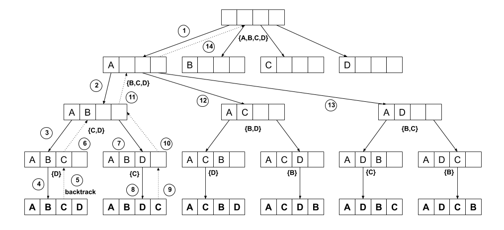
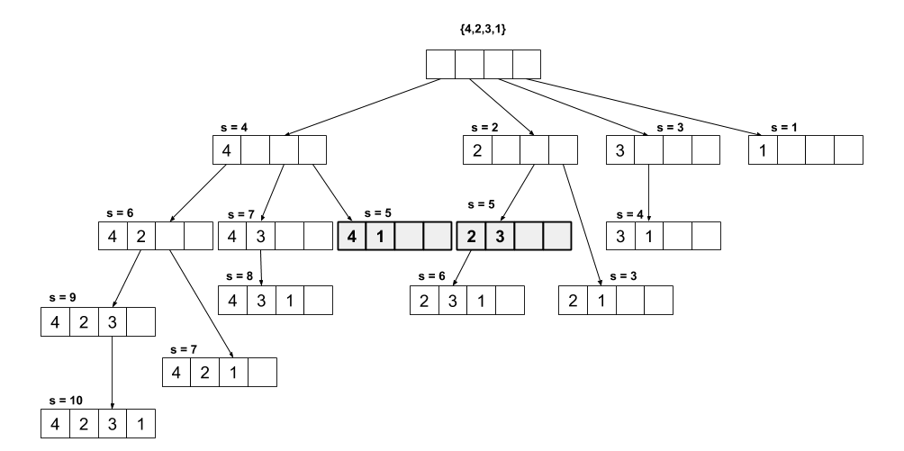
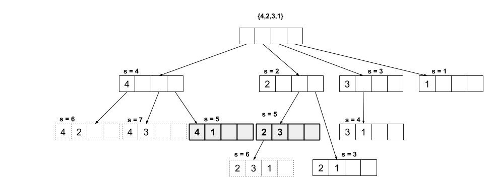

## Permutaciones ##

Consideremos el problema de generar todas las posibles permutaciones de un conjunto de símbolos.

(@) **Problema**. Generar todas las posibles permutaciones de un conjunto de símbolos.  
  **Entradas**. Un conjunto de símbolos $S$ de tamaño $n$.  
  **Salida**. Un conjunto de secuencias $P = \{\pi_1, \pi_2, \dots, \pi_m\}$ de tamaño $m = n!$, donde $\forall \pi \in P, \pi$ es una permutación de $S$.

Por ejemplo, si la entrada del problema es el conjunto

$$
S = \{A, B, C\}
$$

Tenemos entonces que la salida esperada es el conjunto

$$
\begin{aligned}
P = \{& [A, B, C], [A, C, B], \\
 & [B, A, C], [B, C, A], \\
 & [C, A, B], [C, B, A]\}
\end{aligned}
$$

Para resolver este problema, debemos buscar una manera sistemática de generar cada una de las posibles permutaciones. Es decir, queremos ser exhaustivos, pero también queremos evitar generar la misma permutación más de una vez. Estudiemos el siguiente algoritmo que resuelve el problema. Dado el tamaño $m=n!$ de $P$, podemos intuir de antemano que el algoritmo tendrá una alta complejidad temporal y espacial para $n$s grandes.

\begin{algorithm}[H]
    \DontPrintSemicolon
    \KwInput{Un conjunto de símbolos $S$ de tamaño $n$, }
    \KwOutput{Un conjunto de secuencias $P = \{\pi_1, \pi_2, \dots, \pi_m\}$ de tamaño $m = n!$, donde $\forall \pi \in P, \pi$ es una permutación de $S$.}
  
    \BlankLine
    \caption{Permutaciones}
    \SetAlgoVlined
    \SetKwProg{Fn}{función}{}{}
    \Fn{$\permutaciones(S, \pi, n, k, P)$}{
        \If{$k = n$} {
            $P \assign P \cup \{\pi\}$ \;
        } \Else {
            \For{$s \in S$} {
                $S^\prime \assign S - \{s\}$ \;
                $\pi[k] \assign s$ \;
                $\permutaciones(S^\prime, \pi, n, k+1, P)$ \;
                $\pi[k] \assign \varnothing$ \;
            }
        }
    }

    $\permutaciones(S, \pi \assign [\ ], n, k \assign 0, P \assign \{\})$ \;
    \Return{$P$} \;
\end{algorithm}

La función encargada de generar las permutaciones trabaja haciendo una construcción parcial de una permutación $\pi$. La secuencia parcial $\pi$ va creciendo en un elemento con cada llamada recursiva. Justamente debido a que la función es recursiva, se genera un árbol de llamadas que podemos ver ilustrado en la figura $\ref{fig:permutaciones}$. En este árbol, cada nodo corresponde al estado de $\pi$ al iniciar la llamada a la función. El parámetro $k$ indica cuál es el nivel del árbol en cada llamada recursiva, y al mismo tiempo también representa cuál es la casilla de $\pi$ que se está completando en la llamada. Por simplicidad no se presenta el árbol completo, sino solamente el subárbol más a la izquierda.

El objetivo del algoritmo es probar todas las posibles formas de ordenar los elementos del conjunto $S$ en una secuencia que representa a la permutación $\pi$.

Con este fin el algoritmo coloca sistemáticamente elementos de $S$ en $\pi$ hasta completar una permutación de todas las posibles, luego vuelve un paso hacia atrás para probar otros posibles órdenes de elementos de $S$ en $\pi$.

Este proceso se ejemplifica en la figura $\ref{fig:permutaciones}$. En el paso (1) iniciamos con una secuencia $\pi$ vacía y tenemos cuatro opciones para colocar en la primera casilla de $\pi$: $A$, $B$, $C$, o $D$. Eventualmente las vamos a probar todas, sin embargo vamos a iniciar con el símbolo $A$. Quedamos con tres casillas más por llenar en $\pi$ hasta completar la primera permutación y con tres símbolos de $S$ pendientes de ordenar ($B$, $C$ y $D$). En el paso (2) tomamos $B$ y lo colocamos en $\pi$, en el paso (3) colocamos $C$ y finalmente en el paso (4) colocamos $D$. En este punto hemos completado nuestra primera permutación.

Para probar otros posibles órdenes, debemos entonces volver atrás (*backtrack*) hasta un estado en el que tengamos más opciones de símbolos. Cada vez que volvemos atrás eliminamos el último elemento de la secuencia, para dejar espacio libre para probar nuevas opciones. En el paso (5) volvemos atrás un nivel, sin embargo en este punto ya agotamos la única opción que estaba disponible ($D$). Por tanto, en el paso (6) volvemos atrás un nivel más, en este nivel teníamos dos opciones disponibles $C$ y $D$, de las cuales ya habíamos probado la $C$. A partir de este punto reiniciamos el recorrido en profundidad colocando la opción $D$ en $\pi$ en el paso (7) y dejando la opción $C$ para el próximo nivel en el paso (8).

Volvemos atrás en el paso (9) y determinamos que en este punto ya agotamos opciones. Volvemos atrás nuevamente en el paso (10), aquí también ya agotamos opciones. También volvemos atrás en el paso (11) y aquí nos encontramos con que de las tres opciones disponibles, ya probamos la primera $B$ y debemos entonces repetir todo el proceso probando con $C$ en el paso (12) y luego con $D$ en el paso (13). A partir de este punto repetimos el patrón de recorrido en profundidad y vuelta atrás.

Si volvemos al algoritmo, observamos que la llamada recursiva (línea 8) es quien permite el movimiento vertical (hacia abajo y hacia arriba) en el árbol de la figura $\ref{fig:permutaciones}$, mientras que el ciclo de la línea 5 es quien produce el movimiento horizontal (de izquierda a derecha).

Podemos notar que antes de cada llamada recursiva modificamos la permutación parcial $\pi$ agregando el elemento actual $s$ de $S$ (línea 7). Esta construcción algorítmica permite hacer el paso hacia atrás; cuando la función retorna, se restaura el estado original de $\pi$ antes de la llamada (línea 9). En este punto, a su vez, pasamos a la siguiente iteración del ciclo (línea 5) y por tanto probamos nuevos órdenes con la siguiente opción de $S$ disponible.

### Análisis de complejidad temporal ###

Para analizar la complejidad temporal de este algoritmo debemos nuevamente volver al árbol de llamadas[^1]. Como ya observamos anteriormente este árbol se construye gracias al funcionamiento conjunto del ciclo de la línea 5 con la llamada recursiva de la línea 8. El ciclo produce la anchura del árbol, mientras que la llamada recursiva le da profundidad. Cada nodo del árbol representa una repetición del algoritmo.

[^1]: En este punto cabe mencionar que este árbol no es una estructura de datos literal, sino más bien una abstracción que nos permite visualizar el comportamiento del algoritmo.

Analicemos el árbol nivel por nivel. Para nuestro ejemplo de $S = {A, B, C, D}$, el primer nivel tiene $4$ nodos. Para cada uno de estos nodos el segundo nivel tiene $3$ nodos, es decir en este punto tenemos $4 \cdot 3$ nodos. Para cada uno de estos $12$ nodos, el tercel nivel tiene $2$ nodos, en este punto contabilizamos $4 \cdot 3 \cdot 2$ nodos. Finalmente, el último nivel tiene $1$ nodo, estas hojas corresponde al caso base de la función recursiva (línea 2). Contamos al final entonces $4 \cdot 3 \cdot 2 \cdot 1 = 4!$ nodos y podríamos sumar además $+1$ por el nodo raíz, sin embargo sabemos que esta constante no realiza un aporte significativo al crecimiento de la función para $n$s grandes. Tenemos que contabilizar también el tiempo $\mathcal{O}(n)$ requerido para copiar la permutación $\pi$ al conjunto $P$ (línea 3).

Podemos generalizar entonces que

$$
T(n) = \mathcal{O}(n \cdot n!)
$$

Estamos entonces ante un problema intratable para $n$s grandes. Podemos concluir esto gracias a la restricción original del problema de generar todas las posibles permutaciones. Sabemos que para un conjunto $S$ de tamaño $n$ hay $n!$ permutaciones. Es decir, aunque lográramos definir un algoritmo que generara una permutación en un solo paso, igual necesitaríamos de $n!$ pasos para completar la tarea.

### Análisis de complejidad espacial ###

Sabemos que cada llamada recursiva generará un *stack frame* en la pila de llamadas, por tanto podemos esperar un gasto mínimo de $\mathcal{O}(n!)$ casillas de memoria.

Además de este gasto mínimo, estamos construyendo el conjunto $P$ que será de tamaño $n!$ al final de la ejecución del algoritmo, y que contendrá permutaciones $\pi$ de tamaño $n$. Por tanto podemos esperar un consumo de memoria de

$$
S(n) = \mathcal{O}(n!) + \mathcal{O}(n \cdot n!) = \mathcal{O}(n \cdot n!)
$$

## Backtracking ##

Hemos observado el funcionamiento de un algoritmo de *backtracking*. Esta técnica es particularmente útil para resolver problemas de búsqueda combinatoria; es decir, problemas que se pueden modelar como estados de datos que cumplen con un conjunto de restricciones y que deben ir cambiando para encontrar un estado final esperado.

En el caso de nuestro ejemplo sobre las permutaciones, el estado del problema se refleja en la permutación parcial $\pi$, la cual va cambiando una casilla a la vez probando distintas combinaciones de órdenes de los elementos en $S$. Los estados finales corresponden a las permutaciones completas de tamaño $n$. El problema cumple con varias restricciones, la permutación $\pi$ no puede ser más grande que $n$, el tamaño de $S$. Tampoco puede contener elementos repetidos; y no queremos reportar en $P$ una misma permutación más de una vez. Finalmente, queremos reportar todas las posibles permutaciones. El modelo del problema como una serie de estados cambiantes, y el conjunto de restricciones conforman el espacio de búsqueda combinatoria.

La técnica de *backtracking* permite hacer un recorrido sistemático y exhaustivo sobre el espacio de búsqueda. Es sistemática porque establece un órden de búsqueda por profundidad en el que van cambiando los estados. Es exhaustiva porque permite examinar todos los posibles estados finales del problema para evaluar su cumplimiento con las restricciones.

## Suma de subconjuntos ##

Veamos otro problema de ejemplo que se puede resolver con esta técnica. El problema de la suma de subconjuntos se define de la siguiente manera.

(@) **Problema**. Suma de subconjuntos.  
  **Entradas**. Un conjunto de números naturales $S$ de tamaño $n$ y un número natural $k$.  
  **Salida**. Un conjunto de números naturales $S^\prime$ tal que $S^\prime \subseteq S$ y $\sum_{s \in S^\prime} s = k$.  

Para resolver este problema con *backtracking* vamos a generar sistemáticamente los subconjuntos de $S$, sumando sus elementos en busca de los subconjuntos que cumplan con la restricción $\sum_{s \in S^\prime} s = k$.

\begin{algorithm}[H]
    \DontPrintSemicolon
    \KwInput{Un conjunto de números naturales $S$ de tamaño $n$ y un número natural $k$.}
    \KwOutput{Todos los conjuntos de números naturales $S^\prime$ tal que $S^\prime \subseteq S$ y $\sum_{s \in S^\prime} s = k$.}
  
    \BlankLine
    \caption{Suma de subconjuntos}
    \SetAlgoVlined
    \SetKwProg{Fn}{función}{}{}
    \Fn{$\sumasubc(S, n, S^\prime, m, s, i, k)$}{
        \If{$s = k$} {
            $\reportar(S^\prime)$ \;
        }

        \For{$j \in [i \twodots n[$} {
            $S^\prime[m] \assign S[j]$ \;
            $\sumasubc(S, n, S^\prime, m + 1, s + S[j], j + 1, k)$ \;
            $S^\prime[m] \assign \varnothing$ \;
        }
    }

    $\sumasubc(S, n, S^\prime \assign [\ ], m \assign 0, s \assign 0, i \assign 0, k)$ \;
\end{algorithm}

La función $sumasubc$ recibe como entradas el conjunto $S$ así como su tamaño $n$ y el número $k$. Además $S^\prime$ contiene al subconjunto actual que será probado, así como su correspondiente tamaño $m$. La entrada $s$ contiene el valor de la suma de los elementos de $S^\prime$. El parámetro $i$ permite la creación de los subconjuntos marcando un punto de inicio a partir del cual se tomarán los elementos de $S$ para ir construyendo $S^\prime$ sobre la marcha.

Este es un algoritmo recursivo, y por tanto podemos analizar su comportamiento visualizando su árbol de llamadas. La figura $\ref{fig:subsetsum}$ presenta un árbol de llamadas para el caso de ejecutar nuestro algoritmo com $S=\{4,2,3,1\}$ y $k=5$. El algoritmo sigue el mismo patrón de *backtracking* de nuestro ejemplo anterior; un ciclo (línea 4) que le da anchura al árbol y una llamada recursiva (línea 6) que le da profundidad.

Para construir todos los subconjuntos, podemos observar que el ciclo no necesariamente inicia en $0$ en cada llamada, sino que debemos acarrear el último índice utilizado $i$ para no volver a incluir elementos anteriormente utilizados en los nuevos subconjuntos. Es decir, en cada llamada vamos a ignorar todos los elementos a la izquierda de $i$, porque ya los examinamos en una llamada anterior. Podemos visualizar este comportamiento si observamos el orden en el que aparecen todos los hijos de un nodo en un mismo nivel.

### Análisis de complejidad temporal ###

Igual que en nuestro ejemplo anterior, el ciclo y la llamada recursiva definen el comportamiento de algoritmo, este comportamiento conjunto se visualiza fácilmente en el árbol de llamadas. Si observamos el árbol para el algoritmo de suma de subconjuntos notamos que los nodos corresponden a cada uno de los subconjuntos posibles de $S$. Sabemos además que el conjunto potencia de $S$ de tamaño $n$ tiene cardinalidad

\begin{equation}
|\wp(S)| = 2^n
\end{equation}

A pesar de ser un algoritmo de búsqueda, este algoritmo siempre realizará su recorrido completo, independientemente de que la combinación de entradas $S$ y $k$ contenga soluciones o no. Cuando hay soluciones, el algoritmo las encuentra todas. Tomando en cuenta este hecho y el resultado anterior podemos establecer que la complejidad temporal del algoritmo es

$$
T(n) = \mathcal{O}(2^n)
$$

### Podando el árbol de llamadas ###

Podemos observar en la figura $\ref{fig:subsetsum}$ que hay subárboles que no vale la pena explorar, tomemos por ejemplo el subárbol con raíz en el nodo $[4, 2]$. La suma de este nodo da $6$, que sobrepasa el valor para $k=5$. Cualquier otro número que agreguemos a este subconjunto seguirá produciendo una suma mayor que $5$.

Para evitar explorar innecesariamente estos subárboles podemos modificar el algoritmo de la siguiente manera

\begin{algorithm}[H]
    \DontPrintSemicolon
    \KwInput{Un conjunto de números naturales $S$ de tamaño $n$ y un número natural $k$.}
    \KwOutput{Todos los conjuntos de números naturales $S^\prime$ tal que $S^\prime \subseteq S$ y $\sum_{s \in S^\prime} s = k$.}
  
    \BlankLine
    \caption{Suma de subconjuntos con poda}
    \SetAlgoVlined
    \SetKwProg{Fn}{función}{}{}
    \Fn{$\sumasubc(S, n, S^\prime, m, s, i, k)$}{
        \If{$s = k$} {
            $\reportar(S^\prime)$ \;
        }

        \For{$j \in [i \twodots n[$} {
            \If{$s + S[j] \leq k$} {
                $S^\prime[m] \assign S[j]$ \;
                $\sumasubc(S, n, S^\prime, m + 1, s + S[j], j + 1, k)$ \;
                $S^\prime[m] \assign \varnothing$ \;
            }
        }
    }

    $\sumasubc(S, n, S^\prime \assign [\ ], m \assign 0, s \assign 0, i \assign 0, k)$ \;
\end{algorithm}

Esta optimización saca provecho de que antes de hacer la llamada ya podemos saber cuál es el siguiente subconjunto así como el valor de la suma de sus elementos. De esta forma, podemos preguntar si esta suma está dentro de las restricciones del problema (línea 5) para decidir si vale la pena hacer la próxima llamada recursiva o no. El árbol de la figura $\ref{fig:subsetsum_pruned}$ presenta el nuevo árbol de llamadas producido por el algoritmo mejorado. Los nodos dibujados con líneas punteadas corresponden a las potenciales llamadas que fueron prevenidas por no pasar la prueba sobre la restricción.

## Síntesis ##

Los algoritmos de búsqueda combinatoria tienden a tener altos factores de crecimiento, en el caso de nuestros ejemplos hemos observado problemas aparentemente simples con tasas de crecimiento factorial y exponencial.

La técnica de *backtracking* permite hacer recorridos sistemáticos y exhaustivos sobre los espacios de búsqueda generados por este tipo de problemas. Sin embargo, estos algoritmos tendrán valor práctico en la medida que los espacios de búsqueda sean suficientemente pequeños.

## Ejercicios ##

1. Consideremos las posibles permutaciones del conjunto de números naturales $\{0, 1, 2, \dots, (n-1)\}$. Queremos encontrar las permutaciones $\pi$ donde ninguno de sus elementos está en su posición propia, es decir se cumple que $\forall i \in [0 \twodots n[, \pi[i] \neq i$. Por ejemplo para el conjunto $\{0, 1, 2\}$ la permutación $[1,2,0]$ cumple con la restricción porque ninguno de sus elementos coincide con su correspondiente índice, mientras que la permutación $[2, 1, 0]$ no cumple con la restricción porque el elemento $1$ está en el índice $1$ de la permutación. Escriba un algoritmo de *backtracking* con poda que encuentre todas las posibles permutaciones que cumplen con esta restricción para un conjunto dado de $n$ números.

\begin{comment}
Skiena 7.1
\end{comment}

2. Considere de nuevo el algoritmo para la suma de subconjuntos con poda. ¿Podríamos introducir una mejora más si asumimos que el conjunto $S$ está ordenado ascendentemente?

3. Diseñe un algoritmo para encontrar todos los subconjuntos de tamaño $k$ para un conjunto $S$ de tamaño $n$.

\begin{comment}
Skiena 7.1
\end{comment}

4. ¿De cuántas y cuáles maneras diferentes podemos colocar 8 reinas en un tablero de ajedrez de manera tal que ninguna reina ataque a otra?

## Referencias ##

Skiena S. (2010) The Algorithm Design Manual (2da ed.) Springer.