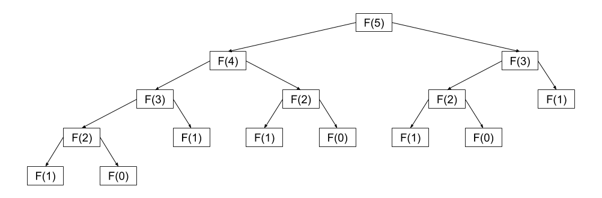
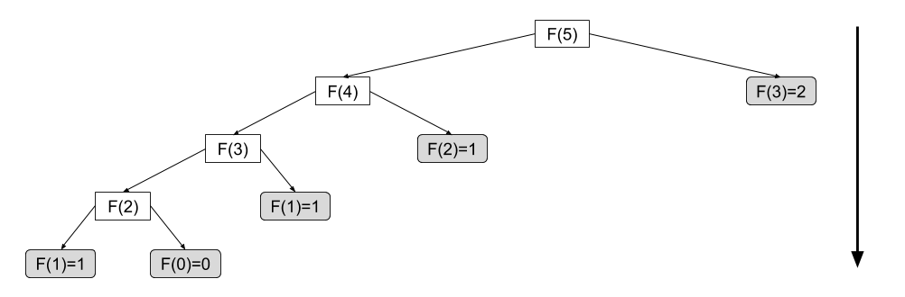
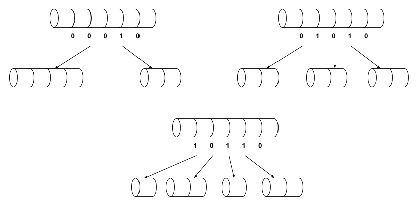
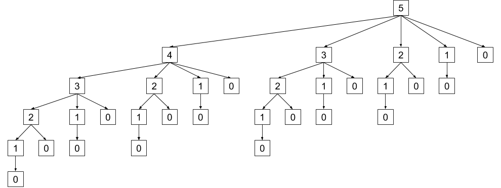
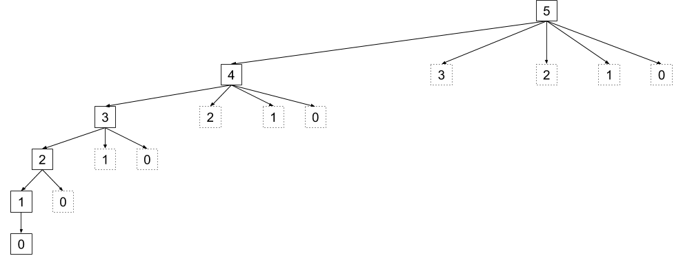

## Serie de Fibonacci ##

La serie de Fibonacci es una serie infinita de números naturales que tiene la siguiente forma $0, 1, 1, 2, 3, 5, 8, 13, \dots$ . Observamos que cualquier número de la serie es igual a la suma de los números inmediatemente anteriores, es decir $3 = 2 + 1$ y $13 = 8 + 5$. Con base en esta observación podemos intuir que el siguiente número de la serie después del $13$ es entonces $21 = 13 + 8$. En términos generales podemos determinar cuál es el $n$-ésimo número de la serie a través de la siguiente función.

$$
F(n) =
\begin{cases}
      0 & n = 0 \\
      1 & n = 1 \\
      F(n - 1) + F(n - 2) & n > 1 \\
\end{cases}
$$

Podemos expresar este cálculo como un algoritmo recursivo.

\begin{algorithm}[H]
    \DontPrintSemicolon
    \KwInput{Un número natural $n$}
    \KwOutput{El número en la $n$-ésima posición de la serie de Fibonacci}
  
    \BlankLine
    \caption{Fibonacci}
    \SetAlgoVlined
    \SetKwProg{Fn}{función}{}{}

    \If{$n = 0 \lor n = 1$} {
        \Return{$n$} \;
    } \Else {
        \Return{$\Fibonacci(n - 1) + \Fibonacci(n - 2)$} \;
    }
\end{algorithm}

Este es quizás el algoritmo más ingenuo para resolver el problema, sin embargo nos permitirá entender algunos de los principios fundamentales detrás de la técnica de programación dinámica.

Al ser un algoritmo recursivo, podemos observar su árbol de llamadas para analizar su comportamiento. La figura $\ref{fig:fibonacci}$ presenta un ejemplo de árbol de llamadas para este algoritmo cuando se ejecuta con $n = 5$.

Este algoritmo realiza dos llamadas recursivas, generando de esta forma un árbol binario de llamadas. El algoritmo producirá un recorrido en profundidad a través de este árbol hasta encontrar los casos base para los cuáles conocemos sus valores correspondientes. A partir de este punto se construirá la secuencia de abajo hacia arriba.

### Análisis de complejidad temporal ###

Analizando el árbol de llamadas de la figura $\ref{fig:fibonacci}$ podemos establecer la siguiente relación de recurrencia[^1]

[^1]: Para relaciones de recurrencia consulte el Apéndice IV

$$
T(n) = T(n - 1) + T(n - 2) + 1
$$

Esto quiere decir que el número de llamadas (o repeticiones) para $T(n)$ es igual al número de llamadas para $T(n - 1)$ más el número de llamadas para $T(n - 2)$ más $1$ correspondiente a la llamada raíz. Sabemos que esta última constante la podemos obviar para efectos de análisis asintótico. En otras palabras, el número de llamadas corresponde al número de nodos del subárbol izquierdo más el número de nodos del subárbol derecho. Tenemos entonces que

\begin{equation}\label{eq:a}
T(n) = T(n - 1) + T(n - 2)\tag{a}
\end{equation}

Dado que la secuencia de Fibonacci está ordenada ascendentemente, sabemos que $F(n-1) > F(n-2)$, por lo tanto el número de cálculos para identificar $F(n-1)$ también es mayor —o igual, en el caso de $F(1)$ y $F(0)$— que el número necesario para $F(n-2)$. Por tanto

\begin{equation}\label{eq:b}
T(n-1) \geq T(n-2)\tag{b}
\end{equation}

Con base en esta relación, podemos identificar las cotas inferior y superior para $T(n)$.

#### Cota inferior ####

Iniciemos con la cota inferior. Si tomamos el resultado ($\ref{eq:b}$) y sumamos $T(n-2)$ a ambos lados de la inecuación obtenemos

$$
\begin{aligned}
T(n-1) + T(n-2) &\geq T(n-2) + T(n-2)
\end{aligned}
$$

Observamos que podemos reemplazar el lado izquierdo de la inecuación por $T(n)$ de acuerdo con el resultado ($\ref{eq:a}$).

$$
\begin{aligned}
T(n) &\geq T(n-2) + T(n-2) \\
\end{aligned}
$$

Simplificamos para obtener

\begin{equation}\label{eq:c}
T(n) \geq 2 T(n-2)\tag{c}
\end{equation}

Si reemplazamos $n$ por $n-2$ en el resultado ($\ref{eq:c}$) obtenemos

$$
\begin{aligned}
T(n - 2) &\geq 2 T((n - 2) - 2) \\
T(n - 2) &\geq 2 T(n - 4) \\
\end{aligned}
$$

Con base en este resultado, podemos entonces reemplazar[^2] $T(n - 2)$ por $2 T(n - 4)$ en ($\ref{eq:c}$). De manera tal que obtenemos

[^2]: Podemos verificar que al hacer este reemplazo se mantienen las relaciones de la inecuación.

$$
\begin{aligned}
T(n) &\geq 2 (2 T(n - 4)) \\
T(n) &\geq 4 T(n - 4) \\
\end{aligned}
$$

Nuevamente, podemos reemaplazar $n$ por $n-2$ en este último resultado, para obtener

$$
\begin{aligned}
T(n - 2) &\geq 4 T((n - 2) - 4) \\
T(n - 2) &\geq 4 T(n - 6) \\
\end{aligned}
$$

Y, de igual manera, podemos reemplazar $T(n - 2)$ por $4 T(n - 6)$ en ($\ref{eq:c}$).

$$
\begin{aligned}
T(n) &\geq 2 (4 T(n - 6)) \\
T(n) &\geq 8 T(n - 6) \\
\end{aligned}
$$

Podemos repetir este proceso hasta identificar un patrón

$$
\begin{aligned}
T(n) &\geq 2 T(n - 2) \\
 &\geq 4 T(n - 4) \\
 &\geq 8 T(n - 6) \\
 &\geq 16 T(n - 8) \\
 &\dots \\
 &\geq 2^i T(n - 2i) \\
\end{aligned}
$$

Notamos que en cada transformación vamos reduciendo $n$; el valor $i$ representa un número de iteraciones de esta transformación a ejecutar. Dado que nuestra función es recursiva, nos preguntamos ¿cuántas iteraciones $i$ serán necesarias para llegar al caso base $n=0$? Dado nuestro modelo, podemos reformular la pregunta de la siguiente manera

$$
\begin{aligned}
n - 2i &= 0 \\
n &= 2i \\
\frac{n}{2} &= i \\
\end{aligned}
$$

Si utilizamos este valor en nuestra inecuación generalizada obtenemos que

$$
\begin{aligned}
T(n) &\geq 2^i T(n - 2i) \\
 &\geq 2^{\frac{n}{2}} T(0) \\
 &\geq 2^{\frac{n}{2}} \Omega(1) \\
 &\geq \Omega(2^{\frac{n}{2}} \cdot 1) \\
 &\geq \Omega(2^{\frac{n}{2}}) \\
 &\therefore T(n) = \Omega(2^{\frac{n}{2}}) \\
\end{aligned}
$$

#### Cota superior ####

En cuanto a la cota superior, podemos utilizar un acercamiento muy similar. Partimos del resultado ($\ref{eq:b}$) y sumamos $T(n-1)$ a ambos lados de la inecuación.

$$
\begin{aligned}
T(n-2) &\leq T(n-1) \\
T(n-1) + T(n-2) &\leq T(n-1) + T(n-1) \\
T(n-1) + T(n-2) &\leq 2T(n-1) \\
\end{aligned}
$$

Utilizamos el resultado ($\ref{eq:a}$) para simplificar

$$
\begin{aligned}
T(n) &\leq 2T(n-1) \\
\end{aligned}
$$

Si aplicamos, de manera similar a lo realizado para la cota inferior, un proceso repetido de reemplazo de $n$ por $n-1$ para obtener un patrón generalizado que nos acerque al caso base, obtenemos entonces

$$
\begin{aligned}
T(n) &\leq 2T(n - 1) \\
 &\leq 4T(n - 2) \\
 &\leq 8T(n - 3) \\
 &\leq 16T(n - 4) \\
 &\dots \\
 &\leq 2^iT(n - i) \\
\end{aligned}
$$

Nuevamente nos preguntamos, ¿cuántas iteraciones de $i$ son necesarias para llegar al caso base $n=0$?

$$
\begin{aligned}
n-i = 0 \\
n = i
\end{aligned}
$$

Y aplicamos el resultado

$$
\begin{aligned}
T(n) &\leq 2^iT(n - i) \\
 &\leq 2^n T(0) \\
 &\leq 2^n \mathcal{O}(1) \\
 &\leq \mathcal{O}(2^n \cdot 1) \\
 &\leq \mathcal{O}(2^n) \\
 &\therefore T(n) = \mathcal{O}(2^n) \\
\end{aligned}
$$

### Análisis de complejidad espacial ###

En términos complejidad espacial, notamos que cada llamada recursiva consume únicamente la memoria necesaria para el parámetro $n$. Sin embargo, debemos recordar que esperamos aproximadamente $2^n$ llamadas. Podemos formalizar entonces que

$$
\begin{aligned}
S(n) &= 2^n \cdot \mathcal{O}(1) \\
 &= \mathcal{O}(2^n \cdot 1) \\
 &= \mathcal{O}(2^n) \\
 \therefore S(n) &= \mathcal{O}(2^n) \\
\end{aligned}
$$

### Optimizando Fibonacci ###

Justo como intuimos anteriormente, el algoritmo no es eficiente pues tiene tanto complejidad temporal como espacial de orden exponencial. Sin embargo, si retornamos a la figura $\ref{fig:fibonacci}$, podemos observar algunas características de comportamiento que podemos aprovechar para diseñar un algoritmo con mejor rendimiento.

Observamos que hay muchos cálculos que se repiten. Para una llamada inicial con $n=5$ el algoritmo repite llamadas recursivas para todos los $n \leq 3$.

$n$    # llamadas
---    ---------------
5        1
4        1
3        2
2        3
1        5
0        3

Aún más importante, observamos que la solución para $n = 5$ contiene necesariamente a la solución para $n = 4$, igualmente la solución para $n = 4$ contiene a la solución para $n = 3$, y así sucesivamente hasta llegar a $n = 0$.

Podemos mantener el comportamiento original del algoritmo, con la diferencia de que vamos a memorizar los resultados parciales que vayamos calculando, para que cuando los requiramos nuevamente no sea necesario recalcularlos, sino simplemente reutilizarlos.

\begin{algorithm}[H]
    \DontPrintSemicolon
    \KwInput{Un número natural $n$}
    \KwOutput{El número en la $n$-ésima posición de la serie de Fibonacci}
  
    \BlankLine
    \caption{Fibonacci memo arriba-abajo}
    \SetAlgoVlined
    \SetKwProg{Fn}{función}{}{}

    \Fn{$\fibomemo(n, T)$} {
        \If{$T[n] = \varnothing$} {
            $T[n] \assign \fibomemo(n-1, T) + \fibomemo(n-2, T)$ \;
        }

        \Return{T[n]}
    }

    $T \assign [\ ]$ \;
    $T[0] \assign 0$ \;
    $T[1] \assign 1$ \;

    \Return{$\fibomemo(n, T)$} \;
\end{algorithm}

Este algoritmo construye la serie parcial de arriba hacia abajo. Es decir, de manera semejante al algoritmo original, parte desde $n$ y hace un recorrido en profundidad hasta alcanzar un caso base y a partir de este calcula va calculando los valores. La diferencia radica en que los resultados parciales se almacenan en la tabla $T$, y a partir de este punto ya no es necesario recalcularlos.

Podemos observar este comportamiento en la figura $\ref{fig:fibonacci_topdown}$. En este árbol tenemos dos tipos de nodos, los nodos blancos representan llamadas recursivas para calcular el valor para el $n$ pasado como argumento, mientras que los nodos grises representan consultas a la tabla $T$ de valores parciales. Si comparamos este árbol con el de la figura $\ref{fig:fibonacci}$ notamos que los nodos grises representan subárboles en el algoritmo original que ya no son recorridos.

En términos de complejidad temporal, notamos que el árbol tienen una apariencia más bien lineal. Siempre exploraremos en profundidad la rama más izquierda del árbol, y las ramas derechas de cada nodo corresponderán a consultas a la tabla de resultados parciales. Para cada $n$ tendremos exactamente dos llamadas recursivas. Concluimos entonces que

$$
T(n) = 2n = \mathcal{O}(n)
$$

En cuánto a la complejidad espacial, tomamos en cuenta una única vez el costo de la tabla $\mathcal{O}(n)$. Cada llamada tiene complejidad constante $\mathcal{O}(1)$ pues consume el espacio para el parámetro $n$ y el puntero a la tabla $T$; y esperamos $2n$ llamadas. Por lo tanto

$$
S(n) = \mathcal{O}(n) + 2n \cdot \mathcal{O}(1) = \mathcal{O}(n)
$$

Otro posible acercamiento, es desarrollar el cálculo de abajo hacia arriba. Es decir partiendo desde los casos base desarrollando la sumas hasta llegar al $n$-ésimo  elemento.

\begin{algorithm}[H]
    \DontPrintSemicolon
    \KwInput{Un número natural $n$}
    \KwOutput{El número en la $n$-ésima posición de la serie de Fibonacci}
  
    \BlankLine
    \caption{Fibonacci memo abajo-arriba}
    \SetAlgoVlined
    \SetKwProg{Fn}{función}{}{}

    $T \assign [\ ]$ \;
    $T[0] \assign 0$ \;
    $T[1] \assign 1$ \;

    \For{$i \in [2 \twodots n]$} {
        $T[i] \assign T[i-1] + T[i-2]$ \;
    }

    \Return{$T[n]$}
\end{algorithm}

Al prescindir de la doble llamada recursiva, este algoritmo reduce a la mitad el número de repeticiones, por tanto tenemos que

$$
T(n) = n - 2 = \mathcal{O}(n)
$$

En términos de complejidad espacial, el gasto de memoria más significativo que hace el algoritmo está en la tabla, entonces

$$
S(n) = \mathcal{O}(n)
$$

En ambos casos, estos nuevos algoritmos representan una mejora significativa al algoritmo original de complejidad exponencial.

## Programación dinámica ##

Los últimos dos algoritmos que estudiamos son ejemplos de algoritmos de programación dinámica. Para poder aplicar esta técnica nuestro problema debe cumplir con dos características particulares: debe presentar subestructura óptima, y superposición de subproblemas.

La **subestructura óptima** requiere, primero, que el problema se pueda dividir en subproblemas más pequeños, semejante al caso de la técnica de divide y conquista. Pero, a diferencia de esta última, requiere además que la solución óptima al problema contenga, o esté compuesta por, las soluciones óptimas de sus subproblemas. En el caso de Fibonacci, notamos anteriormente que la solución para $F(5)$ contiene a la solución para $F(4)$ y así sucesivamente hasta llegar a $F(0)$. Esta característica sugiere además que los problemas de programación dinámica tienen una naturaleza recursiva.

Por otro lado, la **superposición de problemas** indica que durante el proceso de solución del problema original, nos encontraremos varias veces con la necesidad de resolver un mismo subproblema. En el caso de Fibonacci, observamos que para $F(5)$ es necesario resolver más de una vez los subproblemas $F(0), F(1), F(2)$ y $F(3)$. Dada esta característica, determinamos que una forma de reducir la complejidad temporal del algoritmo, es memorizar[^3] las soluciones a los subproblemas para no tener que recalcularlos cuando aparezcan por segunda, tercera, o enésima vez durante el proceso de solución del problema original. Este caso representa una instancia de una regla heurística de optimización de algoritmos: *la optimización del costo de la complejidad temporal usualmente requiere de un mayor gasto en términos de complejidad espacial, y viceversa*.

[^3]: El término en jerga técnica que se maneja en la literatura en inglés es *memoize*.

También, como observamos en nuestro ejemplo de la serie de Fibonacci, los problemas de programación dinámica pueden ser resueltos ya sea con un acercamiento de arriba hacia abajo, a través de memorización de resultados parciales; o con un acercamiento de abajo hacia arriba reconstruyendo la solución desde sus casos base.

## Corte de varillas ##

Analicemos un problema un poco más complejo que puede ser resuelto con programación dinámica, el corte de varillas.

En un sitio de construcción se está utilizando como insumo varilla de acero en diferentes longitudes. La varilla llega al sitio siempre en unidades de longitud fija de 8 metros. De acuerdo con las distintas necesidades de la construcción, estas varillas deben ser cortadas en unidades de menor longitud que pueden estar entre 1m y 8m. Por simplicidad, asumiremos en este escenario que las longitudes de las varillas siempre corresponden a un número natural.

Todas las semanas el equipo que lidera el proyecto determina una tabla de valores para cada longitud de varilla de acuerdo con las necesidades de la semana, la cual se envía al equipo de cortes para que preparen el material con antelación. Con base en esta tabla para una semana específica, queremos apoyar al equipo de cortes con un algoritmo que ayude a determinar cuál es la combinación de cortes que maximiza el valor de la varilla.

Por ejemplo, si partimos de la siguiente tabla de valores $V$

longitud   1   2   3   4   5   6   7   8
--------   --  --  --  --  --  --  --  --
valor      1   5   8   9   10  17  17  20

Observamos que el valor máximo que podemos obtener para una unidad es $22$, cortando la varilla en dos piezas, una de 2m y otra de 6m.

Con el fin de simplificar nuestros análisis y observar la técnica en acción vamos a simplificar nuestra solución al problema, produciendo únicamente el valor máximo alcanzable para una varilla. Definimos entonces el problema de la siguiente manera.

(@) **Problema**. Calcular el valor máximo alcanzable cortando una varilla.  
  **Entradas**. Un número natural $n$ que representa el tamaño de la varilla a maximizar. Una secuencia $V$ donde $\forall i \in [1 \twodots n], V[i]$ representa el valor para una varilla de tamaño $i$. Por definición $V[0] = 0$.  
  **Salida**. Un número natural que representa el valor máximo alcanzable con una varilla de tamaño $n$ y la tabla $V$ dadas.

Una forma de resolver este problema es evaluando todas las posibles combinaciones de cortes, para encontrar el máximo valor.

\begin{algorithm}[H]
    \DontPrintSemicolon
    \KwInput{Un número natural $n$ que representa el tamaño de la varilla a maximizar. Una secuencia $V$ donde $\forall i \in [1 \twodots n], V[i]$ representa el valor para una varilla de tamaño $i$. Por definición $V[0] = 0$.}
    \KwOutput{Un número natural que representa el valor máximo alcanzable con una varilla de tamaño $n$ y la tabla $V$ dadas.}
  
    \BlankLine
    \caption{Corte varilla ingenuo}
    \SetAlgoVlined
    \SetKwProg{Fn}{función}{}{}

    \Fn{$\cortar(n, V)$} {
        \If{$n = 0$} {
            \Return{$0$} \;
        }
        $valor \assign -1$ \;
        \For{$i \in [1 \twodots n]$} {
            $valor \assign \max(valor, V[i] + \cortar(n - i, V))$ \;
        }

        \Return{$valor$} \;
    }
\end{algorithm}

El algoritmo analiza todas las posibles configuraciones de cortes. Nos podemos preguntar ¿cuántas configuraciones podemos esperar? La figura $\ref{fig:corte_varilla}$ presenta un modelo que podemos utilizar para calcular este número.

En la figura $\ref{fig:corte_varilla}$ representamos una varilla de tamaño $n = 6$ como un número binario de $n - 1$ dígitos, en este número un dígito `1` representa un punto de corte en la varilla. Así, en nuestro ejemplo, el número `00010` representa un corte que genera dos varillas, una de tamaño $4$ y otra de tamaño $2$.

Observamos que todas las posibles combinaciones de cortes que podemos hacer en una varilla de tamaño $n$ es igual a la cantidad de números binarios que podemos representar con $n - 1$ dígitos.

$$
T(n) = 2^{n-1} = \mathcal{O}(2^n)
$$

Nuestro algoritmo ingenuo tiene una complejidad temporal exponencial. ¿Podemos optimizarlo de alguna manera? La figura $\ref{fig:corte_varilla_ingenuo}$ presenta el árbol de llamadas recursivas que genera el algoritmo cuando se invoca con $n = 5$.

A partir de este árbol notamos que el problema cumple con las características que permiten solucionarlo aplicando programación dinámica. Observamos superposición de problemas con una repetición de llamadas recursivas: dos subárboles con raíz $3$, cuatro subárboles con raíz $2$, ocho subárboles con raíz $1$. También, de acuerdo con la línea 6 del algoritmo y la figura $\ref{fig:corte_varilla_ingenuo}$, determinamos que la mejor solución para una varilla de tamaño $5$ incluye una selección entre las mejores soluciones para varillas de tamaño $4$, $3$, $2$ y $1$. De la misma forma, la mejor solución para una varilla de tamaño $4$ incluye una selección entre las mejores soluciones para varillas de tamaño $3$, $2$ y $1$. Sucesivamente podemos identificar el mismo patrón para las varillas de los tamaños menores que $4$. Podemos afirmar entonces que el problema tiene subestructura óptima.

Estudiamos a continuación dos posibles soluciones al problema utilizando programación dinámica. La primera utiliza un acercamiento de arriba hacia abajo, mientras que la segunda lo hace abajo hacia arriba.

Solucionamos el problema de arriba hacia abajo manteniendo el recorrido recursivo en profundidad pero aplicando *memoizing* para recordar y reutilizar los resultados previamente calculados.

\begin{algorithm}[H]
    \DontPrintSemicolon
    \KwInput{Un número natural $n$ que representa el tamaño de la varilla a maximizar. Una secuencia $V$ donde $\forall i \in [1 \twodots n], V[i]$ representa el valor para una varilla de tamaño $i$. Por definición $V[0] = 0$.}
    \KwOutput{Un número natural que representa el valor máximo alcanzable con una varilla de tamaño $n$ y la tabla $V$ dadas.}
  
    \BlankLine
    \caption{Corte varilla arriba-abajo}
    \SetAlgoVlined
    \SetKwProg{Fn}{función}{}{}

    \Fn{$\cortar(n, V, T)$} {
        \If{$T[n] \geq 0$} {
            \Return{$T[n]$} \;
        }
        $valor \assign -1$ \;
        \For{$i \in [1 \twodots n]$} {
            $valor \assign \max(valor, V[i] + \cortar(n - i, V, T))$ \;
        }

        $T[n] \assign valor$ \;
        \Return{$valor$} \;
    }

    $T \assign [-1, -1, \dots, -1]$ de tamaño $n + 1$ \;
    $T[0] \assign 0$ \;

    \Return{$cortar(n, V, T)$} \;
\end{algorithm}

Ante el requerimiento de retornar el valor maximizado para una varilla de tamaño $n$, la función primero busca el valor correspondiente en una tabla donde se van almacenando los valores ya calculados (líneas 2-3), si no lo encuentra en la tabla procede a calcularlo siguiendo el mismo recorrido recursivo que la solución ingenua estudiada anteriormente (líneas 4-6), una vez calculado lo almacena en la tabla para futura referencia (línea 7).

La figura $\ref{fig:corte_varilla_arriba_abajo}$ ilustra el comportamiento de este algoritmo. En esta figura las llamadas que calculan sus valores recursivamente (líneas 4-6) se representan como líneas sólidas, mientras que las llamadas que se resuelven encontrando valores en la tabla (líneas 2-3) se representan con líneas punteadas.

Podemos observar que los subárboles que aparecen repetidos en la figura $\ref{fig:corte_varilla_ingenuo}$ ya no se expanden en la figura $\ref{fig:corte_varilla_arriba_abajo}$. Esto es resultado del *memoizing*, que nos permite evitar recalcular valores ya conocidos.

Con respecto a la complejidad temporal, siendo este un algoritmo recursivo, nos enfocaremos en determinar la cantidad de llamadas (o lo que es lo mismo, la cantidad de nodos en el árbol de llamadas) realizadas. La llamada recursiva (línea 6) produce la verticalidad del árbol, a través de un recorrido en profundidad por la rama más izquierda del árbol; este recorrido es de longitud $n$.

Cuando el recorrido en profundidad llega a la hoja, inicia un retorno hacia arriba. Conforme va retornando, el algoritmo continúa su recorrido horizontalmente (línea 5), los valores requeridos en este recorrido ya están almacenados en la tabla *memoized*. Observamos que para cada nivel $i$ del árbol se hacen $n$ llamadas, donde $n$ es el padre de los nodos en el nivel $i$.

Determinamos entonces que

$$
T(n) = n \cdot n = \mathcal{O}(n^2)
$$

Con respecto a la complejidad espacial, cada llamada consume $\mathcal{O}(1)$ espacios de memoria, sin embargo debemos recordar que este espacio se multiplica según la cantidad de llamadas que haga el algoritmo. Adicionalmente debemos contabilizar el espacio lineal $\mathcal{O}(n)$ que consumen respectivamente la tabla de precios y la tabla de *memoizing*. Por tanto, tenemos que

$$
\begin{aligned}
S(n) &= \mathcal{O}(1) \cdot \mathcal{O}(n^2) + \mathcal{O}(n) + \mathcal{O}(n) \\
 &= \mathcal{O}(n^2) + 2 \mathcal{O}(n) \\
 &= \mathcal{O}(n^2) + \mathcal{O}(n) \\
 &= \mathcal{O}(n^2) \\
\end{aligned}
$$

El uso de programación dinámica nos permite traer la solución de este problema a una complejidad polinomial cuadrática, mucho más tratable que la complejidad exponencial de la solución ingenua.

El siguiente algoritmo presenta otra forma de solucionar este problema con programación dinámica, esta vez siguiendo un recorrido de abajo hacia arriba. Este acercamiento parte directamente de los casos base y construye incrementalmente hasta llegar al tamaño de varilla que nos interesa.

\begin{algorithm}[H]
    \DontPrintSemicolon
    \KwInput{Un número natural $n$ que representa el tamaño de la varilla a maximizar. Una secuencia $V$ donde $\forall i \in [1 \twodots n], V[i]$ representa el valor para una varilla de tamaño $i$. Por definición $V[0] = 0$.}
    \KwOutput{Un número natural que representa el valor máximo alcanzable con una varilla de tamaño $n$ y la tabla $V$ dadas.}
  
    \BlankLine
    \caption{Corte varilla abajo-arriba}
    \SetAlgoVlined
    \SetKwProg{Fn}{función}{}{}

    $T \assign [-1, -1, \dots, -1]$ de tamaño $n + 1$ \;
    $T[0] \assign 0$ \;

    $valor \assign -1$ \;
    \For{$j \in [1 \twodots n]$} {
        \For{$i \in [1 \twodots j]$} {
            $valor \assign \max(valor, V[i] + T[j - i])$ \;
        }

        $T[j] \assign valor$ \;
    }

    \Return{$valor$} \;
\end{algorithm}

En este algoritmo, el ciclo $j$ (línea 4) permite ir calculando los valores óptimos para cada tamaño de varilla $j \leq n$, empezando por la varilla de tamaño $1$ e incrementando sucesivamente hasta llegar a la varilla de tamaño $n$, memorizando dichos valores al final de cada iteración (línea 7). Por otro lado el ciclo $i$ (línea 5) investiga todas las posibles combinaciones para una varilla de tamaño $j$; específicamente (en la línea 6) se calcula el valor de cortar la varilla de tamaño $j$ en una varilla de tamaño $i$ (`V[i]`) más el valor de la mejor manera de cortar ,la varilla de tamaño $j - i$ (`T[j-i]`). Por ejemplo para una varilla de tamaño $j = 4$ el algoritmo prueba las siguientes posibilidades:

* El valor de una varilla de tamaño $1$ más el valor de la mejor manera de cortar una varilla de tamaño $3$.
* El valor de una varilla de tamaño $2$ más el valor de la mejor manera de cortar una varilla de tamaño $2$.
* El valor de una varilla de tamaño $3$ más el valor de la mejor manera de cortar una varilla de tamaño $1$.
* El valor de una varilla de tamaño $4$

Vale notar que puesto que los valores se construyen de abajo hacia arriba (o desde $1$ hasta $n$), por tanto en el momento de calcular el valor de la mejor manera de cortar una varilla de tamaño $j=4$ ya tendremos almacenados en la tabla los valores para varillas de tamaño $3$, $2$ y $1$.

Para calcular la complejidad temporal observamos que los ciclos de $j$ e $i$ (líneas 4-5) son dependientes, por tanto podemos formalizarlos de la siguiente manera

$$
\begin{aligned}
T(n) &= \sum_{j=1}^{n} \sum_{i=1}^{j} 1 \\
 &= \sum_{j=1}^{n} j \\
 &= \frac{n(n+1)}{2} \\
 &= \mathcal{O}(n^2)
\end{aligned}
$$

En cuanto a la complejidad espacial, contabilizamos las casillas de espacio consumidas por las tablas $V$ y $T$, tal que

$$
\begin{aligned}
S(n) = n + n = 2n = \mathcal{O}(n)
\end{aligned}
$$

El acercamiento de abajo hacia arriba sigue manteniendo una complejidad temporal cuadrática (en comparación con el acercamiento de arriba hacia abajo). Sin embargo, al pasar de una técnica recursiva a iterativa, se mejora el consumo de memoria reduciendo la complejidad espacial de cuadrática a lineal.

## Síntesis ##

Los algoritmos de programación dinámica permiten reducir la complejidad necesaria para resolver problemas de búsqueda combinatoria, siempre y cuando estos presenten las características de subestructura óptima y superposición de problemas.

Por tanto para poder decidir utilizar esta técnica, y también para determinar cómo diseñar el algoritmo, primero es necesario hacer un análisis del problema y determinar cuál es su subestructura óptima (si es que presenta) y cuál es el patrón de repetición de problemas. Esto permitirá determinar cómo memorizar los valores intermedios y cómo utilizarlos en el cálculo de los valores finales.

## Ejercicios ##

1. Proponga un algoritmo de programación dinámica para encontrar el $n$-ésimo elemento de la serie de Fibonacci que presente complejidad temporal $\mathcal{O}(n)$ y complejidad espacial $\mathcal{O}(1)$.

2. ¿Es posible resolver el problema de suma de subconjuntos del capítulo 7 con programación dinámica? ¿Presenta subestructura óptima? ¿Presenta superposición de problemas?

3. 

## Referencias ##

Cutting a Rod | DP-13. (n.d.) Disponible en: https://www.geeksforgeeks.org/cutting-a-rod-dp-13/

Cormen T., Leiserson C., Rivest R. y Stein C. (2009) Introduction to Algorithms (2da ed.). MIT Press.

Skiena S. (2010) The Algorithm Design Manual (2da ed.) Springer.
