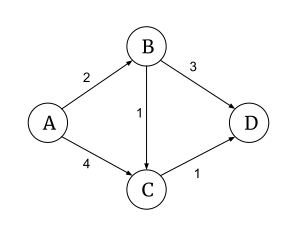
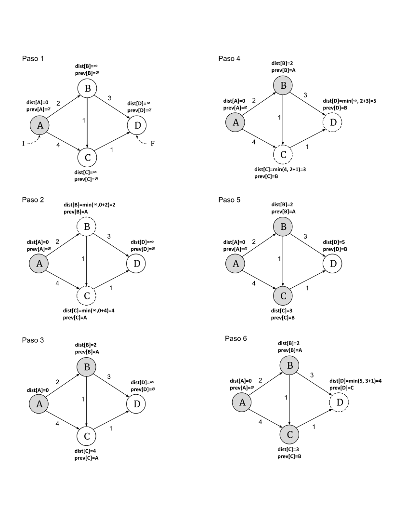

En este capítulo estudiaremos una técnica heurística que podemos aplicar a problemas de optimización en búsqueda combinatoria, los algoritmos voraces. Para algunos problemas, el uso de esta técnica permite encontrar soluciones óptimas a través de un proceso progresivo en el que en cada paso del algoritmo se decide utilizar la opción inmediata mejor entre la serie de opciones posibles, sin consideraciones sobre cómo esta decisión impacta el resultado global del algoritmo. La heurística implica asumir que escoger la mejor opción disponible en cada paso nos llevará a finalizar con la mejor solución final posible para el problema.

Para introducir el uso de esta técnica, consideremos el problema de calendarizar el uso de un único recurso disponible de forma tal que se obtenga el máximo provecho posible.

## Selección de actividades ##

En un centro universitario tenemos a disposición de la comunidad un auditorio en el cuál se pueden llevar a cabo actividades. El auditorio es muy solicitado, y por tanto se desea acomodar la mayor cantidad de actividades por día como sea posible.

Para calendarizar el uso del auditorio en un día particular se reciben las solicitudes de actividades a realizar indicando para cada actividad su hora de inicio y hora de finalización. Puesto que cada solicitud se recibe individualmente, y no hay un requisito de coordinación entre los solicitantes, es muy probable que hayan choques de horario entre algunas de las actividades solicitadas.

El problema a resolver es entonces seleccionar la mayor cantidad de actividades posibles para desarrollarse en el auditorio en un mismo día sin que haya choque de horarios.

Podemos estructurar las solicitudes de actividades para un día en una tabla que contiene para cada actividad su hora de inicio y hora de finalización, por ejemplo de la siguiente manera:

actividad   1   2   3   4   5   6   7   8   9  10  11
--------   --  --  --  --  --  --  --  --  --  --  --
inicio      8   9  10  11  11  13  13  14  16  16  20
fin        14  12  21  13  16  15  17  18  19  20  22

En esta tabla podemos observar por ejemplo que las actividades 1 y 2 tienen choque de horario, puesto que la actividad 1 termina a las 14 horas (2 pm) mientras que la actividad 2 inicia a las 9 horas (9 am). Por otro lado, la actividad 6 no choca con la actividad 9, porque la 6 termina a las 15 horas (3 pm) mientras que la 9 inicia a las 16 horas (4 pm).

Cuando dos actividades no tienen choque de horario decimos que son compatibles, y cuando sus horarios chocan decimos que son incompatibles. Podemos expresar esta relación de la siguiente manera:

(@) **Definición**. Dos actividades $i$ y $j$ son **compatibles** entre si cuando $inicio_i \geq fin_j \lor inicio_j \geq fin_i$.

Expresamos entonces el problema computacionalmente de la siguiente manera.

(@) **Problema**. Seleccionar la mayor cantidad de actividades compatibles entre si.  
  **Entradas**. Un conjunto de actividades $Act = \{1, 2, 3, \dots n\}$ y una secuencia de pares de la forma $(inicio, fin)$ correspondiente a los horarios para cada actividad $H = [(i_1, f_1), (i_2, f_2), \dots, (i_n, f_n)]$.  
  **Salida**. El subconjunto $Sel \subseteq Act$ de mayor cardinalidad tal que $\forall i, j \in Sel, i_i \geq f_j \lor i_j \leq f_i$.  

Para resolver este problema aplicamos la heurística voraz de seleccionar siempre del conjunto de actividades posibles aquella que (1) finalice primero y (2) que sea compatible con la última actividad seleccionada.

\begin{algorithm}[H]
    \DontPrintSemicolon
    \KwInput{Una secuencia de actividades $Act = [(a_1, i_1, f_1), (a_2, i_2, f_2), \dots, (a_n, i_n, f_n)]$.}
    \KwOutput{El subconjunto $Sel \subseteq Act$ de mayor cardinalidad tal que $\forall i, j \in Sel, i_i \geq f_j \lor i_j \leq f_i$.}
  
    \BlankLine
    \caption{Seleccionar la mayor cantidad de actividades compatibles entre si.}
    \SetAlgoVlined
    
    $\ordenar(Act)$ ordenar actividades ascendentemente por hora de finalización \;
    $n \assign |Act|$ \;
    $Sel \assign \{Act[0]\}$ \;
    $j \assign 0$ \;

    \For{$i \in [1 \twodots n[$} {
        \If{$Act[i].i \geq Act[j].f$} {
            $Sel \assign Sel \cup \{Act[i]\}$ \;
            $ j \assign i $
        }
    }

    \Return{$Sel$} \;
\end{algorithm}

El primer paso del algoritmo es ordenar la lista de actividades ascendentemente por hora de finalización (línea 1). Esto nos permitirá ir tomando siempre de la secuencia las actividades que finalicen más pronto. El índice $j$ nos permitirá mantener la referencia a la última actividad agregada a $Sel$ (líneas 4 y 8).

Una vez agregada la primera actividad de la secuencia a $Sel$, es decir la que finaliza más pronto en el día (línea 3), recorremos el resto de la secuencia, preguntando en cada iteración si la actividad actual es compatible con la última actividad agregada a $Sel$ (línea 6), si es compatible la agregamos a $Sel$.

La complejidad temporal de este algoritmo debe tomar en cuenta el tiempo necesario para el ordenamiento así como el recorrido lineal que se realiza sobre la secuencia de actividades $Act$. Para el ordenamiento podemos esperar como mejor opción una complejidad temporal de $\mathcal{O}(n \log n)$.

$$
\begin{aligned}
T(n) = \mathcal{O}(n \log n) + \mathcal{O}(n) = \mathcal{O}(n \log n)
\end{aligned}
$$

## Algoritmos voraces ##

Para decidir si podemos resolver un problema con un algoritmo voraz debemos verificar que el problema cumpla con dos características particulares: subestructura óptima y opción voraz.

La característica de **subestructura óptima** es la misma que necesitamos para resolver problemas con programación dinámica. Recordamos del capítulo anterior que un problema tiene subestructura óptima cuando su solución óptima contiene a su vez la solución óptima para sus subproblemas.

Por otro lado, la característica de **opción voraz** se refiere a que podemos llegar a una solución óptima global escogiendo la opción óptima local en cada repetición del algoritmo. A diferencia de la técnica de programación dinámica, la opción voraz no implica que tenemos que resolver el subproblema para saber cuál es su mejor solución, al contrario simplemente se escoge la opción que aparentemente es la mejor de acuerdo con algún criterio definido para el problema particular en cuestión. Por ejemplo, en el caso de nuestro algoritmo para selección de actividades la opción voraz es escoger en cada paso la actividad que termine más temprano, esto no nos lleva a investigar y resolver un subproblema, simplemente es la mejor opción aparente en cada iteración del algoritmo.

## Correctitud ##

¿Cómo podemos tener certeza de que la heurística de opción voraz que utiliza nuestro algoritmo de selección de actividades siempre nos va a ayudar a generar la solución óptima?

Sabemos que la heurística voraz no garantiza encontrar la solución óptima para cualquier problema, sino que es necesario que presente subestructura óptima y opción voraz.

Podemos responder a la pregunta con una demostración formal de la siguiente manera.

(@) **Teorema**. El problema de selección de actividades se puede resolver con un algoritmo voraz que tome siempre la próxima actividad compatible que finalice más pronto.

#### Demostración ####

Para demostrar que nuestro algoritmo voraz garantiza la solución óptima al problema de selección de actividades debemos demostrar que tiene subestructura óptima y que la opción voraz produce una solución óptima.

*Opción voraz*. Supongamos que $S = [a_1, a_2, \dots, a_n]$ es una solución óptima al problema de selección de actividades para un conjunto de actividades $A$ tal que $a_1$ **no** es la actividad que finaliza más temprano.

Puesto que $S$ es una solución óptima sabemos que:

* $n = |S|$ es el número máximo de actividades posible de acomodar.

* $fin(a_1) \leq inicio(a_2)$, $fin(a_2) \leq inicio(a_3)$ y así sucesivamente para el resto de actividades en la secuencia $S$.

* En general, $\underset{i<j}{\forall i,j} \in [1 \twodots n], fin(a_i) \leq inicio(a_j)$.

Si $a_t$ es la actividad que finaliza más temprano, entonces se cumple que $fin(a_t) \leq fin(a_1)$. Dado que $fin(a_1) \leq inicio(a_2)$ entonces se cumple por transitividad que $fin(a_t) \leq inicio(a_2)$.

Entonces podemos reemplazar $a_1$ por $a_t$ en $S$ manteniendo la compatibilidad entre las actividades. Si aplicamos dicho reemplazo, obtenemos entonces una secuencia $S_v = [a_t, a_2, \dots, a_n]$ tal que $|S_v|=n$. Por tanto, $S_v$ es también una solución óptima.

$\therefore$ La selección de la actividad que finaliza más temprano como opción voraz genera una solución óptima.

*Subestructura óptima*. Consideremos ahora el subproblema $A^{\prime} = A - \{a_t\}$. Podemos demostrar que dado que $S_v$ es una solución óptima al problema $A$, entonces $S_{v}^{\prime} = S_v - [a_t] = [a_2, \dots, a_n]$ es una solución óptima al subproblema $A^{\prime}$.

Sabemos que:

* $|S_v| = n$

* $|S_{v}^{\prime}| = (n - 1)$

Para demostrar por contradicción, supongamos que $S_{v}^{\prime}$ no es la solución óptima al subproblema $A^{\prime}$ y que más bien existe una solución óptima $T^{\prime}$ tal que $|T^{\prime}| > |S_{v}^{\prime}|$, en otras palabras $T^{\prime}$ logra acomodar más actividades que $S_{v}^{\prime}$.

$$
|T^{\prime}| > |S_{v}^{\prime}| \implies |T^{\prime}| > (n - 1)
$$

Si este es el caso, entonces podemos construir a $T = T^{\prime} + [a_t]$ como una solución óptima al problema $A$ (puesto que ya demostramos que el problema presenta opción voraz). Según la definición de $T$, tendríamos que $|T| = |T^{\prime} + 1|$. Con base en este hecho hacemos la siguiente derivación.

$$
\begin{aligned}
|T^{\prime}| &> (n - 1) \\
|T^{\prime}| + 1 &> (n - 1) + 1 \\
|T^{\prime}| + 1 &> n \\
|T| &> n \\
|T| &> |S_v| \\
\end{aligned}
$$

Este resultado implica entonces que $S_v$ no es una solución óptima al problema $A$ y caemos en contradicción con nuestra premisa. No puede haber, por lo tanto, una solución mejor que $S_{v}^{\prime}$ para el problema $A^{\prime}$.

$\therefore$ El problema de selección de actividades tiene subestructura óptima.

$\blacksquare$

## Algoritmo de Dijkstra ##

Analicemos otro ejemplo. Consideremos ahora el problema de encontrar el camino más corto entre dos vértices de un grafo dirigido y pesado.

(@) **Problema**. Camino más corto entre los vértices $I$ y $F$ de un grafo.  
  **Entradas**. El conjunto de vértices $V$ y la matriz de adyacencia $w$ del grafo, y los vértices de inicio $I$ y fin $F$ tal que $I, F \in V$.  
  **Salida**. Una secuencia de vértices $C$ que representa el camino más corto (de mínimo peso) en el grafo, iniciando en $I$ y finalizando en $F$.  

El planteamiento del problema presupone una representación del grafo como una matriz de adyacencia. Esta matriz almacena valores de $\infty$ para pares de vértices que no están conectados entre si.

Estudiaremos a continuación una solución a este problema con el algoritmo de Dijkstra. Este es un algoritmo voraz que va identificando el camino más corto sobre la marcha. Partiendo del vértice de inicio $I$, el algoritmo examina cada vértice del camino, tomando en cuenta a todos sus vecinos y escogiendo el que tenga menor distancia (peso) como el siguiente vértice a examinar. El proceso se repite hasta llegar al vértice $F$ o agotar todos los caminos posibles.

Para que este algoritmo funcione correctamente, el grafo no puede contener pesos negativos.

\begin{algorithm}[H]
    \DontPrintSemicolon
    \KwInput{El conjunto de vértices $V$ y la matriz de adyacencia $w$ del grafo, y los vértices de inicio $I$ y fin $F$ tal que $I, F \in V$.}
    \KwOutput{Una secuencia de vértices $C$ que representa el camino más corto (de mínimo peso) en el grafo, iniciando en $I$ y finalizando en $F$.}
  
    \BlankLine
    \caption{Algoritmo de Dijkstra}
    \SetAlgoVlined
    \SetKwProg{Fn}{función}{}{}

    \Fn{$\dijkstra(V, w, I, F)$} {
      \For{$v \in V$} {
        $dist[v] \assign \infty$ \;
        $prev[v] \assign \varnothing$ \;
        $Q \twoheadleftarrow v$ \;
      }
      $dist[I] \assign 0$ \;

      \While{$Q \neq \varnothing$} {
        $u \assign $ escoger el elemento de $Q$ con el mínimo valor en $dist$ \;
        \If{$u = F$} {
          \Return{$\camino(prev, I, F)$}\;
        }

        $Q \assign Q - u$ \;
        \For{$v \in \vecinos(u, Q, w)$} {
          \If {$dist[u] + w[u][v] < dist[v]$} {
            $dist[v] \assign dist[u] + w[u][v]$ \;
            $prev[v] \assign u$ \;
          }
        }
      }

      \Return{$\varnothing$} \;
    }

    \Fn{$\vecinos(u, Q, w)$} {
      $V \assign $ nueva lista \;
      \For{$v \in w[u]$} {
        \If{$u \neq v \land w[u][v] < \infty \land v \in Q$} {
          $V \twoheadleftarrow v$ \;
        }
      }
      \Return{$V$}\;
    }

    \Fn{$\camino(prev, I, F)$} {
        $C \assign $ nueva pila \;
        $v \assign F$ \;
        \If{$prev[v] \neq \varnothing \lor v = I$} {
          \While{$v \neq \varnothing$} {
            $C \twoheadleftarrow v$ \;
            $v \assign prev[v]$ \;
          }
        }

        \Return{$C$}\;
    }    
\end{algorithm}

El algoritmo inicializa las estructuras necesarias para mantener los datos sobre el camino y la distancia que se irán calculando (líneas 2-6): $dist$ mantendrá las mejores distancias encontradas al momento desde el vértice $I$ a todos los demás vértices del grafo, esta estructura se inicializa en $\infty$; $prev$ representará el camino desde una perspectiva de atrás hacia adelante, es decir almacena predecesores, de manera tal que $prev[F]$ representa al vértice previo a llegar al final del camino, el camino se debe reconstruir entonces desde $F$ hasta llegar a $I$; finalmente, $Q$ es una cola de prioridad que contiene a los vértices pendientes de exploración.

Luego de la inicialización, se ejecuta el ciclo principal de exploración de vértices que se repetirá mientras hayan pendientes en $Q$. La línea 8 es la más importante en relación con nuestro tema pues determina el comportamiento voraz del algoritmo; se selecciona el vértice de $Q$ que represente el camino más corto hasta este punto desde $I$. En este punto cabe resaltar que los problemas que se resuelven con algoritmos voraces deben tener subestructura óptima, y aquí estamos aprovechando este hecho: si el camino más corto entre $I$ y $F$ pasa por $K$ entonces el camino entre $I$ y $K$ será el más corto posible para estos dos vértices.

Si el último vértice $u$, tomado de $Q$, es $F$ quiere decir que hemos encontrado el camino entre $I$ y $F$ (líneas 9-10), en este caso se ejecuta el algoritmo $camino$ para reconstruir el camino final $C$ a través de un recorrido de atrás hacia adelante en $prev$ (líneas 23-29).

Si $u$ no corresponde al final del camino entonces procedemos a explorar sus vértices vecinos (línea 12), estos corresponden a los vértices conectados a $u$ por un arco y que todavía estén dentro de los pendientes $Q$ (líneas 17-22). Esta última validación nos protege de volver a explorar vértices anteriormente visitados, previniendo que el algoritmo se enganche en un bucle infinito cuando hay ciclos en el grafo.

Para cada vecino $v$ se valida si el camino desde $u$ es más corto que la última distancia registrada para $v$, si este es el caso se actualizan las estructuras de datos para reflejar que hemos encontrado un mejor camino (líneas 13-15). Recordemos que en primera instancia todas las distancias estarán inicializadas en $\infty$, por tanto el primer camino encontrado siempre será el mejor.

Finalmente, si exploramos todos los vértices en $Q$ y ninguno es $F$ entonces el algoritmo retorna $\varnothing$ indicando que no existe un camino en el grafo entre $I$ y $F$ (línea 30).

{ width=450px }

Observemos el comportamiento del algoritmo con un ejemplo concreto. La figura $\ref{fig:dijkstra_grafo}$ representa un grafo en el que buscaremos el camino más corto entre los vértices $A$ y $D$. Notemos que hay tres posibles caminos: $(A, B, D)$ con distancia 5, $(A, C, D)$ con distancia también 5, y el más corto $(A, B, C, D)$ con distancia 4.



Como vemos en el paso 1 de la figura $\ref{fig:dijkstra_alg}$, inicialmente las distancias desde $A$ a los demás vértices se inicializan en $\infty$, con la excepción de la distancia hacia $A$ ya que desde $A$ hasta $A$ no hay distancia, ya estamos ahí.

En el paso 2 determinamos que los vecinos de $A$ son $B$ y $C$. El camino más corto entre $A$ y $B$ corresponde a la distancia hasta $A$ más la distancia entre $A$ y $B$, o sea $(0 + 2)$. Similarmente, el camino más corto entre $A$ y $C$ corresponde a $(0 + 4)$.

Los vértices sombreados en gris representan vértices ya explorados, y que por tanto ya no están en $Q$. 

Después de haber explorado el vértice $A$ en el paso 2, para escoger el siguiente vértice debemos considerar a los no sombreados (que estarían en $Q$): $B$ con distancia $2$, $C$ con distancia $4$ y $D$ con distancia $\infty$. Aplicando el criterio voraz escogemos a $B$ por ser el de menor distancia, según se muestra en el paso 3.

En el paso 4 se repite el proceso, explorando ahora al vértice $B$. En este paso determinamos que la distancia del camino hasta $B$ más la distancia entre $B$ y $C$ corresponde a $(2 + 1)$. Esta distancia hasta $C$ pasando por $B$ es menor que la distancia directamente desde $A$ y por tanto actualizamos las estructuras de datos. No sólo se actualiza $dist[C] \assign 3$, sino que también se cambia $prev[C] \assign A$ por $prev[C] \assign B$. 

En este paso también se actualiza la distancia hasta $D$ desde $B$.

Después de explorar $B$ debemos seleccionar el próximo vértice entre: $C$ con distancia $3$, y $D$ con distancia $5$. Vorazmente seleccionamos a $C$ como se observa en el paso 5.

Finalmente, en el paso 6 determinamos que la distancia a $D$ desde $C$ es menor que la distancia desde $B$ anteriormente registrada, y por tanto actualizamos las estructuras de datos correspondientemente. El siguiente vértice a explorar —y el último que queda en $Q$ en nuestro ejemplo— sería $D$, puesto que $F=D$ terminamos la ejecución. Aquí observamos que el camino se puede reconstruir de atrás hacia adelante utilizando $prev$ de la siguiente manera

```
F = D        => camino = {D}
prev[D]=C    => camino = {C, D}
prev[C]=B    => camino = {B, C, D}
prev[B]=A    => camino = {A, B, C, D}
prev[A]=null 
```
También sabemos por $dist$ que la longitud del camino encontrado es $dist[D]=4$.

#### Análisis ####

Con respecto a la complejidad temporal, debemos observar que la decisión que tomemos sobre cómo implementar la línea 8 del algoritmo va a tener un efecto directo sobre el tiempo de ejecución.

Consideremos el caso ingenuo en el que implementamos $Q$ como una lista o arreglo. Tanto $dist$, como $prev$ y $Q$ contendrán todos los vértices del grafo, y tendrán entonces longitud $|dist|=|prev|=|Q|=|V|$. El primer ciclo de inicialización (líneas 2-5) presentará entonces complejidad $\mathcal{O}(|V|)$.

La línea 7 se repetirá mientras $Q$ no esté vacía o no nos topemos con $F$. En el peor de los casos no habrá camino entre $I$ y $F$ y por tanto la línea 7 se repetirá para todos los elementos de $Q$, es decir $|V|$ veces. Luego como $Q$ es una estructura lineal, en la línea 8 debemos recorrerla de principio a fin para encontrar el vértice con distancia mínima. La longitud de $Q$ se irá reduciendo en 1 elemento en cada iteración, por tanto la combinación de líneas 7 y 8 genera una serie aritmética, contabilizamos entonces una complejidad de $\mathcal{O}(|V|^2)$.

La función $camino$ (líneas 23-29) recorre a $prev$ linealmente y por tanto tiene complejidad $\mathcal{O}(|V|)$. Este recorrido sucede exactamente una vez en el algoritmo principal, si y solo si existe al menos un camino entre $I$ y $F$ en el grafo (líneas 9-10).

La función $vecinos$ (líneas 17-22) tiene un ciclo que recorre una fila completa de la matriz de adyacencia y por tanto presenta complejidad temporal $\mathcal{O}(|V|)$. 

Por lo tanto, la línea 12 se repetirá $|V|+|V|$ veces —tomando en cuenta el costo de la llamada a $vecinos$ y luego el recorrido sobre la lista de vecinos—. En combinación con la línea 7 tenemos entonces una complejidad de $\mathcal{O}(|V| \cdot (|V| + |V|)) = \mathcal{O}(2|V|^2) = \mathcal{O}(|V|^2)$.

Consideramos todos estos elementos en nuestra función $T(n)$: el costo de inicialización $\mathcal{O}(|V|)$, más el costo de la combinación de las líneas 7 y 8 $\mathcal{O}(|V|^2)$ junto con el costo de la combinación de las líneas 7 y 12 $\mathcal{O}(|V|^2)$ —pues suceden como parte del mismo ciclo—, más el costo $\mathcal{O}(|V|)$ de invocar una vez a $camino$ en línea 10. Tenemos entonces que

$$
\begin{aligned}
T(|V|)&=\mathcal{O}(|V|) + \mathcal{O}(|V|^2 + |V|^2) + \mathcal{O}(|V|) \\ 
 &= \mathcal{O}(|V|^2)
\end{aligned}
$$

Esta complejidad temporal se puede mejorar si cambiamos la implementación de $Q$  por una cola de prioridad, y reemplazamos la matriz de adyacencia por una lista de adyacencia para cada vértice que contenga sólo los elementos con quienes este está relacionado.

De esta forma, la construcción de $Q$ (líneas 2-5) seguirá teniendo complejidad temporal $\mathcal{O}(|V|)$, pero la extracción en la línea 8 pasará a tener complejidad $\mathcal{O}(\log |V|)$.

Por otro lado, con el cambio de la matriz de adyacencia por listas de adyacencia para cada vértice tendremos que, en combinación, las líneas 7 y 12 repetirán tantas veces como arcos tenga el grafo, llamaremos a este número $|E|$. También es necesario considerar que la actualización de la distancia en la línea 14 implicaría actualizar la llave en $Q$, esta operación también tiene complejidad $\mathcal{O}(\log |V|)$. Entonces, la complejidad del ciclo será $\mathcal{O}(|E| \log |V|)$ asumiendo un peor caso en el que se deba actualizar la distancia en cada iteración.

$$
\begin{aligned}
T(|V|, |E|)&=\mathcal{O}(|V|) + \mathcal{O}((|V| \log |V| + |E| \log |V|) + \mathcal{O}(|V|) \\ 
 &= \mathcal{O}((|V| + |E|) \log |V|)
\end{aligned}
$$

Lo cual representa una mejora sobre la complejidad cuadrática inicial.

## Síntesis ##

Los algoritmos voraces tienden a ser más eficientes que otros algoritmos que resuelven los mismos problemas de búsqueda combinatoria aplicando otras técnicas como por ejemplo programación dinámica o *backtracking*. 

Podemos afirmar esto con cierta confianza porque escoger la opción voraz —escoger el mínimo o el máximo local— tiende a ser una operación más simple que desarrollar una búsqueda exhaustiva sobre todo el espacio disponible o memorizar resultados parciales.

Sin embargo, la complejidad en el uso de esta técnica yace en la necesidad de construir una demostración formal sobre las cualidades del problema en cuestión: subestructura óptima y opción voraz.

## Ejercicios ##

1. [Repaso] Resuelva el problema de selección de actividades utilizando (a) una búsqueda ingenua, (b) programación dinámica.

2. Una persona necesita conducir su automóvil de Limón a Liberia. Sabemos que el tanque del automóvil rinde $n$ kilómetros. Tenemos un mapa que indica las distancias entre las diferentes estaciones de combustible sobre la ruta a tomar. La persona quiere hacer la menor cantidad posible de paradas para cargar combustible. (a) Demuestre que este problema se puede resolver con un algoritmo voraz. (b) Diseñe un algoritmo voraz que resuelva este problema.

\begin{comment}
CLRS 17.2-4 https://sites.math.rutgers.edu/~ajl213/CLRS/Ch16.pdf
\end{comment}

3. Queremos cambiar un monto $n$ de colones a monedas utilizando la mínima cantidad posible de monedas. Las denominaciones de las monedas son 500, 100, 50, 25, 10, 5 y 1. (a) Diseñe un algoritmo voraz que resuelva el problema. (b) Demuestre que su algoritmo siempre va a producir una solución óptima.

\begin{comment}
CLRS 17-1 https://sites.math.rutgers.edu/~ajl213/CLRS/Ch16.pdf
\end{comment}

4. Retomando el ejercicio #3 del capítulo 8. Considere ahora la posibilidad de tomar partes de los paquetes de ayuda, es decir al cargar el camión no necesariamente tengo que cargar el volúmen completo de cada paquete. Proponga un algoritmo voraz que resuelva esta nueva versión del problema.

## Referencias ##

Cormen T., Leiserson C., Rivest R. y Stein C. (2009) Introduction to Algorithms (2da ed.). MIT Press.
