En el capítulo 6 estudiamos problemas computacionales que por su complejidad se tornan difíciles (o imposibles) de resolver debido a su alta tasa de crecimiento en el consumo de recursos conforme crece el tamaño de la entrada. Prestando atención al concepto de *tratabilidad*, posteriormente hemos estudiado cómo podemos mejorar la eficiencia de las soluciones o aproximaciones a estos problemas aplicando diferentes técnicas de diseño de algoritmos que minimicen el consumo de recursos.

En este capítulo estudiaremos un acercamiento alternativo a este tipo de problemas; en lugar de minimizar el uso de recursos, más bien pondremos a disposición de los algoritmos más recursos para su consumo. Particularmente nos enfocaremos en cómo aprovechar más unidades de procesamiento para reducir los tiempos de solución de  problemas computacionales difíciles.

Hasta este punto, los algoritmos que hemos analizado presuponen un flujo secuencial de ejecución, esto significa que cada uno de estos algoritmos se ejecuta como una secuencia lineal de pasos.

Desde esta perspectiva, cada uno de los pasos o instrucciones de un algoritmo secuencial tienen un orden específico: hay una instrucción inicial que llamaremos $i_1$, posterior a esta se ejecutará la siguiente instrucción $i_2$, y sucesivamente se ejecutarán las siguientes instrucciones en el orden lineal (también llamado monotónico) hasta ejecutar la última instrucción $i_k$. La figura $\ref{fig:secuencial}$ ilustra este concepto.

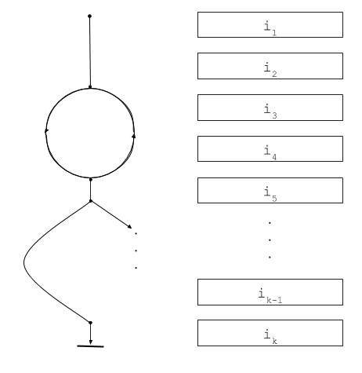{ width=350px }

La decisión sobre la siguiente instrucción a ejecutar no siempre sigue necesariamente un orden monotónico. Ocasionalmente el flujo de ejecución puede caer en ciclos como el que observamos en la figura $\ref{fig:secuencial}$ entre las instrucciones $i_3$ e $i_4$. La instrucción $i_4$ decide cuál será la siguiente instrucción a ejecutar (sea $i_3$ o $i_5$) con base en alguna condición relacionada con el estado actual de la máquina.

Este flujo también puede decidir saltar hacia adelante en la ejecución, por ejemplo en el caso de la instrucción $i_5$, alguna condición puede cambiar la decisión sobre cuál será la siguiente instrucción a ejecutar, ya sea $i_6$ o $i_k$, siendo este último el caso ilustrado en la figura $\ref{fig:secuencial}$.

El flujo secuencial es entonces un flujo lógico, obedece a mecanismos de control basados en predicados que se verifican contra el estado del programa para decidir cuál será la siguiente instrucción a ejecutar en la secuencia. Reconocemos estos mecanismos de control en instrucciones comúnes como los condicionales `if...then...else` o `switch...case`, y en ciclos como `while`, `do...while`, o `for`.

Independientemente de que el flujo permita saltar hacia atrás o hacia adelante en la secuencia de instrucciones, es sin lugar a duda un flujo único, un solo **hilo** conductor de la lógica del algoritmo.

La programación concurrente se refiere al diseño e implementación de algoritmos que manejan múltiples hilos de control. La figura $\ref{fig:concurrente}$ ilustra un ejemplo de un algoritmo concurrente con tres hilos: un hilo principal, un hilo `a` y un hilo `b`.

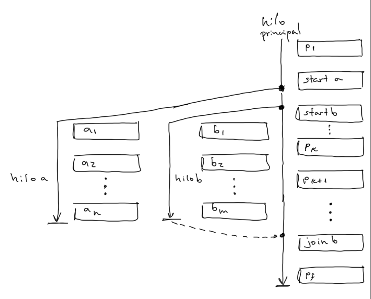{ width=450px }

Como mencionamos anteriormente, un algoritmo **concurrente** maneja múltiples hilos lógicos. En el caso de nuestro ejemplo, un hilo principal, que es el hilo que inicia la ejecución, y dos hilos $a$ y $b$ disparados desde el hilo principal a partir de las instrucciones `start a` y `start b`. Desde una perspectiva lógica podemos asumir que una vez que se dispara un hilo nuevo este estará en ejecución "al mismo tiempo" que los otros hilos del programa, es decir suponemos que los hilos son (al menos aparentemente) simultáneos.

De esta forma, cuando el hilo principal ejecuta la segunda instrucción, etiquetada como `start a`, se dispara un nuevo hilo con el código de $a$, e inmediatamente el hilo principal pasa a ejecutar la tercer instrucción (que también dispara un hilo).

Cada hilo continuará ejecutando sus instrucciones sin detenerse a esperar los resultados de la ejecución de instrucciones en los otros hilos. Esto se cumple siempre excepto para instrucciones especiales como la penúltima presentada en la figura $\ref{fig:concurrente}$ etiquetada como `join b`. Cuando se ejecuta esta instrucción, el hilo principal queda bloqueado hasta que el hilo $b$ finalice su ejecución. Puesto que no hay una instrucción `join a` en ninguno de los hilos, la ejecución del hilo $a$ se realizará de manera independiente de los otros dos hilos. En contraste, el hilo principal depende del hilo $b$.

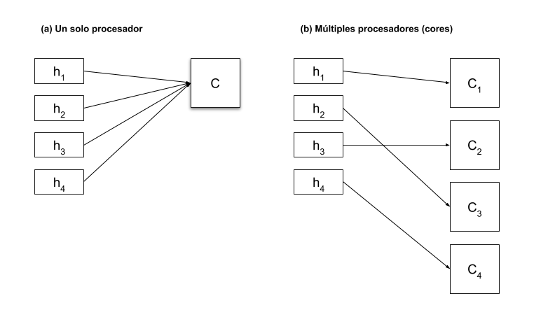{ width=450px }

Los algoritmos concurrentes pueden ser ejecutados en **paralelo** en el caso de que la máquina disponga de múltiples procesadores. Cuando un algoritmo se ejecuta en paralelo, distintos hilos se asignan a distintos procesadores, cada procesador ejecuta la instrucciones de su correspondiente hilo de manera realmente simultánea. La figura $\ref{fig:paralelismo}$ (b) ilustra este caso; un algoritmo paralelizado podría potencialmente ejecutarse más rápido que un algoritmo secuencial pues tiene acceso a más recursos de procesamiento. Sin embargo, un mal diseño del algoritmo concurrente podría tener peor desempeño que uno secuencial.

Por otro lado, cuando un algoritmo concurrente se ejecuta en un único procesador sus hilos son tan solo aparentemente simultáneos, según se ilustra en la figura $\ref{fig:paralelismo}$ (a). Esta aparente simultaneidad se debe a que las instrucciones de todos los hilos se ejecutan en un mismo procesador, y  por tanto deben esperar cada una su correspondiente turno. La concurrencia se logra aprovechando los tiempos muertos del procesador. Cuando una instrucción requiere de acceso a un dispositivo de entrada/salida, a la memoria, o al sistema de archivos se dará un tiempo de espera puesto que las señales eléctricas deben recorrer una distancia física real mayor que la distancia requeridad para el acceso a la memoria de trabajo ubicada a lo interno del procesador (sus registros). Este tiempo de espera puede ser aprovechado permitiendo al procesador ejecutar otras instrucciones de otros hilos mientras los datos de la instrucción anterior viajan hacia y desde los dispositivos externos al procesador.

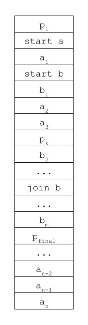{ width=150px }

La figura $\ref{fig:intercalado}$ presenta una posible ejecución de nuestro algoritmo concurrente de ejemplo en un único procesador. En la figura podemos observar que el procesador va intercalando instrucciones tanto del hilo principal, como de los hilos $a$ y $b$, siguiendo el orden lógico de cada hilo y aprovechando los tiempos de espera que pueda generar alguna instrucción. La decisión de cuál instrucción ejecutar en un momento específico puede ser responsabilidad del hardware, del sistema operativo o de alguna combinación de ambos. Por esta razón los algoritmos concurrentes son no determinísticos, distintas corridas del mismo algoritmo ejecutarán sus operaciones en órdenes diferentes; esto podría producir salidas diferentes en cada ejecución, aunque con los mecanismos de sincronización que estudiaremos más adelante podemos garantizar un comportamiento más consistente.

Con base en este última idea, podemos concluir que cuando tenemos un único procesador, el uso de algoritmos concurrentes es útil sólo si las tareas por resolver implican un uso intensivo de entrada/salida —ya sea a través del sistema de archivos, dispositivos periféricos, o la red entre otros—. Por ejemplo en aplicaciones relacionadas con bases de datos, interfaz de usuario, o servicios web. Por otro lado, los algoritmos concurrentes intensivos en el uso de procesador, como por ejemplo para implementar redes neuronales, o la renderización de gráficos tridimensionales, son recomendables cuando hay disponibilidad de múltiples procesadores que permitan paralelizarlos.

## Condiciones de carrera y sincronización ##

La programación concurrente tiene el potencial de proveer a los algoritmos de más recursos para procesamiento, pero también introduce potenciales complicaciones en el manejo del espacio de almacenamiento, particularmente cuando este es compartido entre varios hilos.

Para ejemplificar la situación, consideremos el siguiente algoritmo concurrente.

\begin{algorithm}[H]
    \DontPrintSemicolon
    \BlankLine
    \caption{Conteo}
    \SetAlgoVlined
    \SetKwProg{Fn}{función}{}{}
    \Fn{$\contar(c, n)$}{
      \For{$i \in [1 \twodots n]$} {
          $c \assign c + 1$ \;
      }
    }

    $n \assign 10000$ \;
    $c \assign 0$ \;

    $h_1 \assign \Hilo(\contar(c, n))$ \;
    $h_2 \assign \Hilo(\contar(c, n))$ \;

    $\start(h_1)$ \;
    $\start(h_2)$ \;

    $\join(h_1)$ \;
    $\join(h_2)$ \;
\end{algorithm}

Este algoritmo crea dos hilos $h_1$ y $h_2$, cada uno de los cuales debe ejecutar la misma tarea de contar hasta diez mil.

Ambos hilos comparten una misma dirección de memoria $c$ donde se irá registrando el conteo.

El resultado esperado después de ejecutar el algoritmo es que la variable $c$ contenga el valor `20000`. Sin embargo, si lo ejecutamos podremos comprobar que el algoritmo tiene un comportamiento no determinístico. En cada ejecución retornará un valor diferente, que probablemente será menor que veinte mil en la mayoría de los casos.

Esta situación se debe a que el incremento en el valor de $c$ no es una operación atómica. Tal y como se presenta en la figura $\ref{fig:cond_carrera_1}$, cada incremento requiere de tres operaciones: leer el estado actual de $c$ a un registro, incrementar el registro, y actualizar el estado de $c$ con el valor del registro.

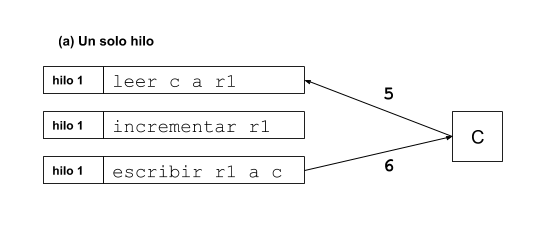{ width=450px }

Cuando introducimos un segundo hilo con la misma tarea de conteo, la ejecución de las operaciones de modificación del valor de $c$ pueden suceder en un orden intercalado con respecto a $c$, por ejemplo podría suceder una situación como la que se ejemplifica en la figura $\ref{fig:cond_carrera_2}$.

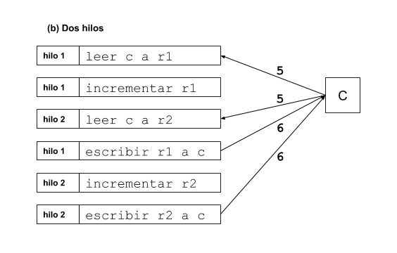{ width=450px }

En el caso de este ejemplo, el hilo $h_1$ lee el valor de $c$ como `5` y, mientras está incrementándolo en el registro local, $h_2$ también lee el valor actual de $c$ como `5` pues $h_1$ no ha tenido oportunidad de actualizarlo aún. Luego $h_1$ escribe el nuevo valor de $c$ como `6` para que posteriormente $h_2$ sobreescriba el valor de $c$ con `6` también. De esta forma se pierde la secuencia del conteo, pues un hilo constantemente sobreescribirá el estado de conteo del otro.

Aún más, si un hilo logra adelantarse por dos o más incrementos, el otro hilo estará trabajando con un valor tan desactualizado que retrocederá la cuenta por varias unidades cuando sea escrito; por esta razón el valor resultado del algoritmo es casi siempre menor que el esperado `20000`.

Podemos resolver este problema causado por la memoria compartida entre hilos utilizando candados que bloqueen el acceso a las direcciones de memoria para que sean accedidas por un hilo a la vez.

\begin{algorithm}[H]
    \DontPrintSemicolon
    \BlankLine
    \caption{Conteo sincronizado}
    \SetAlgoVlined
    \SetKwProg{Fn}{función}{}{}
    \Fn{$\contar(c, n, L)$}{
      \For{$i \in [1 \twodots n]$} {
          $\adquirir(L)$ \;
          $c \assign c + 1$ \;
          $\liberar(L)$ \;
      }
    }

    $n \assign 10000$ \;
    $c \assign 0$ \;
    $L \assign \Candado()$ \;

    $h_1 \assign \Hilo(\contar(c, n, L))$ \;
    $h_2 \assign \Hilo(\contar(c, n, L))$ \;

    $\start(h_1)$ \;
    $\start(h_2)$ \;

    $\join(h_1)$ \;
    $\join(h_2)$ \;
\end{algorithm}

El algoritmo de conteo sincronizado utiliza un candado que debe ser adquirido por el hilo justo antes de incrementar el valor de $c$ (línea 3). Posterior a la modificación de la memoria compartida, se libera el candado (línea 5).

Mientras un hilo esté en posesión del candado, todos los demás hilos que intenten adquirirlo van a quedar bloqueados —haciendo cola— hasta que el candado sea liberado. En el momento en que se libera, el hilo al frente de la cola de espera lo adquiere y los demás hilos en cola continuan esperando su turno.

La figura $\ref{fig:cond_carrera_3}$ ilustra una posible ejecución del algoritmo sincronizado. En este ejemplo, el hilo $h_1$ es el primero en adquirir el candado $L$, por tanto el hilo $h_2$ queda bloqueado en espera a que sea liberado. Esto da chance a $h_1$ de ejecutar las operaciones para incrementar el valor de $c$, asegurando de esta forma que $h_2$ lea el valor de $c$ más actualizado `6` y por tanto se respete el orden de la secuencia de conteo.

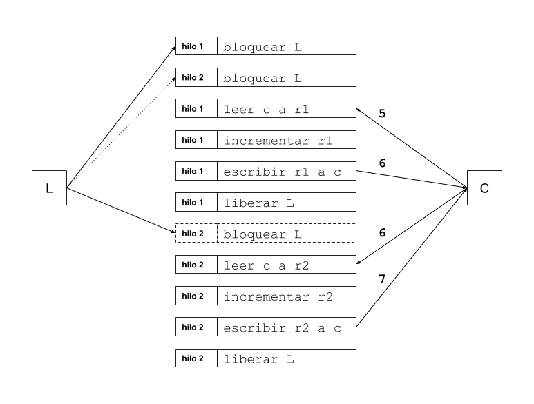{ width=450px }

El uso de candados permite manejar los problemas de condición de carrera provocados por el uso de memoria compartida entre dos o más hilos. Sin embargo, los candados introducen posibles complicaciones en el diseño de nuestros algoritmos concurrentes.

El abuso en la utilización de candados en nuestros algoritmos puede afectar el rendimiento, generando largas colas de espera; y en casos extremos, puede terminar transformando un algoritmo concurrente en uno secuencial.

Por otro lado, si programamos los hilos de manera tal que en cada ejecución deban adquirir múltiples candados podemos empujar al algoritmo hacia un punto muerto[^1] en el cual cada uno de los hilos termina bloqueado esperando a que algún otro hilo (también bloqueado) libere su candado. Recomendamos investigar "El problema de la cena de los filósofos"[^2] como un ejemplo clásico que ilustra dicha situación.

[^1]: Llamado *deadlock* en la literatura en inglés.
[^2]: *Dining philosophers* en la literatura en inglés.

## Prueba de primalidad paralela ##

Consideremos ahora un ejemplo de algoritmo concurrente que involucre algunos de los elementos que hemos estudiado hasta el momento en la resolución del problema computacional de determinar si un número de seis o más dígitos es primo o no.

\begin{algorithm}[H]
    \DontPrintSemicolon
    \KwInput{Un número entero $n$ de 6 o más dígitos. Un número entero $p$ que indica el número de procesadores disponibles.}
    \KwOutput{$Si$ cuando $n$ es primo, $No$ en cualquier otro caso}
    \BlankLine
    \caption{Prueba de primalidad paralela}
    \SetAlgoVlined
    \SetKwProg{Fn}{función}{}{}
    \Fn{$\probar(n, a, b, res)$}{
      \For{$i \in [a \twodots b[$} {
          \If{$n \mod i = 0$} {
            $res \assign No$ \;
            \Return{$res$} \;
          }
      }

      $res \assign Si$ \;
      \Return{$res$} \;
    }

    $tam \assign \lfloor{\frac{(n - 2)}{p}} \rfloor$ \;
    $a \assign 2$ \;
    $hilos \assign [\ ]$ \;

    \While{$p > 0$} {
      \If{$p = 1$} {
        $b \assign n$
      } \Else {
        $b \assign a + tam$ \;
      }
      $r \assign No$ \;
      $h \assign \Hilo(\probar(n, a, b, r))$ \;
      $hilos \twoheadleftarrow (h, r)$ \;
      $\start(h)$ \;

      $a \assign b$ \;
      $p \assign p - 1$ \;
    }

    $primo \assign Si$ \;
    \For{$(h, r) \in hilos$} {
      $\join(h)$ \;
      $primo \assign primo \land r$ \;
    }

    \Return{$primo$} \;
\end{algorithm}

Este algoritmo prueba la primalidad de números muy grandes utilizando la estrategia ingenua de probar cada uno de sus antecesores como posible divisor. No nos interesa particularmente la eficiencia de este algoritmo, sino más bien demostrar cómo se puede utilizar la técnica de programación concurrente para resolverlo de manera paralela.

El algoritmo divide el trabajo de probar todos los antecesores entre el número de procesadores disponibles en la máquina. Cada procesador probará la divisibilidad de un lote de antecesores definido como un rango que inicia en $a$ y finaliza en $b - 1$.

La línea 8 calcula el tamaño que tendrá cada uno de los lotes a probar. En esta línea se resta $n - 2$ para excluir los números $1$ y $n$ de las pruebas.

El ciclo entre las líneas 11 y 21 define el rango $[a \twodots b[$ sobre el que se trabajará, y crea y dispara el hilo. Se guarda una referencia al hilo, así como a la variable compartida $r$ en la secuencia $hilos$. Estas referencias se utilizan para comunicar el hilo principal con cada uno de los hilos trabajadores disparados.

La función $probar$ definida entre las líneas 1 y 7 es la encargada de hacer el trabajo de probar la divisibilidad de un lote de antecesores.

Finalmente, el fragmento entre las líneas 22 y 26, espera a que finalice cada uno de los hilos trabajadores disparados, registrando cada uno de sus resultados. El resultado final será $Si$ si y solo si cada hilo trabajador respondió con un $Si$.

## Arquitecturas paralelas ##

A través de los capítulos anteriores hemos hecho un esfuerzo por abstraer los detalles de las máquinas que ejecutarán nuestros algoritmos en el análisis de sus comportamientos. Sin embargo, el diseño y análisis de algoritmos paralelos requiere que tomemos en cuenta algunos detalles concretos acerca de la arquitectura de la máquina que tienen relación directa con los recursos disponibles. 

Particularmente tendremos que prestar atención al número de procesadores disponibles y sus capacidades para ejecutar instrucciones en paralelo, la organización de la memoria, y el manejo de los dispositivos de entrada/salida.

### Procesadores ###

La primer restricción arquitectónica a tomar en cuenta es el número de procesadores disponibles. Una computadora con $p$ procesadores, puede ejecutar $p$ operaciones simultáneamente.

El número de procesadores disponibles puede tratarse como una entrada más del algoritmo paralelo, de manera tal que se divida el trabajo entre las distintas unidades. 

Un acercamiento alternativo es calcular el número de procesadores a utilizar en el algoritmo como una función de la entrada $p(n)$. En este punto, es necesario notar que las máquinas paralelas pueden ser diseñadas incluyendo decenas, cientos, miles o millones de unidades de procesamiento. 

A pesar de este dato, es válido cuestionar la utilidad de diseñar un algoritmo que simplemente crece el número de procesadores utilizados conforme crece la entrada, ya que si el problema crece indefinidamente, eventualmente consumiremos la totalidad de los recursos de procesamiento disponibles. Sin embargo, la técnica tiene valor práctico al permitir evaluar teóricamente la medida en que una solución paralela es válida para un algoritmo. Si no es posible mejorar la complejidad temporal de un algoritmo utilizando una cantidad indefinida de procesadores entonces podemos concluir que la programación paralela no es una opción viable para resolver el problema.

Otro aspecto arquitectónico a tomar en cuenta es la forma en que se implementa el paralelismo en los procesadores. En una arquitectura de *instrucción única* los múltiples procesadores ejecutan todos la misma instrucción, mientras que en una arquitectura de *instrucciones múltiples* los procesadores pueden ejecutar cada uno una diferente instrucción. 

De manera semejante, una máquina puede estar diseñada para que cada procesador maneje el mismo dato simultáneamente, o diferentes datos simultáneamente.

La taxonomía de Flynn[^3] clasifica las arquitecturas paralelas de acuerdo con una combinación de los parámetros anteriores como se muestra en la siguiente tabla.

                            Múltiples datos    Dato único
-----------------------     ---------------    ----------
Instrucción única           SIMD               SISD
Múltiples instrucciones     MIMD               MISD

[^3]: https://en.wikipedia.org/wiki/Flynn%27s_taxonomy 

### Memoria ###

En cuanto a la memoria, debemos tomar en cuenta si la memoria va a ser compartida entre los distintos procesadores o más bien distribuida.

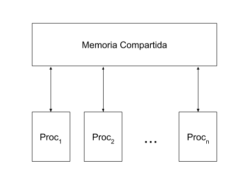{ width=450px }

Según se muestra en la figura $\ref{fig:mem_compartida}$, cuando la memoria es compartida, los distintos procesadores tienen acceso a las direcciones de un mismo espacio de memoria. Como ya observamos en la sección sobre condiciones de carrera, el uso de memoria compartida introduce la posibilidad de conflictos. 

                 lectura  escritura
------------     -------  ---------
concurrente      CR       CW
exclusivo        ER       EW

La arquitectura de la memoria compartida puede entonces incluir una combinación de los parámetros de la tabla anterior, lecturas concurrentes o exclusivas, y escrituras también concurrentes o exclusivas (por ejemplo CREW, o EREW).

Por otro lado, en una arquitectura de memoria distribuida cada unidad de procesamiento tiene acceso exclusivo a su propio espacio de memoria según se muestra en la figura $\ref{fig:mem_distribuida}$. En este escenario los procesadores se comunican entre si intercambiando mensajes a través de una red interna. La forma en que se interconecten los procesadores puede influenciar el diseño de los algoritmos; diferentes opciones de forma de interconexión incluyen: arreglo secuencial, matriz, árbol binario o grafo completo.

Finalmente, con respecto al almacenamiento de datos, también hay decisiones arquitectónicas que se pueden tomar acerca de cómo se leen y escriben datos a los dispositivos externos; estas decisiones implican posibilidades de conflicto similares a las de la memoria compartida.

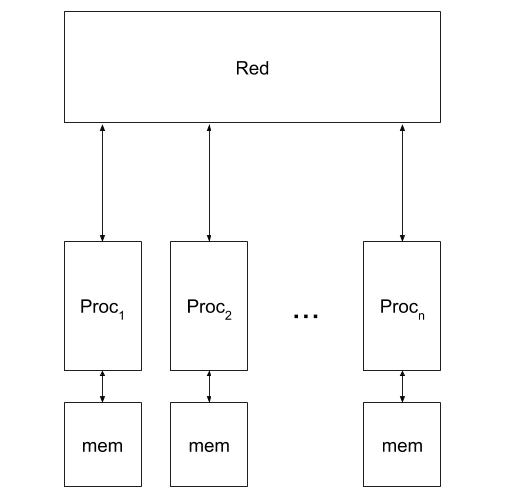{ width=450px }

### Modelo PRAM ###

El modelo PRAM es un ejemplo clásico de una arquitectura paralela. Este modelo se refiere a una máquina paralela de acceso aleatorio con memoria compartida EREW. 

El siguiente algoritmo resuelve el problema de la búsqueda de un elemento en una secuencia de manera paralela.

\begin{algorithm}[H]
    \DontPrintSemicolon
    \KwInput{Una secuencia de números enteros $A$, un número entero $n = |A| = 2^k$ y un número entero $e$}
    \KwOutput{Una secuencia que contiene una permutación de valores que pueden ser ya sea $\varnothing$ o números enteros que representan la posición donde se encontró $e$ en $A$ }
    \SetKwInput{KwModel}{Modelo}
    \KwModel{PRAM EREW con $p = n$ procesadores}
    \BlankLine
    \caption{Búsqueda paralela}
    \SetAlgoVlined
    \SetKwProg{Fn}{función}{}{}
    \SetKwFor{ParFor}{para}{hacer en paralelo}{}
    \Fn{$\copiar(e)$} {
      $T \assign [\ ]$ \;
      $T[0] \assign e$ \;
      \For{$i \in [1 \twodots k]$} {
        \ParFor{$j \in [2^{i-1} \twodots 2^i - 1]$} {
            $T[j] \assign T[j - 2^{i-1}]$ \;
        }
      }

      \Return{$A$} \;
    }

    $E \assign \copiar(e)$ \;
    \ParFor{$i \in [0 \twodots n[$} {
      \If{$A[i] = E[i]$} {
        $E[i] \assign i$ \;
      } \Else {
        $E[i] \assign \varnothing$ \;
      }
    }
    
\end{algorithm}

Dado que el modelo que estamos utilizando está restringido por EREW, sabemos que la máquina sólo permite lecturas y escrituras exclusivas a la memoria compartida. Entonces, no podemos definir un algoritmo paralelo donde los $n$ procesadores lean el valor de $e$ al mismo tiempo. 

Por esta razón, definimos una función $copiar$ (líneas 1-7) que copia en paralelo el elemento $e$ en un nuevo arreglo de tamaño $n$; de esta forma cada procesador leerá su propia copia del elemento a buscar. Aquí es importante notar que por simplicidad del algoritmo definimos que $n$ es una potencia de $2$, o en otras palabras $n = 2^k$. Las instrucciones "`para ... hacer en paralelo`" de las líneas 5 y 9 asignan un procesador a cada índice, de manera tal que se ejecuta simultáneamente el cuerpo para cada valor del índice; resolviendo, lo que de otra forma sería un ciclo, en un solo paso. 

Inicialmente el procesador $P_1$ copia $e$ a $T[0]$ (línea 3). Luego, en las líneas 5-6, para cada $i$ utilizaremos $2^{i-1}$ procesadores para leer en paralelo las casillas de $T$ que contengan a $e$ y copiar el valor a las siguientes casillas vacías del arreglo, según se ilustra en la figura $\ref{fig:copiar_paralelo}$.

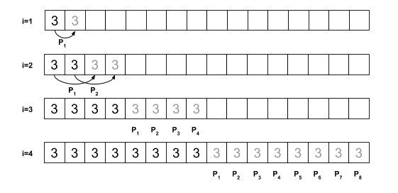{ width=450px }

Una vez cargado el arreglo, se resuelve la búsqueda en un solo paso (líneas 9-13), asignando un procesador a cada una de las casillas de $A$ que serán comparadas con las correspondientes casillas de $E$, el arreglo que contiene las $n$ copias del elemento $e$ a buscar. 

Si las casillas coinciden se sobreescribe la casilla en $E$ con la posición de $A$ donde se encontró a $e$, en caso contrario se sobreescribe con $\varnothing$. La figura $\ref{fig:buscar_paralelo}$ representa este proceso aplicado a un arreglo de 16 casillas $A = [1, 3, 5, 9, 0, 3, 2, 7, 3, 3, 5, 5, 4, 8, 5, 6]$.

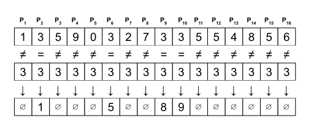{ width=450px }

#### Análisis ####

Para analizar la complejidad temporal del algoritmo necesitamos considerar tanto el procedimiento principal como la función auxiliar $copiar$. Empecemos por esta última.

La función $\copiar$ repite $k = \log_2(n)$ veces (línea 4) la operación paralela de copiar los valores $e$ existentes en el arreglo $T$. Esta operación paralela se resuelve en un solo paso y por tanto tiene complejidad $\mathcal{O}(1)$. De esta forma, definimos la función $T_{copiar}(n)$ como

$$
\begin{aligned}
T_{copiar}(n) &= \log_2(n) \cdot \mathcal{O}(1) \\
 &= \mathcal{O}(\log(n))
\end{aligned}
$$

Luego, el proceso principal de búsqueda (líneas 8-13) no presenta ciclos, tan solo la llamada a $copiar$ y la operación paralela de comparación. Tiene por tanto complejidad

$$
\begin{aligned}
T(n) &= T_{copiar}(n) + \mathcal{O}(1) \\
 &= \mathcal{O}(\log(n)) + \mathcal{O}(1) \\
 &= \mathcal{O}(\log(n))
\end{aligned}
$$

## Ejercicios ##

1. Implemente los ejemplos de *conteo sincronizado* y *prueba de primalidad paralela* en un lenguaje de programación que soporte hilos y candados.

2. Implemente un programa que reproduzca el problema de *la cena de los filósofos* en un lenguaje de programación que soporte hilos y candados.

3. Modifique el programa anterior para garantizar que no sucederá la condición de *deadlock*.

## Referencias ##

Berman K., Paul J. (2005) Algorithms: Sequential, Parallel, and Distributed. Thomson Course Technology.

Butcher P. (2014) Seven Concurrency Models in Seven Weeks. Pragmatic Bookshelf.
