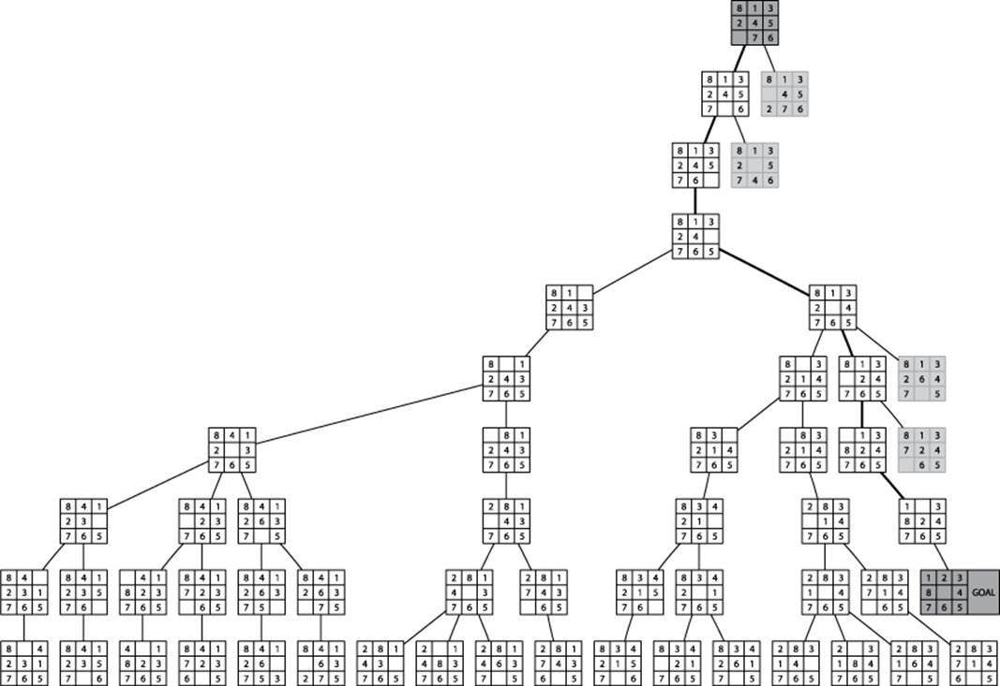

Los árboles de búsqueda son un conjunto de técnicas de diseño de algoritmos que nos permiten acercarnos a problemas computacionales para los cuáles o no conocemos una solución algorítmica exacta, o si la conocemos pero es intratable.

Este acercamiento tiene la ventaja de que no sólo nos permite --en teoría-- llegar a una solución, sino que también nos muestra el camino a través del cual llegamos a la misma.

Es importante notar que en algunas ocasiones esta técnica puede resultar en una solución intratable.

Para buscar soluciones con árboles de búsqueda debemos modelar el problema computacional como un estado inicial (la entrada) al que se le puede aplicar una serie de cambios hasta producir un estado final deseado (la salida o meta). El algoritmo de búsqueda identificará la secuencia de cambios necesaria para producir el estado deseado a partir del estado inicial.

La estructura de árbol se produce al colocar al estado inicial como la raíz. A este estado se le podrán aplicar una serie de cambios, cada cambio posible producirá un nuevo estado. Cada uno de estos nuevos estados será un hijo del estado inicial en el árbol. Recursivamente se repite la operación con cada hijo, produciendo más ramas y niveles en el árbol, hasta que (1) se llegue al estado meta; (2) se llegue a un estado producido anteriormente[^1]; o (3) se llegue a un estado que no tenga más movimientos posibles.

[^1]: Algunos problemas se comportarán más como un grafo que como un árbol, es decir, partiendo de un estado inicial $I$ es posible aplicar una serie de cambios que produzcan diferentes estados $E_1, E_2, ..., E_n$ que me lleven de vuelta al estado $I$. Es decir, pueden haber caminos cíclicos. De esta forma, los algoritmos de búsqueda evitan revisar nodos anteriormente visitados, para asegurar la estructura de árbol, y evitar caer en ciclos infinitos.

Es importante notar que este árbol es una estructura lógica, derivada del comportamiento del modelo del problema, no es una estructura de datos literal. No vamos a construir un árbol con nodos y punteros. Más bien, vamos a construir algoritmos que recorran esta abstracción utilizando otras estructuras de datos auxiliares como pilas, colas y colas de prioridad.

Existen diversas maneras de realizar el recorrido por el árbol, en este capítulo estudiaremos el recorrido por profundidad, el recorrido por anchura y el recorrido heurístico $A*$.

## El rompecabezas de 8 piezas

Para ejemplificar los diferentes algoritmos de búsqueda utilizaremos el rompecabezas de 8 piezas como ejemplo.

Este es un juego en el cual tenemos un tablero cuadrado de 3 x 3 posiciones que contiene 8 piezas movibles numeradas del 1 al 8 y un espacio vacío. Cualquier pieza adyacente al espacio vacío puede moverse, ya sea verticalmente u horizontalmente, para ocuparlo.

El objetivo es iniciar con un tablero con las piezas ordenadas al azar y realizar una serie de movimientos para colocarlas en un orden particular; por ejemplo ordenar los números ascendentemente de manera circular y con el espacio vacío en el centro tal y como se muestra en la figura.

## Búsqueda por profundidad

Este recorrido intenta avanzar lo más posible en cada rama del árbol antes de investigar las siguientes ramas.

El algoritmo intentará encontrar el estado meta analizando todos los posibles estados derivados del primer movimiento de cada nodo hasta llegar a una hoja.

Recordemos que las hojas vienen dadas por estados anteriormente visitados, o estados que ya no tienen movimientos posibles.

Después de arribar a una hoja --sin haber encontrado la meta--, el algoritmo hace *backtrack* hasta el último estado que tenga más movimientos posibles y continuará recursivamente con el mismo comportamiento.

La siguiente figura ilustra este recorrido con nuestro rompecabezas. Para seguir el recorrido, inicie siempre con el nodo más a su izquierda hasta llegar a la hoja, luego haga *backtrack* y continúe con el segundo nodo de izquierda a derecha y así sucesivamente.

Notemos además que la profundidad de las ramas podría llegar a ser muy grande, poniendo en jaque la tratabilidad de nuestra solución. Por esta razón, es común imponer un límite al número de niveles que el algoritmo va a revisar. En el caso de la figura, el algoritmo revisa cada rama hasta el décimo nivel, antes de decidir pasar a la siguiente.

El Algoritmo 1 describe al algoritmo DFS.

\begin{algorithm}
\caption{Recorrido en profunidad DFS}
\label{dfs}
\algrenewcommand\algorithmicend{}
\algrenewcommand\algorithmicprocedure{\textbf{proc}}
\algrenewcommand\algorithmicwhile{\textbf{mientras que}}
\algrenewcommand\algorithmicfor{\textbf{para todo}}
\algrenewcommand\algorithmicdo{}
\algrenewcommand\algorithmicif{\mbox{¿}}
\algrenewcommand\algorithmicthen{\mbox{?}\ :}
\begin{algorithmic}
\Procedure {DFS}{$E_{inicial}$, $E_{meta}$, $prof_{max}$}
  \State $pendientes \gets \Call{Pila}{}$
  \State $visitados \gets \Call{Conjunto}{}$
  \State $pendientes \ll E_{inicial}$
  \While $pendientes \neq \varnothing:$
    \State $pendientes \gg E_{actual}$
    \State $visitados \ll E_{actual}$
    \For $E_{nuevo} \in \Call{Movimientos}{E_{actual}}:$
      \If{$E_{nuevo} \notin visitados$}
        \State $E_{nuevo}.prof \gets E_{actual}.prof + 1$
        \If{$E_{nuevo} = E_{meta}$}
          \State $\uparrow E_{nuevo}$
        \EndIf
        \If{$E_{nuevo}.prof < prof_{max}$}
          \State $pendientes \ll E_{nuevo}$
        \EndIf
      \EndIf
    \EndFor
  \EndWhile
  \State $\uparrow \varnothing$
\EndProcedure
\end{algorithmic}
\end{algorithm}

### Preguntas generadoras

1. ¿De qué tamaño es el espacio de búsqueda para nuestro ejemplo?
2. ¿Qué limitaciones se imponen al funcionamiento del algoritmo desde la perspectiva del uso de memoria?
3. Dejando de lado el tiempo de ejecución, ¿tenemos garantía de que siempre va a encontrar una solución?
4. ¿Qué mejoras podemos plantear para podar el árbol de búsqueda, manteniendo el comportammiento de recorrido por profundidad?

## Búsqueda por anchura

Si la búsqueda por profundidad es vertical, entonces la búsqueda por anchura es horizontal. Desde este acercamiento, se investigarán primero todos los hijos del nodo raíz --es decir, el primer nivel completo-- para luego analizar a cada uno de los hijos de los nodos en este primer nivel --es decir, el segundo nivel--, y así sucesivamente tal como se ilustra en la siguiente figura.

Este algoritmo garantiza que si existe una solución, siempre se va a encontrar el camino más corto al estado meta.

El Algoritmo 2 describe el recorrido BFS.

\begin{algorithm}
\caption{Recorrido en anchura BFS}
\label{bfs}
\algrenewcommand\algorithmicend{}
\algrenewcommand\algorithmicprocedure{\textbf{proc}}
\algrenewcommand\algorithmicwhile{\textbf{mientras que}}
\algrenewcommand\algorithmicfor{\textbf{para todo}}
\algrenewcommand\algorithmicdo{}
\algrenewcommand\algorithmicif{\mbox{¿}}
\algrenewcommand\algorithmicthen{\mbox{?}\ :}
\begin{algorithmic}
\Procedure {BFS}{$E_{inicial}$, $E_{meta}$}
  \State $pendientes \gets \Call{Cola}{}$
  \State $visitados \gets \Call{Conjunto}{}$
  \State $pendientes \ll E_{inicial}$
  \While $pendientes \neq \varnothing:$
    \State $pendientes \gg E_{actual}$
    \State $visitados \ll E_{actual}$
    \For $E_{nuevo} \in \Call{Movimientos}{E_{actual}}:$
      \If{$E_{nuevo} \notin visitados$}
        \If{$E_{nuevo} = E_{meta}$}
          \State $\uparrow E_{nuevo}$
        \EndIf
        \State $pendientes \ll E_{nuevo}$
      \EndIf
    \EndFor
  \EndWhile
  \State $\uparrow \varnothing$
\EndProcedure
\end{algorithmic}
\end{algorithm}

### Preguntas generadoras

1. ¿Cómo impacta el cambio de estructura de datos de pila a cola en el uso de la memoria?
2. ¿Porqué este algoritmo garantiza encontrar el camino más corto?

## Búsqueda heurística

Una heurística es una "regla de dedo". Un acercamiento que por experiencia tiende a producir resultados positivos, aunque esto no sea garantía de que vaya a producir resultados positivos cada vez que se utiliza.

Este concepto se operacionaliza en el contexto de árboles de búsqueda como algún método que me permita cumplir metas inmediatas en el proceso de búsqueda, aunque esto no sea garantía de que me va a permitir llegar a una solución óptima. En cada paso de la búsqueda se evalúan las opciones disponibles de acuerdo con una función heurística y se investiga primero la opción mejor evaluada.

De esta forma se define la función heurística $f^*(n)$ de la siguiente forma:

$$
f^*(n) = g^*(n) + h^*(n)
$$

Donde:

+ $g^*(n)$ estima la secuencia de pasos más corta entre el estado inicial y el estado actual $n$.
+ $h^*(n)$ estima la secuencia de pasos más corta entre el estado actual $n$ y el estado meta.
+ Por lo tanto, $f^*(n)$ estima la secuencia de pasos más corta entre el estado inicial y el estado meta, pasando a través del estado actual $n$.

Para calcular $g^*(n)$ simplemente debemos mantener registro del camino de estados visitados hasta el momento.

La función $h^*(n)$ debe evaluar cuantitativamente qué tan cerca se encuentra el estado actual $n$ del estado meta.

El algoritmo seleccionará cuáles estados investigar con base en el valor $h^*(n)$ que se haya calculado para cada estado. El objetivo es que se investiguen las ramas más prometedoras primero, con la esperanza de encontrar la solución ahí y no tener que perder tiempo investigando callejones sin salida.

El Algoritmo 3 describe el recorrido heurístico $A*$.

\begin{algorithm}
\caption{Recorrido heurístico A estrella}
\label{aestrella}
\algrenewcommand\algorithmicend{}
\algrenewcommand\algorithmicprocedure{\textbf{proc}}
\algrenewcommand\algorithmicwhile{\textbf{mientras que}}
\algrenewcommand\algorithmicfor{\textbf{para todo}}
\algrenewcommand\algorithmicdo{}
\algrenewcommand\algorithmicif{\textbf{\mbox{¿}}}
\algrenewcommand\algorithmicthen{\textbf{\mbox{?}}\ :}
\algrenewcommand\algorithmicelse{\textbf{sino}\ :}
\begin{algorithmic}
\Procedure {A*}{$E_{inicial}$, $E_{meta}$}
\State $E_{inicial}.g \gets 0$
\State $pendientes \gets \Call{ColaPrioridad}{}$
\State $visitados \gets \Call{Conjunto}{}$
\State $E_{inicial}.h \gets h(E_{inicial})$
\State $pendientes \ll E_{inicial}$
\While $pendientes \neq \varnothing:$
  \State $pendientes \gg E_{actual}$ \Comment{Saca de la cola con base en el mínimo valor h}
  \State $visitados \ll E_{actual}$
  \If{$E_{actual} = E_{meta}$}
    \State $\uparrow E_{actual}$
  \EndIf
  \For $E_{nuevo} \in \Call{Movimientos}{E_{actual}}:$
    \State $E_{nuevo}.g \gets E_{actual}.g + 1$
    \State $E_{nuevo}.h \gets h(E_{nuevo})$
    \If{$E_{nuevo} \in visitados$}
      \State $E_{visitado} \gets visitados[E_{nuevo}]$
      \If{$E_{nuevo}.h < E_{visitado}.h$}
        \State $visitados[E_{visitado}] \gets \varnothing$ \Comment{Borrar del conjunto de visitados}
        \State $pendientes \ll E_{nuevo}$
      \EndIf
    \Else
      \State $pendientes \ll E_{nuevo}$
    \EndIf
  \EndFor
\EndWhile
\State $\uparrow \varnothing$
\EndProcedure
\end{algorithmic}
\end{algorithm}

### Función heurística

A continuación se presentan tres opciones para una función $h^*(n)$ aplicable a nuestro ejemplo.

#### Opción 1: Diferencias

Calcula la sumatoria de las diferencias absolutas entre posiciones opuestas de un estado cualquiera.

De esta forma para el estado meta de la Figura 1, se calcula la función $h^*(n)$  como:

\begin{equation}
\begin{aligned}
|1-5| = 4 \\    
|2-6| = 4 \\    
|3-7| = 4 \\    
|8-4| = 4
\end{aligned}
\end{equation}

$$
h^*(E_{meta}) = |16 - (4 + 4 + 4 + 4)| = 0
$$

Mientras que para cualquier otro estado como el de la Figura 4:

\begin{equation}
\begin{aligned}
|8-6| = 2 \\
|1-0| = 1 \\
|3-7| = 4 \\
|2-5| = 3
\end{aligned}
\end{equation}

$$
h^*(E_{i}) = |16 - (2 + 1 + 4 + 3)| = 6
$$

#### Opción 2: Conteo de fichas mal colocadas

Consiste en contar cuántas fichas no están en su posición final esperada.

Para el estado meta el conteo debería ser $h^*(E_{meta}) = 0$. Mientras que para el estado $E_{i}$ el conteo es $h^*(E_{i})=6$.

#### Opción 3: Distancia Manhattan + Secuencia

##### Distancia Manhattan

La distancia Manhattan para una ficha cualquiera se calcula como el número de movimientos necesarios para colocarla en su posición final. Para el caso del estado meta $d_{M}(E_{meta}) = 0$ pues todas las fichas se encuentran ya en el estado final y por tanto no hace falta ningún movimiento.

Mientras que la distancia Manhattan para el estado $E_{i}$ de la Figura 4 tenemos que:

\begin{equation}
\begin{aligned}
d(1) = 1 \\
d(2) = 2 \\
d(3) = 0 \\
d(4) = 1 \\
d(5) = 1 \\
d(6) = 1 \\
d(7) = 0 \\
d(8) = 1 \\
\end{aligned}
\end{equation}

$$
d_{M}(E_{i}) = \sum^8_{i=1}d(i) = 1 + 2 + 0 + 1 + 1 + 1 + 0 + 1 = 7
$$

##### Secuencia

La secuencia toma en cuenta soluciones parciales en las cuales las fichas están ordenadas en la secuencia correcta aunque no estén colocadas en sus posiciones finales. Se define la función $s$ de la siguiente manera:

$$
s(ficha) =
\begin{cases}
2\ cuando\ ficha\ no\ es\ seguida\ por\ sucesor, \\
1\ cuando\ ficha\ está\ en\ el\ centro, \\
0\ en\ cualquier\ otro\ caso
\end{cases}
$$

Tenemos que para el estado meta $S(E_{meta}) = 0$, mientras que para $E_{i}$:

\begin{equation}
\begin{aligned}
s(1) = 2 \\
s(2) = 2 \\
s(3) = 2 \\
s(4) = 1 \\
s(5) = 0 \\
s(6) = 2 \\
s(7) = 2 \\
s(8) = 0 \\
\end{aligned}
\end{equation}

$$
S(E_{i}) = \sum^8_{i=1} s(i) = 2 + 2 + 2 + 1 + 0 + 2 + 2 + 0 = 11
$$

Por tanto tenemos que:

$$
h^*(E_{meta}) = d_{M}(E_{meta}) + 3 \cdot S(E_{meta}) = 0 + 3 \cdot 0 = 0
$$

$$
h^*(E_{i}) = d_{M}(E_{i}) + 3  \cdot S(E_{i}) = 7 + 3 \cdot 11 = 40
$$

### Preguntas generadoras

1. En la función que calcula $h^*(n)$ para la tercera opción heurística, ¿qué papel juega la constante 3 que multiplica al término de secuencia $3 \cdot S(E_{meta})$?
1. Compare las tres opciones para la función heurística $h^*(n)$ para nuestro ejemplo. ¿Cuál es la mejor opción y porqué?
2. Compare las estructuras de los algoritmos $DFS$, $BFS$ y $A*$. ¿En qué se diferencian? ¿En qué se asemejan?
3. Se podría afirmar que $BFS$ y $DFS$ son búsquedas ciegas, mientras que $A*$ no. ¿Porqué?
4. ¿Porqué se considera a la técnica de árboles de búsqueda como inteligencia artificial?

## Referencias

Heineman G.T., Pollice G., Selkow S. (2009) Algorithms in a Nutshell: A Desktop Quick Reference. Sebastopol, CA, EE.UU.: O'Reilly
