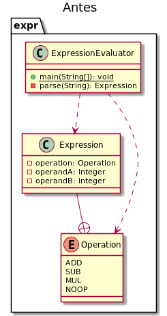

# Evaluador de expresiones

Este es un ejemplo de código que no cumple con el principio de responsabilidad única (SRP).

## Diseño ##



## Utilización ##

```bash
java expr.ExpressionEvaluator
```

El programa corre un CLI para hacer evaluación de expresiones aritméticas infijas.

```
> 1 + 3
4
> -1 * 2
-2
> 3 - 6
-3
> exit
Finishing process
```

## Análisis de SRP ##

* ¿Cómo se podría evaluar la cohesión de este módulo?
* ¿Cuáles son las distintas responsabilidades que cumple este módulo?
* ¿Cómo se podría rediseñar el módulo para cumplir con SRP?
