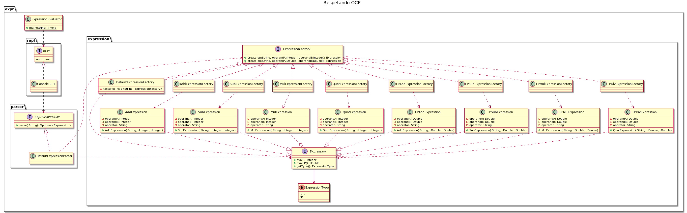

# Evaluador de expresiones

Este es un ejemplo de código que no cumple con el principio de segregación de interfaces (ISP) ni con el principio de inversión de dependencias (DIP).

## Diseño ##



## Utilización ##

```bash
java expr.ExpressionEvaluator
```

El programa corre un CLI para hacer evaluación de expresiones aritméticas infijas.

```
> 1 + 3
4
> -1 * 2
-2
> 3 - 6
-3
> 1.0 + 3
3.0
> 1+3
Expresión inválida: error de sintaxis
> 2.0 / 3
0.6666666666666666
> salir
Finalizando el proceso
```

## Análisis de ISP ##

* ¿Puedo invocar `evaluateInt()` y `evaluateFP()` en un mismo objeto de tipo `Expression`?
* ¿Puedo invocar `create(String, Integer, Integer)` y `create(String, Double, Double)` en un mismo objeto de tipo `ExpressionFactory`? ¿Cuál es la diferencia con el caso anterior?
* ¿Cómo se podría rediseñar el módulo para cumplir con ISP?

## Análisis de DIP ##

* ¿Cómo evaluaría el nivel de acomplamiento entre el `REPL` y el `ExpressionParser`?
* ¿Cómo evaluaría el nivel de acomplamiento entre el `ExpressionParser` y el `ExpressionFactory`?
* ¿Cómo se podría rediseñar el módulo para cumplir con DIP?
