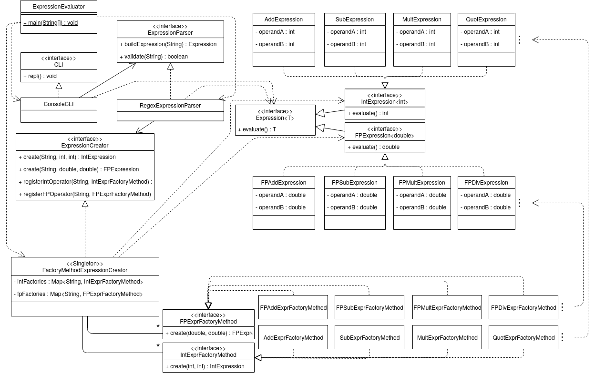

# Evaluador de expresiones

Este es un ejemplo de código diseñado para ejemplificar la aplicación principios SOLID. 

## Diseño ##



## Utilización ##

```bash
java ExpressionEvaluator
```

El programa corre un CLI para hacer evaluación de expresiones aritméticas infijas.

```
> 1 + 3
4
> -1 * 2
-2
> 3 - 6
-3
> 1.0 + 3
3.0
> 1+3
Expresión inválida: error de sintaxis
> 2.0 / 3
0.6666666666666666
> salir
Finalizando el proceso
```

## Análisis final ##

* ¿Cómo podemos incorporar más tipos de expresiones? Ejemplo relacionales y lógicas.