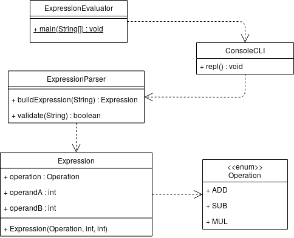

# Evaluador de expresiones

Este es un ejemplo de código que no cumple con el principio abierto/cerrado (OCP) ni con el principio de sustitución de Liskov.

## Diseño ##



## Utilización ##

```bash
java ExpressionEvaluator
```

El programa corre un CLI para hacer evaluación de expresiones aritméticas infijas.

```
> 1 + 3
4
> -1 * 2
-2
> 3 - 6
-3
> 1.0 + 3
Expresión inválida: error de sintaxis
> 1+3
Expresión inválida: error de sintaxis
> salir
Finalizando el proceso
```

## Análisis de OCP ##

* ¿Cuáles son las implicaciones de agregar un nuevo operador? Por ejemplo el operador para calcular el cociente de la división entera `/ `.
* ¿Cómo se podría rediseñar el módulo para cumplir con SRP?

## Análisis de LSP ##

* ¿Cuáles son las implicaciones de agregar un nuevo tipo de expresiones? Por ejemplo expresiones relacionales o lógicas.
* ¿Cuáles son las implicaciones de agregar un nuevo tipo de interfaz de usuario? Por ejemplo una interfaz gráfica de escritorio, o una interfaz web.
* ¿Cómo se podría rediseñar el módulo para cumplir con LSP?

