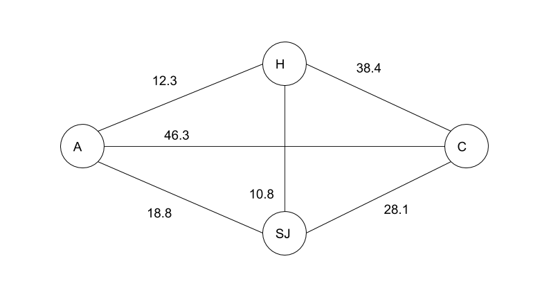

Los algoritmos de optimización estocástica permiten buscar soluciones óptimas a problemas que se puedan modelar como combinaciones de múltiples variables. Esta característica combinatoria implica que los problemas usualmente cuentan con una vastedad de posibles soluciones, provocando que sea impráctico verificarlas una por una.

Los algoritmos de optimización realizan una búsqueda dirigida en el espacio de soluciones partiendo de un punto al azar. Cada solución encontrada es evaluada cuantitativamente, esta evaluación es la variable que se busca optimizar --maximizando o minimizando dependiendo del contexto del problema--. El mecanismo de búsqueda aplica pequeños cambios a las soluciones encontradas para producir nuevas soluciones con el objetivo de mejorar la evaluación con cada cambio.

Estos algoritmos pueden introducir aleatoriedad tanto en los valores de la variables que componen las soluciones, como en la evaluación y el mecanismo de dirección de la búsqueda. Es por esta aleatoriedad característica que se clasifican como estocásticos.

## El vendedor viajero

El problema que utilizaremos para ilustar los algoritmos de optimización es el del vendedor viajero. Este problema parte de una colección de ciudades todas interconectadas entre si. Un vendedor viajero necesita definir la ruta más corta que le permita visitar a cada una de estas ciudades sólo una vez, empezando y finalizando la gira en la misma ciudad.

Desde la teoría de grafos podemos replantear el problema de la siguiente manera: dado un grafo completo $G$ encontrar un camino cíclico, sin elementos repetidos, que pase por cada uno de los vértices de $G$.

La figura 1 presenta un ejemplo concreto con las ciudades del Valle Central de Costa Rica. El grafo representa las distancias en km que hay entre Alajuela, Heredia, San José y Cartago.

Las soluciones al problema se pueden representar como arreglos de símbolos, donde cada símbolo representa una ciudad. Por ejemplo $\{ A, C, SJ, H \}$ representa una solución en la que se parte de Alajuela hacia Cartago, luego se visita San José, y finalmente Heredia, retornando de ahí hacia Alajuela.

El tamaño del arreglo corresponderá al número de ciudades por visitar, y el arreglo no admite repetidos. Con estas restricciones nos aseguramos que se visiten todas las ciudades y que cada ciudad se visite una única vez. Finalmente, el ciclo lo completamos tomando en cuenta que de la última ciudad en el arreglo hay un traslado final a la primera ciudad en el arreglo.

Las soluciones se evaluarán con una función de costo $f_{costo}$ definida como la sumatoria de las distancias entre los traslados especificados por la secuencia de los símbolos en el arreglo, obteniendo de esta forma la distancia total de la ruta. Tomemos como referencia las distancias en la figura 1. Tenemos entonces que:

$$
f_{costo}(\{A, C, SJ, H\}) = 46.3 + 28.1 + 10.8 + 12.3 = 97.5
$$

$$
f_{costo}(\{A, C, H, SJ\}) = 46.3 + 38.4 + 10.8 + 18.8 = 114.3
$$

El objetivo entonces es minimizar la función de costo para minimizar la distancia recorrida, en pos de la ruta más corta.

Cabe notar que por simplicidad nuestro ejemplo es bastante trivial pues sólo trabaja con cuatro ciudades y por tanto podría ser solucionado rápidamente con una búsqueda por fuerza bruta. Sin embargo, cabe notar que el número de soluciones posibles para el problema en general corresponde al número de permutaciones del arreglo $n!$ donde $n$ es el tamaño del arreglo. La búsqueda de fuerza bruta tiene entonces una complejidad temporal de $\mathcal{O}(n!)$, haciéndola intratable para un número mayor de ciudades[^1].

[^1]: Pensemos por ejemplo visitar todas las ciudades de América por avión.

A continuación estudiaremos cuatro algoritmos de optimización estocástica que nos permiten acercarnos a solucionar este problema y otros que se puedan representar de manera similar como arreglos de variables: búsqueda aleatoria, *hill climbing*, *simulated annealing*, y algoritmos genéticos.

## Búsqueda aleatoria

Este algoritmo simplemente genera una serie de soluciones al azar, buscando optimizar su evaluación en cada iteración. En este y todos los demás casos presentaremos algoritmos que minimizan su función de costo.

\begin{algorithm}
\caption{Búsqueda Aleatoria}
\label{aleatoria}
\algrenewcommand\algorithmicend{}
\algrenewcommand\algorithmicprocedure{\textbf{proc}}
\algrenewcommand\algorithmicwhile{\textbf{mientras que}}
\algrenewcommand\algorithmicfor{\textbf{para todo}}
\algrenewcommand\algorithmicdo{}
\algrenewcommand\algorithmicif{\textbf{\mbox{¿}}}
\algrenewcommand\algorithmicthen{\textbf{\mbox{?}}\ :}
\algrenewcommand\algorithmicelse{\textbf{sino}\ :}
\begin{algorithmic}
\Procedure {Aleatoria}{$dominio$, $repeticiones$}
  \State $costo_{min} \gets \infty$
  \State $sol_{min} \gets \varnothing$
  \For $i \in [1..repeticiones]:$
    \State $sol \gets dominio.generar()$ \Comment genera solución al azar
    \State $costo \gets dominio.f_{costo}(sol)$
    \If{$costo < costo_{min}$}
      \State $costo_{min} \gets costo$
      \State $sol_{min} \gets sol$
    \EndIf
  \EndFor

  \State $\uparrow sol_{min}$
\EndProcedure
\end{algorithmic}
\end{algorithm}

El algoritmo recibe un objeto $dominio$, la responsabilidad de este objeto es manejar los detalles particulares de la representación del problema --en nuestro caso el arreglo de ciudades--. De esta forma, el objeto de dominio "sabe" cómo generar soluciones al azar y también cómo evaluar soluciones.

### Preguntas generadoras

1. ¿Cuál es la probabilidad de que encuentre la mejor solución para nuestro problema del vendedor viajero?
2. ¿Qué utilidad puede tener un algoritmo de búsqueda aleatoria?

## Hill climbing

Este algoritmo identifica el proceso de optimización con la metáfora de escalar una colina, llegar al tope de la colina equivale a encontrar la solución óptima. El buscador es un agente que escala una colina, y que después de cada paso que da se detiene a mirar a su alredor, buscando el camino que lo siga llevando hacia la cima.

La figura 2 ilustra esta metáfora. Dada una solución aleatoria, representada por el punto negro, se generan soluciones próximas o vecinas --soluciones que varíen en algunos pequeños detalles con respecto a la actual--. El costo de cada solución vecina es evaluado y comparado con la solución actual, el objetivo es encontrar un vecino que mejore en costo y que por tanto me acerque más a la cima de la colina. El algoritmo se detiene cuando ninguno de los vecinos produce un costo mejor que el de la solución actual, interpretando que si ya no puedo seguir escalando en ninguna dirección es porque ya estoy en el punto más alto de la colina.

\begin{algorithm}
\caption{Hill Climbing}
\label{hillclimbing}
\algrenewcommand\algorithmicend{}
\algrenewcommand\algorithmicprocedure{\textbf{proc}}
\algrenewcommand\algorithmicwhile{\textbf{mientras que}}
\algrenewcommand\algorithmicloop{\textbf{repetir\ :}}
\algrenewcommand\algorithmicfor{\textbf{para todo}}
\algrenewcommand\algorithmicdo{}
\algrenewcommand\algorithmicif{\textbf{\mbox{¿}}}
\algrenewcommand\algorithmicthen{\textbf{\mbox{?}}\ :}
\algrenewcommand\algorithmicelse{\textbf{sino}\ :}
\begin{algorithmic}
\Procedure {HillClimbing}{$dominio$}
  \State $sol \gets dominio.generar()$ \Comment genera solución al azar
  \State $sol_{min} \gets sol$
  \State $costo_{min} \gets dominio.f_{costo}(sol)$
  \Loop
    \State $vecinos \gets dominio.vecinos(sol)$
    \For $v \in vecinos:$
      \State $costo_{v} \gets dominio.f_{costo}(v)$
      \If{$costo_{v} < costo_{min}$}
        \State $costo_{min} \gets costo_{v}$
        \State $sol_{min} \gets v$
      \EndIf
    \EndFor
    \If{$sol_{min} = sol$}
      \State $\uparrow sol$
    \Else
      \State $sol \gets sol_{min}$
    \EndIf
  \EndLoop
\EndProcedure
\end{algorithmic}
\end{algorithm}

Notemos que el algoritmo se desarrolla dentro de un ciclo infinito que sólo se puede interrumpir cuando se llega a un tope --cuando ninguno de los vecinos mejora a la solución actual--. A diferencia de la búsqueda al azar --controlada por el parámetro $repeticiones$--, con *hill climbing* no tenemos control sobre el tiempo que va a tardar el algoritmo ejecutándose, pero si tenemos garantía de que el algoritmo va a llegar a un tope[^2].

[^2]: Podríamos afirmar entonces que *hill climbing* se puede categorizar como un algoritmo Las Vegas, mientras que la búsqueda aleatoria se categoriza como un algoritmo Monte Carlo.

Este es un algoritmo voraz que funciona bien cuando el espacio de búsqueda se comporta como una colina en la que siempre hay claridad sobre cuál camino sigue escalando y cuál camino me lleva de vuelta hacia abajo.

Sin embargo, son comúnes las situaciones en las que el espacio de búsqueda contiene cimas locales --también llamadas máximos locales-- tal y como lo ilustra la figura 3. En estas situaciones, el algoritmo por su voracidad se detendrá en la primer cima local que encuentre.

Como observamos en la figura 3, todas las soluciones vecinas a la solución actual son caminos de descenso. El algoritmo es incapaz de ver más allá del diámetro de su vecindario y por tanto no cae en cuenta de la presencia de una colina aún más alta que la actual. Podríamos pensar en aumentar el radio del vecindario con la esperanza de proveer al algoritmo con una mejor visibilidad. Sin embargo, el máximo local y el máximo absoluto podrían estar colocados en extremos diametralmente opuestos del espacio de búsqueda; aumentar el radio del vecindario potencialmente podría transformar nuestro *hill climbing* en una búsqueda por fuerza bruta.  

### Preguntas generadoras

1. ¿Qué estrategias podemos proponer para generar los vecinos para nuestro problema específico del vendedor viajero?
2. ¿Cómo podemos mitigar el problema de los máximos locales, manteniendo el comportamiento de *hill climbing*?

## Simulated annealing

*Annealing* por su nombre en inglés es un proceso metalúrgico en el que se calienta un metal a altas temperaturas y luego se le deja enfriar lentamente. Este proceso tiene como objetivo alterar algunas propiedades del metal como su dureza o maleabilidad. El cambio se logra gracias a que el proceso de calentamiento aumenta la energía en los átomos y luego el enfriamiento produce nuevas configuraciones atómicas de baja energía.

El algoritmo de *simulated annealing* es metáfora de este proceso. El mecanismo es similar a los dos algoritmos anteriores, se generan soluciones al azar y luego aplicando pequeños cambios se producen nuevas soluciones. Cada solución es evaluada, y se busca optimizar su costo.

La diferencia con *hill climbing* radica en reducir su voracidad aceptando algunas soluciones que nos lleven en dirección de descenso. Estas soluciones serán aceptadas con base en una probabiblidad que se calcula en cada iteración. Con este mecanismo tratamos de reducir la probabilidad de quedar atascados en una cima local.

La simulación del proceso de enfriamiento determinará cuántas repeticiones realizará el algoritmo.  

\begin{algorithm}
\caption{Simulated Annealing}
\label{simulatedannealing}
\algrenewcommand\algorithmicend{}
\algrenewcommand\algorithmicprocedure{\textbf{proc}}
\algrenewcommand\algorithmicwhile{\textbf{mientras que}}
\algrenewcommand\algorithmicloop{\textbf{repetir\ :}}
\algrenewcommand\algorithmicfor{\textbf{para todo}}
\algrenewcommand\algorithmicdo{}
\algrenewcommand\algorithmicif{\textbf{\mbox{¿}}}
\algrenewcommand\algorithmicthen{\textbf{\mbox{?}}\ :}
\algrenewcommand\algorithmicelse{\textbf{sino}\ :}
\begin{algorithmic}
\Procedure {SimulatedAnnealing}{$dominio$, $temp = MAXINT$, $tasa_{enfr} = 0.95$}
  \State $sol \gets dominio.generar()$ \Comment genera solución al azar
  \State $costo \gets dominio.f_{costo}(sol)$
  \While $temp > 0.01$ :
    \State $sol' \gets dominio.vecino(sol)$ \Comment obtiene un vecino al azar
    \State $costo' \gets dominio.f_{costo}(sol')$
    \State $p \gets \mathrm{e}^{\frac{-|costo'-costo|}{temp}}$
    \State $p_{azar} \gets \Call{Random}{0, 1}$ \Comment distribución uniforme
    \If{$costo' < costo \lor  p_{azar} \leq p$}
      \State $sol \gets sol'$
      \State $costo \gets costo'$
    \EndIf
    \State $temp \gets temp \times tasa_{enfr}$
  \EndWhile
  \State $\uparrow sol$
\EndProcedure
\end{algorithmic}
\end{algorithm}

### Preguntas generadoras

1. Explique el papel que juega la variable $p$ en el comportamiento del algoritmo. Tome en cuenta que $\mathrm{e}^0 = 1$ y $\lim_{x \to -\infty} \mathrm{e}^x = 0$. ¿Qué papel juega la expresión $-|costo'-costo|$ en el cálculo de la probabilidad? ¿Qué papel juega $temp$ en el cálculo de la probabilidad?

2.  ¿Porqué es importante que $p$ se obtenga al azar de una distribución uniforme?

2. ¿Porqué este algoritmo no me garantiza que siempre voy a evitar máximos locales?

## Algoritmos genéticos

Esta técnica se inspira en el proceso darwiniano de evolución por selección natural. Consiste en generar una serie de soluciones al azar, tomar una fracción de las mejor evaluadas, y a partir de ellas producir un nuevo conjunto de soluciones. Este proceso se repite varias veces buscando una convergencia hacia las mejores soluciones posibles.

El supuesto detrás de este mecanismo es que una combinación de soluciones buenas puede producir soluciones aún mejores.

El algoritmo sigue este esquema de pasos:

1. Generar una población de soluciones al azar.
2. Evaluar la población.
3. Seleccionar una élite las mejores soluciones de la población.
4. Producir una nueva generación de soluciones a partir de cruzamiento y mutación de la  élite.
5. Repetir a partir de paso (2) con nueva generación.

\begin{algorithm}
\caption{Algoritmo Genético}
\label{algoritmogenético}
\algrenewcommand\algorithmicend{}
\algrenewcommand\algorithmicprocedure{\textbf{proc}}
\algrenewcommand\algorithmicwhile{\textbf{mientras que}}
\algrenewcommand\algorithmicloop{\textbf{repetir\ :}}
\algrenewcommand\algorithmicfor{\textbf{para todo}}
\algrenewcommand\algorithmicdo{}
\algrenewcommand\algorithmicif{\textbf{\mbox{¿}}}
\algrenewcommand\algorithmicthen{\textbf{\mbox{?}}\ :}
\algrenewcommand\algorithmicelse{\textbf{sino}\ :}
\begin{algorithmic}
\Procedure {Genético}{$dominio$, $tam\_pobl$, $prop\_elite$, $prob\_mut$, $repeticiones$}
  \State $pobl \gets dominio.generar(tam\_pobl)$
  \While $repeticiones > 0$:
    \For $sol \in pobl$:
      \State $sol.aptitud \gets dominio.f_{costo}(sol)$
    \EndFor
    \State $\Call{Ordenar}{pobl, llave = aptitud}$
    \State $num\_padres \gets \lfloor (|pobl| \times prop\_elite) \rfloor$
    \State $num\_hijos \gets (|pobl| - num\_padres)$
    \State $sig\_gen \gets pobl[0:num\_padres]$
    \State $descendencia \gets \varnothing$
    \While $num\_hijos > 0$ :
      \State $padre_A \gets sig\_gen[\Call{Random}{}]$
      \State $padre_B \gets sig\_gen[\Call{Random}{}]$
      \State $hijo \gets dominio.cruzar(padre_A, padre_B)$
      \State $p \gets \Call{Random}{0, 1}$ \Comment distribución uniforme
      \If{$p \leq prob\_mut$}
        \State $hijo \gets dominio.mutar(hijo)$
      \EndIf
      \State $descendencia \ll hijo$
      \State $num\_hijos \gets num\_hijos - 1$
    \EndWhile
    \State $pobl \gets sig\_gen \ll descendencia$
    \State $repeticiones \gets repeticiones - 1$
  \EndWhile
\EndProcedure
\end{algorithmic}
\end{algorithm}

### Preguntas generadoras

1. ¿Cuáles deberían ser los valores para los parámetros del algoritmo:  $tam\_pobl$, $prop\_elite$, $prob\_mut$, $repeticiones$?

2. Si consideramos este algoritmo como IA, ¿quiere decir que la evolución es inteligente? ¿qué características podrían compartir la evolución y la inteligencia --a como la hemos caracterizado hasta el momento--?
